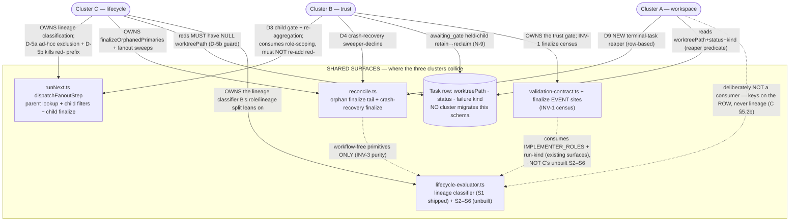

# Cross-plan integration MAP — FG-561 foundations campaign

**This is a MAP, not a contract.** It does not restate, add to, or override the three cluster PRDs. Every
binding decision lives in a PRD; this document only shows where the three clusters **touch**, who **owns** each
shared line of semantics, and what **order** their eventual implementation children must land in. Where a claim
is a citation of a reviewed PRD it is labelled **VERIFIED (via PRD)**; where it is this map's reasoning about how
the three compose it is labelled **INFERENCE**; genuinely unsettled seams are **OPEN QUESTION (operator)**.

**The three normative surfaces (authoritative; cited, never restated):**

- **Cluster A — Agent workspace isolation** — `docs/prds/agent-workspace-isolation.md`
  (FG-559 git-capable mount + D6 detector + D10 blue seam · FG-345 remaining scope · FG-356 terminal/orphan reaper).
- **Cluster B — Review execution trust** — `docs/prds/review-execution-trust.md`
  (FG-566 provisioning · FG-541 push policy · FG-524 fanout-child gate + re-aggregation · FG-525 invoke/crash gate · INV-1 finalize-site census).
- **Cluster C — Workflow lifecycle semantics** — `docs/prds/workflow-lifecycle-semantics.md`
  (FG-477 lifecycle evaluator S1–S6 · FG-527 classifier migration of `retry.ts` / `dispatchFanoutStep`).

The three `docs/plans/foundations-lane-*.md` discovery plans are evidence only and are **superseded where they
differ from their PRD** (each PRD §0). This map cites PRDs, not plans.

---

## Architecture — the shared surfaces and who owns each



The dashed edges are the load-bearing claims: **A is deliberately not a consumer of C's evaluator** (it answers
worktree ownership from the row — C §5.2(b) — which is what keeps the two clusters independent); **B consumes
role/run-lineage signals that already ship, not C's unbuilt surfaces** (§2.4 below); and **reconcile may use only
C's workflow-free primitives** because it holds no workflow by design (C INV-3).

---

## 1. Cross-cluster dependencies

The dependency verb below is "X's work must land or be verifiable before Y's." Each cites the PRD decision that
creates it.

| Dependency | Direction | Why (cited) | Strength |
|---|---|---|---|
| **D1** | **C-FG527 (D-5b) before B-FG524** | Both edit `dispatchFanoutStep`'s child filters `runNext.ts:1620-1626` and `:1668-1671` (B §9.1, C §5.2(a), both VERIFIED via plan §7.1). B's child gate must derive child identity from the role-scoped evaluator, **not** the `agentRole.startsWith("red-")` heuristic C-FG527 is deleting (B §9.1 boundary; C D-5b). If B lands first it either re-introduces the prefix C is retiring — regressing C's INV-1 shrinking allowlist — or must be rewritten when C lands. | **Hard (textual + semantic).** SERIALIZE. |
| **D2** | **B-INV-1 needs no C surface** | B's finalize-EVENT census keys on `isInvokeLikeRun`/`taskHasPipelineFinalize` (`run-kind.ts`) and `IMPLEMENTER_ROLES` (`validation-contract.ts:53`) — B §2 / INV-1, VERIFIED. Those are **shipped** surfaces, **not** C's unbuilt S2–S6. | **None** — B-INV-1 is independent (see §2.4, §4-Q3). |
| **D3** | **A-FG356 vs B-FG524** | A's reaper is a **terminal-task-only** pass (A D9) and B's held child is `awaiting_gate` = **non-terminal** (B D3/N-9). A's own predicate already excludes it (D9 terminal filter + D9b clause (c) "not terminal → RETAIN"). B N-9(a) additionally requires the reaper treat `awaiting_gate` as a live child state. | **Weak** — one shared constant to agree on (`awaiting_gate` ∈ non-terminal). PARALLELIZABLE (see §4-Q2). |
| **D4** | **C-S2 union ⇄ B-FG524 hold** | Coupled, order **deferred to this map by C OQ-6**. The invariant either order must preserve: S2 models a held child as **ACTIVE, never blocked/terminal** (C INV-7 / §5.2(a)). The pre-existing `awaiting_gate` status (B D3: no schema migration — status + payload already exist) **decouples** them: C can model `awaiting_gate → ACTIVE` and B can populate it, in either order, provided both honor that mapping. | **Soft** — decoupled by the pre-existing status (see §4). |
| **D5** | **A-FG559 before B-FG566 ownership predicate** | FG-566's "provision only a Forge-owned workspace" predicate must be written against whatever FG-559 lands as a Forge-owned workspace — linked worktree vs standalone clone (B §9.3, VERIFIED). FG-566 does **not** fix git-in-container and FG-559 does **not** fix deps — distinct contracts; the only coupling is the workspace **definition**. B provisions host-side into `ctx.projectDir` (B D1.3 / INV-4), which exists regardless, so provisioning itself is not blocked. | **Soft** — predicate shape only; parallelizable with a late bind. |

**INFERENCE (D1 ordering specifics).** C's own internal `dispatchFanoutStep` sequence is fixed by C D-7: the
`retry.ts` correction (D-1/D-4) first, then D-5a (ad-hoc exclusion, three sites) **before** D-5b (`red-` prefix
removal). B-FG524 rebases after D-5b. The PRDs state the overlap and defer the ordering to this artifact
(C §5.2 opening; C OQ-6); this map fixes it.

---

## 2. Overlapping files / schemas — the load-bearing section

### 2.1 `src/v2/runNext.ts` — `dispatchFanoutStep` (VERIFIED: function at `runNext.ts:1549`)

The **sharpest collision in the program** (C §5.2(a)). Same function, edited by C-FG527 and B-FG524.

| Region (VERIFIED lines) | Cluster C — FG-527 | Cluster B — FG-524 | Verdict |
|---|---|---|---|
| `existingParent` lookup `:1572-1574` | D-5a: add FG-507 ad-hoc exclusion so an operator's `forge invoke` row is invisible; mint a fresh fanout parent | — | **COEXIST** (C only) |
| `childTasksForCleanup` `:1620-1626` | D-5b: rewrite predicate — child identity from evaluator, drop `red-` prefix | D3: change **semantics** — a held child must be **retained**, not swept (today filters `status === "complete"`) | **CONFLICT** (same lines, both change) |
| re-entry branch `:1668-1671` (`pendingHasChildren`) | D-5b: rewrite the `red-` predicate | D3: **replace the branch outright** to re-aggregate (today returns `existingParent.status` and stops) | **CONFLICT** (same lines, both change) |
| child finalize `markTaskComplete` `:2541` | — | D3: add validation-contract gate + `held` `ChildOutcome` variant (`:2353`) | **COEXIST** (B only; disjoint region) |

**The semantic seam and its trap (VERIFIED via B §9.1).** The naive way to ask "implementer child (gate) vs
red child (exempt)?" at finalize is `agentRole.startsWith("red-")` — **the exact heuristic C-FG527 is deleting.**
B's boundary decision (B §9.1): FG-524 must **not** ask that question at all — the validation evaluator is already
role-scoped (`IMPLEMENTER_ROLES` excludes reds, `validation-contract.ts:53`), so calling it unconditionally at the
child finalize lets *role* do the exempting, adds no lineage dependency, and is strictly less code.

**Which lands first, and is it a trivial rebase (INFERENCE).** C-FG527's D-5a → D-5b lands first; B-FG524 rebases
on top. At `:1620-1626` the rebase is close to trivial once child identity is classifier-based (B layers a
retain-on-held semantic onto C's rewritten predicate). At `:1668-1671` it is **not** a trivial rebase — both
clusters rewrite the same branch (C swaps the predicate; B replaces the branch body with re-aggregation), so this
is a **coordinated change**, not a mechanical merge. The child-gate at `:2541` is disjoint and rebases trivially.

### 2.2 `src/v2/reconcile.ts` — three clusters, mostly disjoint regions

| Cluster | Touch (VERIFIED lines) | Nature |
|---|---|---|
| **A — FG-356** | NEW terminal-task **reaper pass** appended to `reconcileRun`'s tail (A D9); reads the Task row only (A D9a — **no FS scan**). Must **not** touch the running-only loop `reconcile.ts:452` (A §4). Prunes branch `forge/<runId>/<taskId>` under the same predicate (A D9d). | additive tail pass |
| **C — FG-477/527** | Owns `finalizeOrphanedPrimaries` (`reconcile.ts:1361`, on `isPhasePrimaryRow`) and the fanout-parent sweeps (`:1120`, `:1261-1263`); migrates them to the classifier (C §5.2(b)). | in-place migration |
| **B — FG-525** | Crash-recovery gate at `reconcile.ts:779`/`:880` (complete an invoke-like task when `isInvokeLikeRun`) as a **sweeper-decline** (leave non-terminal, `failPipelineUnfinalized` shape) — B D4 / INV-1. | in-place gate |

**Verdict: COEXIST textually** (different line regions) **with three semantic convergences that must be
preserved (INFERENCE, reconciling the three PRDs):**

1. **A keys on the row; C keys off lineage — deliberately non-overlapping.** C §5.2(b) binds "worktree ownership
   is answered from the ROW (`worktreePath` presence), **never** from lineage," and A D9a independently mandates
   "the Task row, and nothing else." **They agree by construction.** The stated risk (C §5.2(b)) is that A adds a
   *fourth* structural lineage probe to reconcile — which A D9a already forbids. No action beyond honoring both.
2. **A's reaper and C's `finalizeOrphanedPrimaries` are the same tail of the same function** (C §5.2(b)). C may
   finalize an orphaned primary to a terminal status; A's reaper then reads that now-terminal row and may reap its
   worktree. Because A's reaper is idempotent and state-free (A I-7), intra-pass ordering is not load-bearing.
3. **B's sweeper-decline keeps a contraband task NON-terminal** (D4). A's terminal-only reaper therefore leaves
   its worktree alone — the correct outcome (unresolved contraband is retained). **B's decline and A's
   terminal-filter compose safely with no coordination.**

### 2.3 The Task row — `worktreePath` / `status` / `merge_conflict` failure kind (three clusters, one row)

**No cluster migrates the `tasks` schema** — A §4 ("no schema change, no new column"), B §5 ("no task-row / `tasks`
schema migration"), C §6/OQ-3 ("do not persist the attempt kind … blocked behind FG-553"). All three lean on the
`awaiting_gate` status + payload **already existing** (B D3, VERIFIED plan §1.3). This shared no-migration stance
is itself a cross-cutting constraint (see §5).

**Reads / writes map:**

| Column / value | A (workspace) | B (trust) | C (lifecycle) | Where they MUST agree |
|---|---|---|---|---|
| `worktreePath` | **reads** — reaper predicate (D9a/b) | **relies on** — held child retains its worktree, reclaims later (N-9) | **reads** — reds MUST carry **NULL** `worktreePath`; binds a **guard test** that fails if a red ever acquires one (D-5b) | Writers are the **workspace/dispatch** path (children get one at `runNext.ts:2505/:2559`; reds get none at `:1298-1308`, VERIFIED via C D-5b). B and C only **read**. No write conflict. |
| `status` (the "terminal" line) | reaper fires only on **TERMINAL** status (D9) | introduces `awaiting_gate` as a **live non-terminal** fanout-child state (D3/N-9) | S2 must model `awaiting_gate` as **ACTIVE**, never blocked/terminal (INV-7) | **All three must treat `awaiting_gate` as non-terminal / ACTIVE.** If any treats it as terminal → premature reap (A), or a permanent wedge (C settle logic reads it "not terminal forever"). |
| `merge_conflict` failure kind | **reads** — in the INSPECTION-RETAIN set → **retain** the worktree (D9b, `failure-kind.ts:125-143`); adds **no** kind (A §4) | — | **reads** — `merge_conflict` → **SHARED** blocker → holds the whole campaign (S5, `policy.ts:139-141`; C §5.2(b)) | Same kind, two disjoint consumers → COEXIST. **Neither may broaden `merge_conflict`'s membership unilaterally** — C §5.2(b) warns broadening it broadens campaign holds and says that decision "should be in the worktree ticket, not discovered in a campaign." |

### 2.4 `src/v2/validation-contract.ts` + the finalize sites — the consumer contract B needs from C

**B owns the trust gate; C owns lineage classification** (B §2/INV-1; C D-2). The task asks whether B's
finalize-event enumeration needs C's evaluator surface to exist first. **INFERENCE, and the answer is nuanced:**

- **B's INV-1 census is buildable on already-shipped surfaces.** It classifies each finalize EVENT by run-lineage
  (`isInvokeLikeRun` / `taskHasPipelineFinalize` in `run-kind.ts`) and role (`IMPLEMENTER_ROLES`,
  `validation-contract.ts:53` — VERIFIED, `IMPLEMENTER_ROLES` present at `validation-contract.ts:32/53`). These
  are **existing** modules, **not** C's unbuilt S2–S6 surfaces. So **B's finalize-site guard (INV-1 / N-1) does
  NOT depend on C's new evaluator surfaces existing first.** It is B's highest-leverage, first-to-land item (B D5)
  and can proceed in parallel with C's retry.ts work.
- **The one place B leans on C is inside `dispatchFanoutStep`.** B's per-child gate (D3, `:2541`) must identify a
  fanout implementer child. B §9.1 binds that this be role-scoped (`IMPLEMENTER_ROLES`), **not** the `red-`
  prefix. That is aligned with — and depends on — C-FG527 having removed the prefix and made child identity
  classifier-derived (D1 above). So B's *child-gate site* wants C-FG527 first; B's *census* does not.
- **The consumer contract, stated:** C must not change the semantics of the shipped lineage layer / `run-kind` in
  a way that reclassifies which finalize events are implementer-reachable, and C-FG527's prefix deletion (D-5b)
  must not leave a window where a red is transiently mis-scoped. This is a **non-regression** contract, not a
  build-ordering "C's surface must exist first." B's census over the seven+ enumerated finalize classes (B §2
  table) is self-contained on existing surfaces.

### 2.5 `src/v2/lifecycle-evaluator.ts` — C owns; note the (non-)consumers

**VERIFIED:** the file is **204 lines** today (confirmed) — the shipped **S1 lineage layer only**
(`classifyTaskLineage`); S2–S6 do not exist yet (C §7.2). Consumers:

- **reconcile** consumes **only** the workflow-free primitives (C INV-3 / `lifecycle-evaluator.ts:192-201`) — it
  holds no workflow by design and must never throw.
- **A is deliberately NOT a consumer** — its reaper answers worktree ownership from the row (C §5.2(b) / A D9a).
  This non-dependency is the architectural guarantee that keeps the workspace cluster independent of the lifecycle
  cluster.
- **B is at most an indirect consumer** — it uses `IMPLEMENTER_ROLES` (its own file) and `run-kind.ts`, not the
  new S2–S6 surfaces (§2.4).
- The real consumers of the new surfaces are C's own migration targets: `ready-queue`, `gate`, `runNext`,
  `campaign/policy` (C Architecture diagram). `campaign/policy` stays a **translation layer** — `BlockerKind`
  vocabulary stays in `types/` (C §5.1); the evaluator returns lifecycle facts, campaign maps them to policy.

---

## 3. Ownership conflicts — who decides, who conforms

| Shared semantics | OWNS | CONFORMS | Basis (cited) |
|---|---|---|---|
| Fanout **child identity** in `dispatchFanoutStep` | **C** (D-5b: identity from the evaluator, never a role-name prefix) | **B** — calls the role-scoped evaluator unconditionally; introduces **no** `red-` check (B §9.1) | C D-5b; B §9.1 |
| **Lineage classification** vs the **trust gate** that consumes it | **C** (lineage) | **B** (the gate consumes lineage/role — B §2/INV-1) | C D-2; B §2 |
| The **held-child state** (`awaiting_gate`) | **B** owns the *hold* (FG-524 D3) | **C** must *model* it as ACTIVE in S2 (INV-7); **A** must treat it as live/non-terminal (won't reap) | B D3/N-9; C INV-7/§5.2(a); A D9 |
| **Worktree ownership** in reconcile | **A** (row-based predicate, D9a) | **C** agrees — ownership from the row, never lineage (§5.2(b)) | A D9a; C §5.2(b) — *convergence, not conflict* |
| `verdictBlocksGate` gate-blocking predicate (`gate.ts:59-65`) | **C** owns placement — stays in `gate.ts` until C relocates it (§5.2(c)) | **B** edits it **in place**; the two clusters must **not fork it** (a fork re-opens the F16 divergence FG-523 closed) | C §5.2(c) |
| `merge_conflict` failure-kind membership | **shared read**; neither may broaden it unilaterally | A retains on it (D9b), C holds the campaign on it (S5) | A §4 ("adds no kind"); C §5.2(b) |
| **Run completion writes** (no-resurrection) | **store layer** owns the guarantee (`store/runs.ts:147`, `:174-179`) | all clusters must **not add a third completion-writing path** (C INV-2) | C INV-2/S3 — a boundary A and B must not cross |

### Genuine unresolved ownership → OPEN QUESTIONS for the operator

- **OQ-INT-1 — `retry.ts:263` fail-open mount mode has no owner, and it collides with A's security boundary.**
  C D-6 / OQ-2 (VERIFIED) flags that `retry.ts:263`'s prefix fallback fails **OPEN**: a **non-prefixed red gets a
  writable mount**, "plausibly a security finding for another cluster … flagged, not fixed. It needs an owner, and
  it does not have one." **INFERENCE (this map):** a non-prefixed red with a *writable* `/project` is exactly A
  D10's "any agent whose `/project` is writable" attacker-controlled-pointer class — A's D10b pointer-freeze
  *would* mitigate the RCE **if A keys the freeze on mount-mode (rw ⇒ freeze), not on "is this a blue agent."**
  But the fail-open **grant itself** (a red becoming rw at all) is owned by neither A nor C. **Operator must
  decide:** does `retry.ts:263`'s mount-mode fallback fall inside Cluster A's D2/D10 security boundary, or is it a
  separate finding needing its own owner? Confirm A's D10b keys on mount-mode so the mitigation actually covers a
  fail-open red.

- **OQ-INT-2 — who reclaims a held child's worktree when the run ends with the child still held?**
  B N-9(b) requires the worktree be **reclaimed, never leaked**, "once the held child resolves and the parent
  finalizes, **or the run ends** with the child still held." **INFERENCE (this map):** A's FG-356 reaper is
  **terminal-only** (D9); a still-held child at run-end is **non-terminal** (`awaiting_gate`), so **A's reaper
  never reclaims it.** Either (i) run-end/abandon must *terminalize* held children (then A's reaper collects them
  on the next pass), or (ii) Cluster B owns the run-end reclaim path directly. Neither PRD nails the run-end arm.
  **Operator/decomposition must assign this** — it is the one held-child seam A's design does not close.

---

## 4. Parallelizable vs serialized children — the ordering DAG

The task's three questions, answered concretely:

- **Q1 — Does B-FG524 require C-FG527's classifier migration first?** **YES (hard).** Both edit the same
  `dispatchFanoutStep` lines (`:1620-1626`, `:1668-1671`); B must consume classifier-based child identity rather
  than re-add the `red-` prefix C is deleting (B §9.1; C D-5b). **SERIALIZE: C-FG527 (D-5a → D-5b) → B-FG524.**
- **Q2 — Does A-FG356's reaper require B's N-9 held-child rule first?** **NO (parallelizable).** A's reaper is
  terminal-only and a held child is non-terminal, so A's own predicate (D9 + D9b clause (c)) already excludes it.
  The only shared obligation is the constant `awaiting_gate ∈ non-terminal` — both must honor it (A must not add
  it to its terminal set; B N-9(a) makes the reaper aware). They **parallelize**, with that one agreed constant.
  (The run-end reclaim gap is OQ-INT-2, not a reaper/hold ordering issue.)
- **Q3 — Does B's finalize-event enumeration require C's lifecycle-evaluator surface?** **NO.** B-INV-1 keys on
  `run-kind.ts` + `IMPLEMENTER_ROLES` — shipped surfaces (§2.4). It can land **first**, in parallel with C's
  retry.ts work.

**Recommended landing DAG (INFERENCE — the PRDs defer ordering here; C OQ-6 explicitly to this artifact):**

```
INDEPENDENT — can start in parallel (no cross-cluster dependency):
  ├─ B-INV-1  finalize-site census guard        (B D5 — highest leverage, existing surfaces)
  ├─ C-retry  retry.ts correction D-1/D-4        (C D-7 §1 — independent file)
  ├─ A-FG559  mount + D6 detector + D10 pointer  (A D1–D7, D10 — container; git-path facts FG-553-insensitive)
  └─ B-FG566  provision into ctx.projectDir      (B D1/INV-4 — host-side; late-bind ownership predicate to A-FG559, D5)

SERIAL CHAIN on dispatchFanoutStep:
  C-FG527 D-5a (ad-hoc exclusion, 3 sites)  →  C-FG527 D-5b (red- prefix → classifier, + worktreePath guard)
                                                    │
                                                    ▼
                                              B-FG524 (child gate + parent re-aggregation)      [Q1: hard serialize]

COUPLED, order-flexible (decoupled by pre-existing awaiting_gate status):
  C-S2 (models awaiting_gate → ACTIVE, INV-7)  ⇄  B-FG524 hold      [C OQ-6; either order if both honor ACTIVE]

PARALLEL, one shared constant:
  A-FG356 reaper   ‖   B-FG524          [Q2; shared: awaiting_gate is non-terminal]

CROSS-CUTTING PREREQUISITE (must be fixed before A-FG356, B-FG524, or C-S2 changes any status set):
  Agree awaiting_gate ∈ {non-terminal, ACTIVE}
```

**Recommended concrete order:** land **B-INV-1**, **C-retry**, **A-FG559** first (fully independent). Then
**C-FG527 D-5a → D-5b** on the dispatch path. Then **C-S2** (modelling `awaiting_gate → ACTIVE`) and **B-FG524**
(which rebases on D-5b and populates the held state); these two are coupled but decoupled in practice by the
pre-existing status, so they may land in either order or together, provided both honor `awaiting_gate = ACTIVE`.
**A-FG356** and **B-FG566** can run alongside the whole chain. This map does **not** decompose these into child
stories — that is gated on each PRD passing review (A §10, B §6, C §7.3).

---

## 5. Post-FG-561 revalidation triggers (FG-553 / FG-555 in flight)

FG-553 (control-runtime isolation: promotion mechanism, store-version policy, dev-vs-stable runtime split) and
FG-555 (runtime selection) are on the primary orchestrator's lane. Per-cluster, the PRD conclusions that need
**re-verification** once FG-553 lands — cited by id, with the discipline (per each PRD) of also naming what is
**explicitly NOT** a trigger:

### Cluster A — workspace isolation

- **A §7.3 (VERIFIED) — the highest-value trigger in the cluster.** FG-553 moves the control runtime behind a
  promoted release directory. An acceptance test that edits `spawn.ts` and then runs `forge` would exercise the
  **OLD** mount logic, pass green, and prove nothing. **Every executed acceptance test in A §7.1/§7.2 (AC-3…AC-7,
  N-1…N-9) must be confirmed to run against the artifact it thinks it is testing (`forge-dev` vs `forge`).** This
  is the "anything assuming forge executes the working tree" trigger for A.
- **Explicitly NOT a trigger (A §7.3):** the git-path-resolution facts (probes p5/p5b/p6b — AC-1/AC-2/AC-3/AC-7's
  git semantics) are about **git's** path resolution, not forge's runtime, and are **insensitive** to FG-553.
  Do not re-run them for FG-553; `p5` remains the acceptance probe for AC-1/AC-2 across the change.

### Cluster B — review execution trust

- **B OQ-4 (VERIFIED) — "forge executes the working tree" + "which artifact."** The FG-566/541/524/525 probes ran
  the working tree via `tsx`. After FG-553, `forge review-loop` runs the **promoted release**, so a fix in `src/`
  is not live until promoted; each acceptance falsification must be executed against the right artifact, and
  `fg566-unprepared-env.sh` re-run once FG-553/FG-555 land.
- **B D1.4 + OQ-1 (FG-555) — "which Node/ABI local verification runs under."** FG-566 **declares and records** the
  provisioning runtime (default `process.execPath` / `process.versions.modules`) and **refuses rather than
  guesses** on mismatch. When FG-555 lands its launched-workload runtime contract, **D1.4's default is the one
  line that changes** (OQ-1). The dev-vs-stable runtime split can change the ABI provisioning keys on, so
  **N-2/F3 (deps built for an incompatible ABI are not accepted as ready) must be re-derived against the pinned
  post-FG-553 ABI** (B §9.4). `INV-4`'s `project_dir` keying is *insensitive* (the reviewed project's dir is
  unchanged); only the **recorded ABI** is sensitive — do not conflate them.

### Cluster C — workflow lifecycle semantics

- **C §8 (VERIFIED) — "a single Forge version owns the store."** IF FG-553's **store-version policy** admits
  **more than one Forge version writing the same store**, two conclusions must be re-verified:
  1. **A-5's safety argument** — narrowing touches only marker-stamped rows; rule 0 reads a provenance marker
     written by the **current** Forge version. If marker-less rows become reachable on **live** (not historical)
     runs, `legacy_ambiguous_invoke` stops being a legacy kind and the bound dissolves.
  2. **S5 / A-6** — `classifyTaskLineage` is deterministic *given a workflow + row set*, but **two Forge versions
     with different classifier rules writing the same store can disagree about the same row**; terminal-blocker
     derivation and reconcile's orphan sweeps become version-dependent.
- **C OQ-3 (VERIFIED):** persisting the attempt kind on the task row is **deferred into** FG-553's store-version
  decision — it "collides head-on" and must land **inside** that policy, never beside it.
- **Explicitly NOT a trigger (C §8):** FG-553's **exec-not-spawn / pinned-interpreter** work changes *how*
  `forge next` is launched, not *what it decides*. **No conclusion in C depends on it** — C says so precisely
  because the temptation is to list it.

### Cross-cutting — the shared no-migration assumption × store-version policy (INFERENCE)

All three clusters deliberately avoid a `tasks`-schema migration (A §4; B §5; C §6/OQ-3), each leaning on the
`awaiting_gate` status + payload **already existing** (B D3). **If FG-553's store-version policy introduces
per-version store schemas or a migration-on-open regime, this shared "no migration needed" stance must be
re-confirmed** — it is safe only while the store schema is stable across the versions that open it. This is the
"migrations run on every writable DB open / single version owns the store" trigger, and it lands on the campaign
as a whole, not on one cluster. C OQ-3 is the one place a cluster has already routed a would-be migration into
FG-553's policy; the no-migration convergence of A/B/C is the place to watch if that policy changes.

---

*This map cites the three PRDs and defers every binding decision to them. It creates no backlog children,
decomposes nothing, files no tickets, and touches neither source nor the PRDs.*
