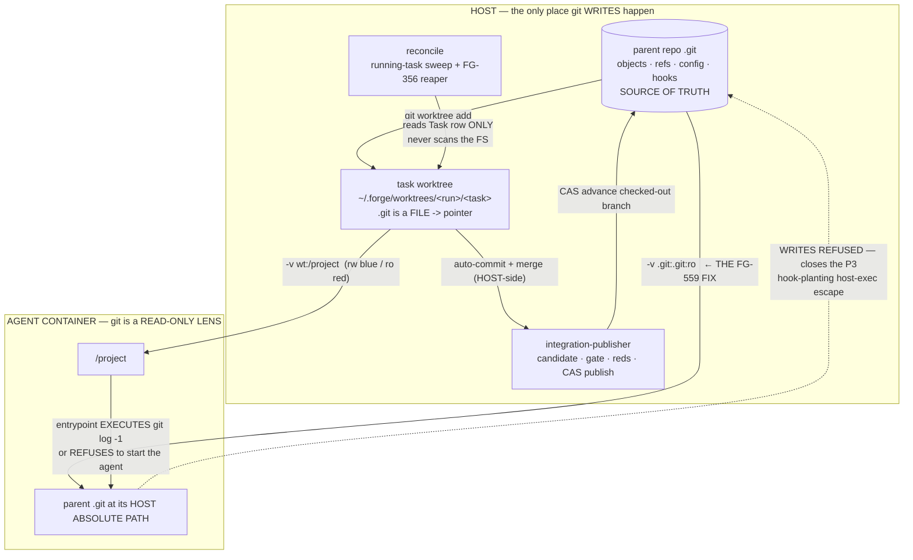

> # ⚠ STATUS — SUPERSEDED DISCOVERY INPUT
>
> This is a **point-in-time architecture/discovery record.** The **binding contract** is
> [`docs/prds/agent-workspace-isolation.md`](../prds/agent-workspace-isolation.md). **Where this plan and the PRD
> differ, THE PRD GOVERNS.** This document remains valid as *evidence* (its executed probes P1–P4 are cited by the
> PRD) but is **not accepted** and is **not a contract**. Do not implement from it where it conflicts with the PRD.
>
> **Known supersessions:**
> - **(a) Red-baseline method.** The red-baseline method used throughout this plan is **replaced by the PRD's
>   four-label method** — VERIFIED FACT / INFERENCE / OPEN QUESTION / **NORMATIVE-UNMET** (PRD §0). Under it, a
>   decision this cluster establishes that the system does not yet implement is **NORMATIVE-UNMET** — it has **no
>   baseline and gets NO red**; it is UNMET, not falsified. So this plan's blanket claim that *every* proposed
>   child carries a baseline-observable red is **wrong for norms** and superseded by **PRD §8.6 + §7.2**.
> - **(b) D10a host-hook-disabling is MANDATORY.** Disabling worktree-supplied hooks on host-side git that runs
>   inside an agent worktree (`-c core.hooksPath=/dev/null`) is **part of the security boundary (PRD D10a)** and
>   **narrows non-goal 4** — it is **NOT** optional defense-in-depth. Everywhere this plan frames host hook
>   disabling as deferred / operator-optional / "worth a story, not required," the PRD governs and it is
>   **mandatory**.

# Foundations — Lane A: workspace isolation (FG-559 + FG-345 + FG-356). **PLAN ONLY. No implementation. No tickets filed.**

**Baseline:** standalone clone at `185afc3` (`origin/main`). · **Epic:** FG-561 foundations campaign.
**Status:** architecture + planning complete; awaiting operator review before any implementation.

**The rule this plan is written under (inherited from FG-551 via `docs/plans/fg553-slice1-architecture.md`):**
*a property concerning RUNTIME BEHAVIOR must be demonstrated by EXECUTING it. A source-pattern match is not
evidence.* Every claim below is labelled **VERIFIED FACT** (file:line or captured probe output), **INFERENCE**
(reasoning from verified facts), or **OPEN QUESTION**.

---

## 0. Honest statement of what this pass could and could not execute

**The task package's baseline claim is FALSE and I am not going to plan around it.** It states
*"Dependencies are installed (node_modules present, Node 24 / ABI 137); `npm run typecheck` and `npx vitest run
<file>` work."*

**VERIFIED FACT — none of that is true in this container:**

| claim | reality (executed) |
|---|---|
| `node_modules` present | **EMPTY** — `ls node_modules \| wc -l` → **0** |
| `npm run typecheck` works | **`sh: 1: tsc: not found`** |
| `npx vitest run <file>` works | vitest downloads, then **`Cannot find package 'better-sqlite3'`** at `src/store/db.ts:1` — **every DB-touching test is unrunnable**, which is all of them |
| (also) docker available | **no daemon**; and no root, no `chroot`, no `unshare` (all "Operation not permitted") |

**Consequences, stated plainly rather than papered over:**
- **I could not run the test suite. `tests_run` is therefore: ZERO forge tests.** In particular **I could NOT
  execute `src/v2/fg530-crash-worktree.worktree.test.ts`**, so "the FG-530 crash lane still reproduces at this
  SHA" is **NOT a verified fact in this plan** — it is an **OPEN QUESTION** with a named falsification test
  (§5, Child 4). *(Independently, those tests are `*.worktree.test.ts` and `preflightWorktreeGate` hard-fails
  on Linux — `worktree-lifecycle.ts:63-68` — so this Linux container could not run them even with deps.)*
- **I could not run docker IN THIS PLANNING CONTAINER.** The ticket's demand — *"prove a REAL
  `git diff <shaA>..<shaB>` succeeds inside a container under that shape, and prove it FAILS today"* — **has since
  been discharged in a REAL container ON THE HOST.** `p5-docker-container-git.sh` was executed on the macOS host
  and its `.out` now records the real run: **DIRECTION 1 (today's shape) fails** with
  `fatal: not a git repository: (null)`; **DIRECTION 2 (the chosen `:ro` parent-`.git` mount) succeeds**;
  DIRECTION 3 (`:ro` project + `:ro` `.git`) refuses every write; DIRECTION 4 (the rejected rw shape) is a
  **confirmed container→host escape**. A companion run under macOS's default symlinked `$TMPDIR`
  (`p5b-symlinked-tmpdir-hazard.out`) found the **path-identity symlink hazard** — the fix silently no-ops on a
  symlinked checkout — now a **binding invariant (PRD D3: canonicalize with `realpath`).**

**What I COULD execute, and did:** real `git` (2.34.1) against real repos and real linked worktrees. FG-559 is
in its entirety a question about **git's path resolution**, and that is exactly what was executed. Four probes,
all rerunnable, all with literal captured output committed alongside this plan:

| probe | script | output | what it settles |
|---|---|---|---|
| P1 | `p1-worktree-gitdir-shape.sh` | `.out` | the `.git` pointer shape; the **minimal sufficient mount set**; that a **read-only** parent `.git` is sufficient for all reads |
| P2 | `p2-rewrite-vs-mount.sh` | `.out` | the object store is **unavoidable**; `GIT_DIR`/pointer **rewriting works** at a clean container path |
| P3 | `p3-write-exposure.sh` | `.out` | **THE SECURITY BOUNDARY** — a rw `.git` is a **container→host code-execution escape** |
| P4 | `p4-fail-loud-detector.sh` | `.out` | the fail-loud detector classifies every case correctly, both directions |
| P5 | `p5-docker-container-git.sh` | `.out` | **EXECUTED ON THE HOST.** Dir 1 (today) FAILS; **Dir 2 (chosen `:ro` parent-`.git` mount) WORKS**; Dir 3 refuses all writes; Dir 4 confirms the container→host escape. |
| P5b | *(host run, annotated)* | `p5b-symlinked-tmpdir-hazard.out` | **EXECUTED ON THE HOST.** Under macOS's default symlinked `$TMPDIR` the chosen fix **silently no-ops** with the identical error → **canonicalize (`realpath`) is a binding invariant (PRD D3).** |

---

## 1. Ground truth — what is ACTUALLY shipped at `185afc3`, and where the tickets are stale

The task brief warned the tickets are partly stale. They are, and **more so than the brief itself says.**

### 1.1 Worktree mode is OPT-IN and macOS-only — this bounds FG-559's blast radius

**VERIFIED FACT.** `isWorktreeModeEnabled()` returns true only when `FORGE_WORKTREES === "1"`, and
`FORGE_NO_WORKTREES=1` is a kill switch that overrides it (`worktree-lifecycle.ts:41-44`).
`preflightWorktreeGate` **hard-fails on Linux** (`worktree-lifecycle.ts:63-68`), refuses non-git projects
(`:71-77`), and refuses a dirty tracked tree unless `FORGE_WORKTREE_IGNORE_DIRTY=1` (`:81-93`).

**INFERENCE (bounding the defect):** FG-559 bites exactly two populations — (a) runs with `FORGE_WORKTREES=1`
on macOS, and (b) any `forge invoke --project <a worktree>` (`invoke.ts:524` passes `args.projectDir` straight
through as the mount). It is **not** breaking the default path today. That is the good news; it is also why
the defect could sit undetected. **It becomes a much bigger deal the moment worktree mode becomes the
default** — which is the direction FG-345 points.

### 1.2 The per-task worktree lifecycle, as it actually is

| stage | what happens | citation |
|---|---|---|
| **create** | `preflightWorktreeGate` → `createWorktree` → `setTaskWorktreePath`, all **before** `runContainer` | `runNext.ts:585-610` |
| **branch identity** | `forge/<runId>/<taskId>` — **deterministic, derived, never stored** | `worktree-lifecycle.ts:28-30` |
| **ref recording** | `Task.worktreePath` (`worktree_path` column), written **durably before the container starts** so reconcile can find it after a restart | `store/tasks.ts:47,76,80-83`; `runNext.ts:580-583,590` |
| **merge-back** | **NOT what the ticket says — see below** | — |
| **removal** | `removeWorktreeIfSafe` — removes **only** if `FORGE_WORKTREES_EPHEMERAL=1` **or** `provenMerged=true` | `worktree-lifecycle.ts:179-223`, esp. the early return at **`:187`** |

### 1.3 **The ticket's merge-back framing is DEAD CODE.** FG-425 superseded it.

**VERIFIED FACT.** `mergeWorktreeBranch` (`worktree-lifecycle.ts:244`) and `mergeIntegrationBranchToHead`
(`:487`) have **ZERO call sites anywhere in `src/`** outside their own definitions and comments. I enumerated
every reference: the only hits are comments and tests. Not only is this deliberate — **there is an enforcement
test asserting it**: `fg425-publisher-scope.test.ts:182` greps for
`/\bmergeIntegrationBranchToHead\s*\(|\bmergeWorktreeBranch\s*\(/` and fails if `runNext` calls either. And
`runNext.ts:95-98` says so in prose: *"runIntegrationGate is deliberately NOT imported here any more — the gate
now runs inside the publisher, against the candidate worktree, never against the publish target."*

**The real path is the FG-425 serialized publisher.** `publishIntegration` (`integration-publisher.ts:393`)
builds a **candidate** worktree, merges the task/child branches into it, **validates the candidate**, and
**CAS-publishes the exact commit it validated**. Three call sites, and they are the whole surface:
`runNext.ts:764` (single step), `:892` (forced republish after a human `gate advance --force`), `:1991`
(fanout). The publish target is **`projectDir`'s checked-out branch** (`publication-target.ts:246-256`).

> **Any plan that proposes "fix the merge-back" is planning against code that no longer runs.** This is the
> single biggest stale-ticket trap in this lane, and it would have produced a plausible, well-formed, wrong plan.

### 1.4 **FG-559 hits REDs directly** — and reds are the population that most needs git

> **⚠ SUPERSEDED → PRD §8.1 + §8.2.** This section's INFERENCE that *"every red/reviewer today runs in a
> container where git is 100% broken — including git diff"* is **corrected by the PRD as FALSE as stated**: reds
> have `tools: ["read"]` and **no Bash**, and their seeds say they cannot run `git diff` — reds never invoke git,
> so nothing is broken for them today and the mount grants them nothing (whether reds ever get a git-read
> capability is the review-trust lane's call, PRD OQ-4). The **real present-tense victim is `test-engineer`**,
> whose seed instructs `git diff HEAD~1` (`seeds/agents/test-engineer/CLAUDE.md:13`). The `spawn.ts:462` citation
> below is also a **miscitation** (that line is in `buildProvisionerDockerArgs`; the project mount mode comes from
> `SpawnContext.PROJECT_MODE`) — **PRD §8.2. THE PRD GOVERNS.**

**VERIFIED FACT.** Reds run against the **candidate worktree**, not the main checkout:
`runRedsAgainst(dir)` (`runNext.ts:711-732`) passes `dir` as `projectDir` into `dispatchReds`
(`runNext.ts:725`, `:1047-1058`), and the publisher calls it from inside `validate(dir, sha)` with the
candidate dir (`integration-publisher.ts:401-407`). The candidate is itself a linked git worktree created by
the publisher. Reds get `-v <dir>:/project:ro` (`spawn.ts:462` for the red/reviewer path).

**INFERENCE:** so in worktree mode, **every red/reviewer today runs in a container where `git` is 100%
broken** — including `git diff`, which is the reviewer's primary instrument. FG-559's "silently degraded"
framing is exactly right, and it lands hardest precisely where trust is being established.

### 1.5 The current mount preflight **cannot see this bug, even in principle**

**VERIFIED FACT.** `preflightProjectMount(projectDir)` (`spawn.ts:479-507`) checks the dir exists, is a
directory, is non-empty, and has a `.git` **or** `package.json`. But **every call site hands it
`args.projectDir` — the MAIN CHECKOUT — never the worktree that is actually bind-mounted**:
`runNext.ts:572`, `:2467`, `:2957`, and `invoke.ts:548`.

Meanwhile the dir actually mounted is `repoRootForMount = args.worktreePath ?? args.projectDir`
(`runNext.ts:2838`). **Demonstrated in P4** (case 1 vs case 2): handed the main checkout the predicate
correctly says `OK plain-checkout`; handed the worktree it says `NEEDS_MOUNT`. The preflight is looking at
the wrong path. This is a prerequisite fix, not a detail.

### 1.6 FG-345's eight "open questions" — scored against the code

| # | question | status |
|---|---|---|
| 1 | **Post-merge integration gate mandatory** (HARD CONSTRAINT 1: semantic cross-file breakage merges CLEAN) | **VERIFIED — DISCHARGED.** `runIntegrationGate` has exactly one production call site: `integration-publisher.ts:404`, inside `validate`, which runs **once per candidate INSIDE the rebuild loop** (so an AD-1 rebase/rebuild **re-gates the rebuilt tree**). Every merge→publish path routes through `publishIntegration` (§1.3). **One honest limit** (below). |
| 2 | **Sequential chaining off the previous step's branch, not all-off-HEAD** | **INFERENCE — achieved, but by a different mechanism than the ticket imagines.** `createWorktree` runs `git worktree add <path> -b <branch>` with `cwd: projectDir` (`worktree-lifecycle.ts:139-142`) → it branches off **projectDir's current HEAD**. The publisher advances **projectDir's checked-out branch** (`publication-target.ts:246-256`). Steps are dispatched sequentially. So step N+1 branches off a HEAD that **already contains step N's published work**. Chaining is *emergent from branch-off-HEAD-after-publish*, not from explicit branch chaining. **Not executed → falsification test named in Child 5.** |
| 3 | **Untracked/ignored files** | **VERIFIED — partially handled, with a real gap.** `createWorktree` collects untracked files via `git ls-files --others --exclude-standard` (`:146-158`) and `runNext.ts:594-598` warns. **The gap: `--exclude-standard` EXCLUDES IGNORED files.** So `.env`, local configs, and anything gitignored are **absent from the worktree AND absent from the diagnostic** — invisible twice. **OPEN**, see §4. |
| 4 | **Dirty tracked state** | **VERIFIED.** Refused by gate 3 unless `FORGE_WORKTREE_IGNORE_DIRTY=1` (`worktree-lifecycle.ts:81-93`). |
| 5 | **Non-git projects** | **VERIFIED.** Refused by gate 2 (`worktree-lifecycle.ts:71-77`). |
| 6 | **Red review timing — pre-merge candidate or post-reconcile merged?** | **VERIFIED — ANSWERED: the CANDIDATE, pre-publish.** Reds are folded into the publisher's validation set via `alsoValidate` and run against the candidate (`runNext.ts:708-711`, `integration-publisher.ts:401-407`). They review **exactly the tree that will land**, and an AD-1 rebuild **re-runs them** against the rebuilt candidate (`runNext.ts:698-701`). A red rejection means **nothing was published** (`runNext.ts:802-806`). This is a strictly better answer than the ticket's two options. |
| 7 | **persistence-check adaptation (FG-354)** | **VERIFIED — SHIPPED.** `runNext.ts:665` → `checkResultPersistence(primaryWorktreePath ?? args.projectDir, result)`; `invoke.ts:798` → `getTask(taskId)?.worktreePath ?? args.projectDir`. **But `createWorktree` still prints a `console.warn` saying FG-354 has NOT landed and the check "may false-fail"** (`worktree-lifecycle.ts:130-134`). **That advisory is now factually WRONG and lies to the operator on every worktree creation.** Deleting it is a one-line honesty fix (Child 5). |
| 8 | **Platform** | **VERIFIED.** Linux hard-fails (`worktree-lifecycle.ts:63-68`); FG-358 tracks it. Out of this lane's scope. |

**The one honest limit on the integration gate (VERIFIED, `integration-gate.ts:39-48,63-65`):** the gate is a
**silent no-op for any project with no `test:unit` script** in `package.json` — it returns
`{ok:true, output:"no test:unit script … — integration gate skipped"}`. For such a project, HARD CONSTRAINT 1
is **not** discharged: semantic cross-file breakage merges clean and ships. That is a deliberate, reasoned
choice ("a project-config gap, not a merge defect"), but it means **"the gate is mandatory" is true of the
code path and false of the guarantee.** Named as an OPEN QUESTION in §4 rather than silently inherited.

### 1.7 FG-356: the leak, precisely

**VERIFIED FACT.** `reconcileRun` calls `removeWorktreeIfSafe` at exactly two places — `reconcile.ts:569-571`
(provisioning-phase crash) and `:681-683` (pre-container crash) — and **both omit `provenMerged`**, so it
defaults to `false`, so `worktree-lifecycle.ts:187` (`if (EPHEMERAL !== "1" && !provenMerged) return;`)
**returns immediately. Outside EPHEMERAL test mode, reconcile has NO filesystem side-effect whatsoever.** The
code says so itself at `reconcile.ts:676-679`: *"the worktree call passes provenMerged=false, so outside
EPHEMERAL mode it is a no-op … discarding is never reconcile's call (invariant 4)."*

**And the sharper fact that determines the reaper's whole shape — VERIFIED, `reconcile.ts:452`:**

```
for (const t of tasksForRun(runId)) {
  if (t.status !== "running") continue;      // <-- reconcile's sweep is RUNNING-ONLY
```

**The FG-530 crash lane kills at `finalizePrimary:between-complete-status-and-event`** — i.e. **after** the
terminal status is written, **before** cleanup runs. On restart that task is `complete`, so
**reconcile's main loop `continue`s past it forever. Its worktree is never revisited by anything.**

> **Therefore a reaper bolted into reconcile's running-task loop CANNOT fix FG-530's leak.** It would fix only
> the orphan case and would look correct while leaving the demonstrated leak wide open — the exact
> adjacent-thing-satisfying-the-assertion failure this campaign forbids. **The reaper must sweep TERMINAL tasks
> with a non-null `worktree_path`.** See §4.

---

## 2. FG-559 — decision

### 2.1 What was executed, and what it proves

**VERIFIED FACT (P1).** A linked worktree's `.git` is a **file**, 58 bytes, containing
`gitdir: <parent>/.git/worktrees/<name>` — **an absolute HOST path**. `objects/`, `refs/`, `config`, `HEAD`
live **only** in the parent's common dir (reached from the per-worktree gitdir by the relative `commondir` file,
`../..`). The worktree directory itself contains **zero** object-store entries. On the real forge host these are
two entirely disjoint subtrees: worktrees live under `~/.forge/worktrees/<runId>/<taskId>`
(`util/paths.ts:11,46`), the parent repo lives wherever the operator keeps it. **Bind-mounting the worktree
therefore conveys none of the repository.**

**VERIFIED FACT (P1, executed) — the mount-set matrix.** `git log`, `git diff A..B`, `git show`, `git blame`,
`git status`, `git diff HEAD`, run in a view where only the listed paths exist:

| mount set | result |
|---|---|
| **SET 0 — worktree dir only (TODAY)** | **ALL SIX FAIL**: `fatal: not a git repository: …/.git/worktrees/…` |
| SET 1 — + the gitdir target only (no object store) | all fail |
| SET 2 — + `objects` (still no `refs`/`config`/`HEAD`) | all fail |
| **SET 3 — + `refs` + `packed-refs` + `HEAD` + `config`** | **ALL SIX OK** ← minimal sufficient set |
| SET 4 — the entire parent `.git` | ALL SIX OK |
| **SET 5 — the entire parent `.git`, READ-ONLY** | **ALL SIX OK** ← *the load-bearing result* |

**VERIFIED FACT (P2/Q1).** With every other path present but **`objects` absent**, git does not merely fail to
diff — it **refuses to recognise the repository at all**. **The object store is unavoidable.** No amount of
`GIT_DIR`/`core.worktree` rewriting can synthesize content that is not mounted. *(This answers required probe 2
in the negative: rewriting cannot avoid the object store.)*

**VERIFIED FACT (P2/Q2).** Rewriting *can*, however, avoid the **host absolute path**. With the parent `.git`
mounted at a clean container path (`/gitcommon`) and the host path absent, **all four of these work**:
rewriting the `.git` pointer file (2b); `GIT_DIR` + `GIT_WORK_TREE` env **even with the broken pointer file
still on disk** (2c); `GIT_DIR` + `GIT_COMMON_DIR` + `GIT_WORK_TREE` (2d); and the per-worktree `gitdir`
back-pointer is **irrelevant** to read commands (2e). *(So path-identity is a CHOICE, not a necessity — which
is why it has to be justified rather than assumed.)*

**HONEST SCOPE OF P1–P4 (do not overclaim).** These reproduce the container's **path-visibility**, which is
what a bind mount *is* for the purposes of git's resolution: `-v H:C` makes host path `H` readable at `C` and
leaves every other host path absent. They are **not a container**: they do not test Docker's boundary, uid
mapping, macOS gRPC-FUSE/VirtioFS behavior, or Docker's auto-creation of nested parent dirs for a
path-identity mount. **P5 has since closed that gap: `p5-docker-container-git.sh` was executed in a REAL Docker
container on the macOS host** — DIRECTION 1 (today) fails, DIRECTION 2 (the chosen `:ro` parent-`.git` mount)
works, DIRECTION 3 refuses all writes, DIRECTION 4 confirms the container→host escape. **The symlinked-`$TMPDIR`
run (`p5b-symlinked-tmpdir-hazard.out`) additionally exposed the path-identity symlink hazard — now a binding
invariant (PRD D3).** The P1–P4 path-visibility results and the P5/P5b container runs agree; proving both
directions in a real container is **Child 1's acceptance gate (AC-1/AC-2), now already captured.**

### 2.2 THE SECURITY CONSEQUENCE — this is what decides it (P3, executed)

The ticket asks what a rw parent-`.git` mount exposes for a blue agent. The answer is worse than ref mutation.

**VERIFIED FACT (P3, Scenario A — parent `.git` mounted READ-WRITE):**

- **A1 — the container REWROTE the host repo's `main`.** `git update-ref refs/heads/main <evil>` succeeded;
  the host repo's `main` moved from `2581354…` to `7b9fd0e…`.
- **A2 — the container wrote a loose object into the host's object store**, confirmed present via the host's
  own `git cat-file -e`.
- **A3 — CONTAINER → HOST CODE EXECUTION.** git hooks live in the **common** `.git/hooks`, which is **shared by
  every linked worktree**. The container planted `.git/hooks/pre-commit`. Then **forge's own host-side
  merge-back auto-commit** (`worktree-lifecycle.ts:274-279` / the publisher's equivalent at
  `integration-publisher.ts:~301`, `execFileSync("git", ["commit", …])`) **executed it, on the host, as the host
  user.** Captured verbatim:

  ```
  *** YES — THE HOST EXECUTED THE CONTAINER'S CODE ***
      HOST CODE EXECUTION as agent at /tmp/fg559-p3/host/dotforge/worktrees/run1/task1
  ```

  **No agent misbehaviour is needed beyond writing one file into the mounted `.git`.** The trigger is forge's
  own plumbing, on the ordinary success path. This is not a theoretical escape.

**VERIFIED FACT (P3, Scenario B — parent `.git` mounted READ-ONLY):** B1 ref rewrite **refused**; B2 object
write **refused**; B3 hook plant **refused (`Permission denied`)**; B4 `git log`/`show`/`blame` **all still
work**; B5 **in-container `git commit` FAILS** — the one real cost, addressed below.

### 2.3 DECISION

> **⚠ SUPERSEDED / INCOMPLETE → PRD D1–D4, D10, §8.7.** This is the **original, incomplete** mount shape. The PRD
> governs and adds three things §2.3 lacks: **(1) canonicalization (D3)** — the mount host+target paths MUST be
> `realpath`-resolved, else the fix **silently no-ops on a symlinked checkout** (observed in P5b / PRD AC-3);
> **(2) the blue worktree-local `.git` pointer seam (D10b)** — for a rw `/project` the pointer file is
> attacker-controlled and MUST be frozen `:ro` over itself (observed-red P6b / AC-7), which §2.3's "host absolute
> path, `:ro`" does not contemplate; **(3) mandatory host hook-disabling (D10a)** — `-c core.hooksPath=/dev/null`
> on host git in an agent worktree is **part of the boundary**, not the deferred aside §2.6 frames. **Do NOT
> implement the §2.3 mount as written — implement PRD D1–D4 + D10. THE PRD GOVERNS.**

> **Bind-mount the parent repo's common `.git` at its HOST ABSOLUTE PATH, READ-ONLY (`:ro`), for EVERY agent
> class — blue and red alike. The container's git becomes a READ-ONLY HISTORY LENS. It is never a writable VCS.
> Every git WRITE (auto-commit, merge, publication) stays on the host, where it already is.**
>
> Ship it together with the two-layer fail-loud detector (§2.5). Neither alone is the fix.

Concretely, one extra mount alongside the existing `-v <root>:/project:<mode>`, whenever the effective mount
root's `.git` is a **file**: `-v <parentCommonDir>:<parentCommonDir>:ro`. Mounting the whole common dir also
covers the per-worktree gitdir, which lives inside it at `.git/worktrees/<name>` — one mount, not two.

**Why read-only for BLUE too, not just red.** The isolation promise of worktrees is the whole point of FG-345;
a blue agent is an LLM, not a trusted process. P3 shows rw hands it the host repo's refs, the host's object
store, and **host code execution via forge's own merge-back**. There is no fine-grained middle ground: an
in-container commit must write **objects** (common dir) *and* update `refs/heads/forge/<run>/<task>` (also the
common dir, `refs/` — a linked worktree's branch ref is not worktree-local), so any mount permissive enough to
allow a commit is permissive enough for A1 and A2. **Read-only is not a hardening tweak; it is the boundary.**

**Why path-identity, when P2 proves rewriting also works.** The `.git` pointer file is **shared state between
the host and the container** — the host runs git *in that same worktree* (the publisher's auto-commit/merge).
So:
- A **persistent host-side rewrite** of the pointer would break the **host's own** git in that worktree. Non-starter.
- A **container-side rewrite** needs `/project` **writable** — which reds do not have (`:ro`), and reds are
  precisely the population that needs git. It would work for blue and fail for red: the worst possible split.
- **`GIT_DIR` env** works for both (P2/2c) but is **sticky**: it applies to *every* git invocation anywhere in
  the container, so an agent running git in any other directory (a nested clone, a vendored repo, a scratch
  checkout) is **silently hijacked** — a fresh instance of exactly the silent-wrongness class FG-559 exists to
  kill. Rejected on principle, not on feasibility.
- **Path-identity needs no rewrite, no env var, and is uniform across `:ro` and `:rw`.** Its cost is that the
  container's filesystem mirrors one host path. **Accept that cost.**

**Rejected alternatives (the ticket's four directions, scored):**

| direction | verdict |
|---|---|
| **1. Mount the gitdir target + object store** | **CHOSEN**, in its whole-common-dir, path-identity, **read-only** form. |
| **2. Rewrite `.git`/`GIT_DIR` inside the container** | **Rejected — on scope, not feasibility** (P2 proves it works). Needs `/project` rw → **breaks for reds**; or `GIT_DIR` env → **sticky hijack**. |
| **3. Give the agent a standalone clone** | **Rejected.** A clone is a **different object graph**: the task branch would have to be pushed back, and FG-425's CAS model — validate a candidate SHA, publish *that exact commit* by compare-and-swap (`integration-publisher.ts:393`+) — assumes a **shared object store**. It re-introduces the merge semantics FG-425 deleted, doubles disk per task, and still leaves `forge invoke --project <worktree>` broken. |
| **4. Fail loudly on a dangling gitdir** | **Necessary but NOT sufficient — ship it AS WELL, never INSTEAD.** Alone it converts silent wrongness into a hard refusal that **kills worktree mode for every reviewer, red, and fixer**. It is the safety net, not the fix. |

### 2.4 The accepted cost, stated up front

**In-container `git commit` will fail (VERIFIED, P3/B5).** Today's contract comment says *"agents are expected
to commit their work on the task branch"* with host-side auto-commit as a safety net
(`worktree-lifecycle.ts:238-243`). Under this decision **the safety net becomes the only commit path** — which
in practice it very nearly is already, since the publisher auto-stages and commits the worktree itself.

Two things follow, and they are **implementation-visible, not optional**:
1. **The agent-facing contract must say so explicitly** (task package / seed): *"/project is a git worktree with
   READ-ONLY history. Use git to READ (log/diff/show/blame). Do NOT commit — forge commits and publishes for
   you."* An agent that discovers this by hitting a permission error will burn turns and may report failure.
2. **The entrypoint refusal message (§2.5) must say the same thing**, so the failure mode is self-explaining.

> **RESOLVED → PRD D5 / §8.5 (OQ-1).** The PRD grepped the in-repo seed corpus: **no containerized agent seed
> instructs `git commit`** (`seeds/agents/**`). D5a is purely additive; the only residual is drift in the
> operator's installed `~/.forge` copy, tracked as **PRD OQ-1**. The open question below is answered for the
> shipped seeds. **THE PRD GOVERNS.**

**OPEN QUESTION (operator):** do any installed seeds instruct agents to `git commit`? I could not grep `~/.forge`
seeds from here (they are host-installed; `seeds/` in-repo is the source, not the installed copy). If some do,
they need the one-line contract change above. **Default if unanswered: ship read-only and fix the seeds.**

### 2.5 The fail-loud detector — where it lives, what it inspects, what it does

> **⚠ SUPERSEDED / INCOMPLETE → PRD D6, D3, D10 (§8.7).** The detector below is correct in shape but incomplete:
> **Layer 1 MUST compare CANONICAL (`realpath`) paths (D3)** — the plain "assert both are in the mount set" check
> misses the symlink no-op (P5b / AC-3); and **Layer 2's executed `git log -1` PASSES against a hijacked
> standalone-gitdir pointer** (observed-red P6b / AC-7), so it does NOT by itself close the blue pointer seam —
> that is D10b's job. The two layers are necessary, not sufficient. **THE PRD GOVERNS.**

FG-559 requires that **silent degradation be impossible regardless of which fix is chosen.** Two layers, because
each catches what the other cannot. **Both are exercised in P4.**

**Layer 1 — HOST-SIDE preflight** (home: `spawn.ts`, alongside `preflightProjectMount:479`).
- **Input: the EFFECTIVE MOUNT ROOT — `worktreePath ?? projectDir`** (`runNext.ts:2838`'s `repoRootForMount`).
  **This is itself a required fix**: today every call site passes `args.projectDir` (`runNext.ts:572`, `:2467`,
  `:2957`; `invoke.ts:548`), so the preflight is structurally blind to the bug (§1.5, P4 case 1).
- **Inspects:** `<root>/.git`. A **directory** → ordinary checkout, nothing to do. A **file** → parse
  `gitdir: <target>`, resolve the common dir via `<target>/commondir`, and **assert both are in the mount set
  being built**. Pointer **dangling on the host** → the worktree is corrupt.
- **Does:** refuse the dispatch with a named error (not `ERR_*` noise) before any container starts.
- **P4 evidence:** main checkout → `OK plain-checkout`; worktree → `NEEDS_MOUNT /…/proj/.git (gitdir=…)`;
  parent repo gone → `DANGLING /…`; non-git dir → `OK not-a-git-repo`.

**Layer 2 — CONTAINER-SIDE assertion** (home: `docker/agent-entrypoint.sh`, which has **zero git awareness**
today — verified by reading it).
- **Inspects:** if `/project/.git` exists at all, **EXECUTE** `git -C /project rev-parse --git-dir && git -C
  /project log -1`.
- **Does:** on failure, **exit non-zero with a named error BEFORE the agent process starts.**
- **Why this layer is the one that actually discharges FG-559:** it tests the **runtime property by executing
  it**, rather than inferring it from the docker argv that was *supposed* to produce it. A plausible-but-wrong
  mount set — the exact failure shape FG-551 legislates against — passes Layer 1 and **dies at Layer 2**.
- **P4 evidence, both directions:** today's shape → `REFUSE … fatal: not a git repository` ⇒ *"detector REFUSED
  — silent degradation prevented"*; fixed shape → `PASS git is usable inside the container`.

**Policy per agent class: REFUSE for ALL containerized dispatches. Do NOT vary by role.**
This is a considered answer to the ticket's *"refuse vs warn per agent class"*, and the answer is **no
role-conditional trust**. Rationale: once the mount ships, a dangling gitdir means something is genuinely broken;
"warn for blue, refuse for red" is precisely the reasoning by which a reviewer eventually ends up reviewing
without git — the exact outcome FG-559 exists to prevent, re-introduced through a policy door.
**Escape hatch:** `FORGE_ALLOW_DANGLING_GITDIR=1` downgrades Layer 2 to a loud warning — matching forge's
existing kill-switch idiom (`FORGE_NO_WORKTREES`, `FORGE_NO_NM_SHADOW`, `FORGE_WORKTREE_IGNORE_DIRTY`).

### 2.6 Defense in depth — worth a story, not required by the decision

> **⚠ SUPERSEDED → PRD D10 / D10a (and PRD §8.7).** This section frames disabling repo hooks in forge's host-side
> plumbing as optional hardening ("worth a story, not required by the decision," "belongs in its own reviewable
> story … not smuggled into the mount fix"). **The PRD makes it MANDATORY for host git that runs inside an agent
> worktree** — after the PRD's P6b observed-red, the worktree-local `.git` pointer is attacker-controlled for a rw
> class, so `-c core.hooksPath=/dev/null` on agent-worktree-cwd invocations (D10a) plus freezing the pointer
> `:ro` (D10b) **is the security boundary, not defense-in-depth.** Non-goal 4 is narrowed to match: only the
> **non-agent-worktree** broadening stays operator-optional (PRD OQ-5). The reasoning below stands as discovery;
> its "not required" conclusion does not. **THE PRD GOVERNS.**

**INFERENCE from P3/A3.** Forge's own host-side git plumbing (auto-commit, merges) runs the repo's hooks. With
`.git` mounted `:ro` the container cannot plant one, so the escape is closed *by the mount*. But forge's
**bookkeeping commits are forge's plumbing, not the user's commits**, and running arbitrary repo hooks inside
them is gratuitous authority. Running forge's internal git with `-c core.hooksPath=/dev/null` closes A3
independently of the mount mode — so a future loosening of the mount cannot silently re-open it.
**Trade-off, stated:** a repo's legitimate `pre-commit` (formatter, linter) would stop running on forge's
auto-commit. **I recommend disabling** — a bookkeeping commit that reformats the agent's diff is a bug, not a
feature — but it is a behavior change and belongs in its own reviewable story (Child 6), not smuggled into the
mount fix.

---

## 3. Architecture

> **⚠ INCOMPLETE → PRD §6 (§8.7).** This diagram shows the original mount fix but **predates two binding
> additions**: the **D10b** worktree-local `.git`-pointer `:ro` freeze (the blue seam) and **D3**
> canonicalization of every mount path. Implement the governing trust boundary from the PRD §6 diagram, not this
> one. **THE PRD GOVERNS.**



The dashed edge is the architectural claim: **the container may read the repository and may never write it.**
The `.git` mount is one-directional by construction, and the entrypoint assertion is what makes the claim
*checked* rather than *asserted*.

---

## 4. FG-345 remaining scope + FG-356 reaper spec

### 4.1 FG-345 — what is genuinely still open (everything else is VERIFIED in §1.6)

| open item | proposed resolution |
|---|---|
| **Ignored files are invisible twice** (§1.6 #3) — `--exclude-standard` hides them from the worktree *and* from the diagnostic | **Decision: report, do not copy.** Copying ignored files (`.env`, caches, `node_modules`) into the worktree would defeat FG-376's dependency-volume design (`spawn.ts:289-299`) and risks leaking secrets into a branch the publisher will commit. Extend the existing diagnostic to a SECOND list ("ignored files present in the main checkout, absent from your worktree") via `git ls-files --others --ignored --exclude-standard`, and surface it to the agent, not just to stderr. **The gap becomes visible instead of silent** — the same principle as FG-559. |
| **The integration gate is a silent no-op without a `test:unit` script** (§1.6, `integration-gate.ts:63-65`) | **OPEN QUESTION for the operator.** HARD CONSTRAINT 1 is discharged *for forge itself* (it has `test:unit`) and **not discharged for any project lacking one** — those projects get clean-merging semantic breakage, exactly what the constraint forbids. Options: (a) keep skipping (today), (b) skip but record a **durable, visible "gate not enforced" marker on the publication attempt** so the trust gap is auditable, (c) refuse to publish without a gate command. **Default if unanswered: (b)** — it makes the hole visible without breaking every non-JS project. Not this lane's to decide alone; it touches the review-trust lane's validation contract. |
| **Sequential chaining is emergent, not explicit** (§1.6 #2) | Accept the emergent mechanism (it is simpler and it already works), but **pin it with a test** so a future change to the publish target or dispatch order cannot silently turn it into all-off-HEAD. Child 5. |
| **The stale FG-354 advisory** (`worktree-lifecycle.ts:130-134`) | Delete it. It tells operators a shipped fix has not shipped. Child 5. |

### 4.2 FG-356 — the reaper, specified

**WHERE IT HOOKS.** **Not** inside reconcile's running-task loop. As established in §1.7 (`reconcile.ts:452`),
that loop `continue`s past every terminal task — so it structurally cannot see the FG-530 leak, which is a task
that **already reached a terminal status**. The reaper is a **separate pass in `reconcileRun`** over:

> **every task of the run whose `worktree_path` is NOT NULL and whose status is TERMINAL** (complete, failed,
> cancelled, blocked_by_red).

This single input set covers **both** leaks — the crashed-after-status-write case (FG-530) *and* the
orphaned-and-finalized case — with one predicate.

**WHAT IT READS: the Task row, and nothing else.** `t.worktreePath`, `t.status`, its failure kind, `t.runId`,
`t.id`, plus `run.projectDir`. **NO filesystem scanning of `WORKTREES_DIR`.** This is a hard constraint, not a
preference: forge supports **concurrent runs** (the entire FG-425 publication lane exists because of it), so a
directory scan **cannot distinguish another live run's worktree from an orphan**. The Task row is the only
authority for who owns a worktree. A scan-based reaper would eventually delete live work.

**THE RETAIN PREDICATE.** Retain (do **NOT** remove) if **ANY** of:

- **(a) The worktree has CHANGED FILES.** reconcile already computes exactly this —
  `changedWorktreeFiles(path)` (`reconcile.ts:229-240`, `git status --porcelain`). **This is the load-bearing
  clause**: it makes the reaper safe *even if the failure-kind list below is later extended and someone forgets
  to update it*. Unmerged work is never discarded — reconcile's own invariant 4 ("discarding is never
  reconcile's call", `reconcile.ts:678-679`) survives intact.
- **(b) The failure kind is in the INSPECTION-RETAIN set** — FG-352's retain-on-conflict, generalized to every
  kind whose *diagnosis requires the tree*. From `failure-kind.ts:125-143`: `merge_conflict`,
  `integration_failed`, `integration_gate_timeout`, `integration_gate_crashed`, `publish_base_churn`,
  `dirty_publish_target`, `publication_refused`, `orphaned_work_may_persist`, `orphaned_needs_finalize`,
  `oom_killed`, `fanout_wave_orphaned`.
- **(c) The task is not terminal.**

**REAP only when: terminal AND kind ∉ retain-set AND the worktree is CLEAN.** That is provably-nothing-to-lose —
in practice `pre_container_crash`, `provisioning_phase_crash`, plain `orphaned` with an empty tree, and the
FG-530 case (a `complete` task whose work was already published, so its worktree is clean and redundant).

**A NEW, NAMED CONDITION — do not lie with `provenMerged`.** `removeWorktreeIfSafe` today permits removal on
exactly two conditions: `EPHEMERAL` or `provenMerged` (`worktree-lifecycle.ts:187`). The reaper needs a **third**:
*proven-empty*. It **must be an explicit new parameter**. Passing `provenMerged: true` from the reaper would be
a **false claim that a merge happened** — it would silently widen the no-discard invariant for every other
caller, and a later reader would have no way to tell the two apart. This is the single easiest way to implement
FG-356 wrongly.

**IDEMPOTENCY CONTRACT.**
- The reaper is a **pure function of (Task row, filesystem presence)**. Running it twice ≡ running it once.
- It **never writes task state** — no status transitions, no events that change control flow. (An audit event
  recording *what was reaped* is fine and wanted; it must not be load-bearing.)
- `removeWorktreeIfSafe` already no-ops on an absent path (`worktree-lifecycle.ts:189`); a failed
  `git worktree remove` is swallowed and simply retried next pass, matching the existing best-effort posture
  (`:207`, `:220`).
- **The branch is part of the leak**: `forge/<runId>/<taskId>` must be pruned under the *same* predicate
  (`git branch -D`, as `:216` already does). A reaper that removes the directory and leaves the ref has
  half-fixed FG-356 — refs accumulate forever and `git worktree prune` will not touch them.
- Because it reads only terminal rows and deletes only clean trees, it is safe to run on **every** reconcile
  pass, and safe to run **concurrently** with a live run on the same project (it can never select that run's
  live worktrees — they are not terminal).

---

## 5. Proposed child stories — **PLAN CONTENT ONLY. NOT FILED.**

> **⚠ SUPERSEDED → PRD §8.6 + the four-label method (PRD §0).** The claim that **every** child carries a
> falsification test "observed RED against this baseline" is **correct for factual defects and wrong for norms.**
> The PRD reclassifies Child 3 (agent-facing read-only-git contract) and the Child 2 / Child 4 **mutants** as
> **NORMATIVE-UNMET / test-strength checks with NO baseline red** — they mutate code that does not exist yet, so
> there is nothing to redden against this baseline. Only genuine defects (Child 0/1/4-leak/5) take observed-red.
> **THE PRD GOVERNS.**

Ordered. Each is independently implementable, independently reviewable, and carries a **falsification test that
can be observed RED against this baseline**.

| # | child | scope | depends on | acceptance (EXECUTED) + named RED test |
|---|---|---|---|---|
| **0** | **Preflight the path that is actually mounted** | `preflightProjectMount` is handed the **effective mount root** (`worktreePath ?? projectDir`) at all four call sites (`runNext.ts:572`, `:2467`, `:2957`; `invoke.ts:548`). Pure plumbing; **no new policy.** | — | **RED today:** a test asserting the preflight receives the worktree path fails at every call site (P4 case 1 shows the predicate is handed the main checkout and reports `OK`). **Why first:** every later check keys off this argument; done later, Children 1–2 would be written against the wrong path and would *look* correct. |
| **1** | **FG-559 mount: parent `.git` at its host absolute path, `:ro`** | When the effective mount root's `.git` is a FILE, add `-v <commonDir>:<commonDir>:ro` for **every** agent class. `spawn.ts` mount construction. *(Shape governed by PRD D1–D4 + D10: build from `realpath`'d paths and add the D10b worktree-local-`.git` `:ro` freeze — §8.7.)* | 0 | **`p5-docker-container-git.sh` HAS NOW BEEN EXECUTED ON THE HOST — both directions, in a REAL container.** Direction 1 (today): `git diff A..B` in the container **FAILED** (captured, `p5…out`). Direction 2 (fixed): the same `git diff A..B` **SUCCEEDED** (captured). **RED baseline captured** (P1/SET 0 + P5 DIRECTION 1). **Reject the hollow version:** asserting the docker argv contains the `-v` string. *That is a source-pattern match, and FG-551 forbids it* — the assertion must be **git succeeding inside the container**. |
| **2** | **FG-559 fail-loud: two-layer detector** | Layer 1 host predicate (`spawn.ts`); Layer 2 **executed** assertion in `docker/agent-entrypoint.sh`. REFUSE for all classes; `FORGE_ALLOW_DANGLING_GITDIR=1` downgrades Layer 2 to a warning. Refusal text states the read-only-history contract (§2.4). | 0 | **RED today:** dispatch a red against a worktree with no `.git` mount → today the agent **starts and runs**; after this child it **refuses before the agent process starts**. Executed in a real container. **Mutant that must redden:** make Layer 2 check only that `/project/.git` *exists* (rather than executing `git log -1`) → must go red, because today's broken shape has a `.git` file that exists and is useless. |
| **3** | **Agent-facing read-only-git contract** | Task package / seed text: */project's git history is READ-ONLY; read with log/diff/show/blame; do not commit — forge commits and publishes for you.* Resolves the §2.4 cost. | 1 | A blue agent that attempts `git commit` gets a **self-explaining** refusal, not a bare permission error. **Blocked on the §2.4 OPEN QUESTION** (do installed seeds tell agents to commit?). |
| **4** | **FG-356 reaper** | The terminal-task pass of §4.2: Task-row-only input, the three-clause retain predicate, the **new explicit `provenEmpty` condition** on `removeWorktreeIfSafe`, branch pruning, idempotency. | — (parallel with 0–3) | **RED baseline — MUST BE OBSERVED FIRST, and I could NOT observe it (§0):** run `src/v2/fg530-crash-worktree.worktree.test.ts` **on the macOS host** and confirm that killing at `finalizePrimary:between-complete-status-and-event` leaks a worktree + branch that **no reconcile pass ever removes** (predicted by `reconcile.ts:452`, but **predicted, not executed**). **If that RED does not reproduce, this child's premise is wrong and the spec must be re-derived before any code is written.** Then: (i) the leak is reaped; (ii) a `merge_conflict` worktree is **RETAINED**; (iii) a worktree with changed files is **RETAINED** even under a reapable kind; (iv) running the reaper twice ≡ once; (v) a **concurrent live run's** worktrees are untouched. **Mutant:** pass `provenMerged:true` instead of the new condition → the retain tests must redden. |
| **5** | **FG-345 truth-up: diagnostics + the stale advisory + pin the chaining** | Delete the false FG-354 advisory (`worktree-lifecycle.ts:130-134`). Add the **ignored-files** second diagnostic (§4.1) and surface it to the agent. Add the test that **pins sequential chaining** (§1.6 #2). | — (parallel) | **RED today:** a test asserting `createWorktree` does not warn about FG-354 fails (the `console.warn` is there). Chaining test: step 2's worktree base **contains** step 1's published commit — red if a future change makes steps branch all-off-a-stale-HEAD. |
| **6** | **Defense in depth: no repo hooks in forge's own git plumbing** ⚠ **SUPERSEDED → PRD D10a.** Disabling worktree-supplied hooks on host-side git that runs **inside an agent worktree** is **MANDATORY** — part of D10a's security boundary, **not** optional defense-in-depth. The PRD narrows non-goal 4 accordingly: only broadening hook-disabling to forge's git against the **main checkout / fresh candidate worktrees** (no agent has written) stays operator-optional (PRD OQ-5). The "needs the operator's call" framing below applies ONLY to that broader, non-agent-worktree case; the agent-worktree case is not optional. **THE PRD GOVERNS.** | `-c core.hooksPath=/dev/null` on forge's internal auto-commit/merge invocations (§2.6). ~~**Behavior change — needs the operator's call.**~~ *(superseded — mandatory for agent-worktree cwd per D10a)* | 1 | **RED today — and it is P3/A3, already captured:** a hook planted in `.git/hooks/pre-commit` **is executed by the host** during forge's auto-commit. After this child, the same hook does **not** run. |

**Dependencies and parallelism.** **0 → 1 → 2 → 3** is the FG-559 chain and must be sequential (each keys off
the previous one's argument/mount). **4 (FG-356)** and **5 (FG-345 truth-up)** are **fully independent of the
FG-559 chain and of each other** — three lanes can run in parallel. **6** depends on 1 landing (it is only
*needed* once the mount exists) and is gated on an operator decision. **⚠ SUPERSEDED → PRD D10a / OQ-5:** the
**agent-worktree** hook-disabling in Child 6 is **MANDATORY (D10a)**, not operator-gated; only broadening it to
forge's git against the **main checkout / fresh candidate worktrees** remains an operator decision (OQ-5). **THE
PRD GOVERNS.**

**Ship 0 before anything else.** It is small and boring, and every later check keys off the argument it fixes.

---

## 6. Cross-lane coupling — what this plan touches that the other lanes plausibly touch

This campaign also runs a **review-trust lane** (FG-566/FG-541/FG-524/FG-525) and a **lifecycle-semantics lane**
(FG-477/FG-527). Named specifically, for the integration artifact:

| surface | this lane's change | who else plausibly touches it |
|---|---|---|
| **`src/v2/reconcile.ts`** | **Adds a NEW terminal-task pass** (§4.2). Does **not** modify the running-task loop, and **writes no task state**. | **Lifecycle-semantics lane, high-collision.** FG-477/FG-527 are about lifecycle transitions — i.e. the *running-task loop* and the failure-kind landings. **Coordination point:** if that lane adds or renames a failure kind, it **must** be classified into or out of my **inspection-retain set** (§4.2b). A new kind that silently defaults to "reapable" would let the reaper delete a tree someone needs to diagnose. The changed-files clause (§4.2a) is the backstop, but do not rely on it. |
| **`src/v2/failure-kind.ts` (the kind union)** | **Reads** it (retain set). Adds no kind. | **Lifecycle-semantics lane** — likely adds/renames kinds. See above. |
| **The `Task` row / `worktree_path` column** | **Reads only.** No schema change, no new column. | Both lanes read it. **No write conflict from me.** |
| **`src/v2/runNext.ts`** | Child 0 touches **four `preflightProjectMount` call sites only** (`:572`, `:2467`, `:2957`). No control-flow change. | **Review-trust lane, moderate.** `runNext.ts` is where reds are dispatched (`:711-732`, `:1047`) and where the publisher is called (`:764`, `:892`, `:1991`). My edits are argument-level and should rebase cleanly, **but they are in the same file**. |
| **`src/v2/spawn.ts` (mount construction)** | **The FG-559 mount + Layer-1 preflight.** The most substantive change in this lane. | **Review-trust lane, HIGH — and this is the important one.** FG-559 changes *what a red can see*: after Child 1, **reds get working `git diff` for the first time**. Any review-trust work that assumes reviewers can/cannot use git, or that ships evidence *because* reviewers lack git, **must be re-derived against this**. **The two lanes should agree on this before either lands.** |
| **`docker/agent-entrypoint.sh`** | Layer-2 executed git assertion (Child 2). File has **no git awareness** today. | Review-trust lane, if it injects reviewer context at container start. |
| **The validation contract (`ValidationResult` / `alsoValidate` / `integration-gate.ts`)** | **Reads only** — but §4.1 raises the **"gate is a silent no-op without `test:unit`"** hole, which is **squarely a review-trust question**. I explicitly do **not** decide it here. | **Review-trust lane owns the decision.** I recommend option (b): a durable "gate not enforced" marker on the publication attempt. |
| **`review-loop.ts` / the lineage classifier** | **Not touched by this plan.** | Review-trust lane. Flagged only so the integration artifact can record "Lane A asserts no change here." |
| **Agent seeds / task-package text** | Child 3 adds the read-only-git contract line. | **Review-trust lane, moderate** — it also edits reviewer-facing seed text. Textual collision likely; semantic conflict unlikely. |

> **⚠ SUPERSEDED → PRD §8.1.** The `spawn.ts` row's claim that *"after Child 1, reds get working `git diff` for
> the first time"* is **false as stated** — reds have no Bash and never invoke git; the mount is a **precondition**
> for a future review-trust decision (PRD OQ-4), not a delivered capability. The cross-lane coordination point
> still stands, but as a precondition, not a granted benefit. **THE PRD GOVERNS.**

---

## 7. Post-FG-561 revalidation triggers (FG-553 / FG-555 are in flight on another lane)

FG-553 moves the **control runtime** into a release directory behind an atomic `current` symlink, with an
`exec`-not-`spawn` PATH shim (`docs/plans/fg553-slice1-architecture.md` §1). **Named explicitly: which of my
conclusions must be RE-VERIFIED if that promotion mechanism lands.**

1. **Anything assuming `forge` executes the WORKING TREE.** My probe harness and Children 0/1/2 assume the code
   under test is the code in the checkout. Post-promotion, **`forge` runs the promoted release, not the working
   tree** — so an acceptance test that edits `spawn.ts` and runs `forge` **would test the OLD mount logic and
   pass green while proving nothing.** That is FG-553's F23/F25 hazard applied to my lane. **Every executed
   acceptance test in Children 0–2 must be re-confirmed to run against the artifact it thinks it is testing**
   (`forge-dev` vs `forge`), or it is worthless. **This is the highest-value trigger in this section.**
2. **The `.git` mount path itself.** My decision mounts the **parent repo's** `.git`. FG-553 introduces a
   **release directory** as a *second* code location. If any forge-internal git operation is ever run against a
   *release* rather than the project, its `.git` (if any) is **not** covered by my mount rule. **Re-verify the
   effective mount root's definition** (`runNext.ts:2838`) survives the runtime split unchanged.
3. **The dev/stable runtime split vs the worktree gates.** `preflightWorktreeGate` hard-fails on Linux and
   refuses a dirty tree (`worktree-lifecycle.ts:63-93`). FG-553's `forge-dev` runs from a **dev worktree** —
   which is itself a **linked git worktree of the forge repo**. **If forge-dev's own worktree is ever handed to
   `--project`, it hits FG-559 exactly.** My fix covers it (the detector is mount-root-general, not
   forge-specific), but this should be **explicitly re-tested** after FG-553, not assumed.
4. **The `p5` docker probe's assumptions.** It runs `git` in a stock image, independent of forge's runtime — so
   it is **insensitive** to FG-553. **This is deliberate**, and it is why P5 stays valid as the acceptance gate
   for Child 1 across the promotion change.
5. **NOT affected (stated so it is not re-litigated):** P1–P4's conclusions are about **git's** path resolution,
   not forge's runtime. FG-553 cannot change them. The **FG-356 reaper** reads only the Task row and the
   filesystem — no runtime assumption — though its *tests* inherit trigger #1.

---

## 8. Risks / open

- **RESOLVED BY EXECUTION — the real-container proof IS DONE (§0).** `p5-docker-container-git.sh` was executed
  in a REAL Docker container on the macOS host: DIRECTION 1 (today's shape) fails, **DIRECTION 2 (the chosen
  `:ro` parent-`.git` mount) works**, DIRECTION 3 refuses every write, DIRECTION 4 confirms the container→host
  escape. The mount shape no longer rests on inference about Docker bind-mount semantics.
- **HIGH — path-identity mounting is NOT symlink-safe (`p5b-symlinked-tmpdir-hazard.out`).** Under macOS's
  default symlinked `$TMPDIR`, the chosen fix's DIRECTION 2 **silently no-ops with the identical
  `fatal: not a git repository: (null)`** the unfixed system produces. **The mount MUST be built from `realpath`'d
  paths and the detector MUST compare canonical paths — now a binding invariant (PRD D3 / I-2 / AC-3).** If
  path-identity is otherwise rejected, **P2 already proves the fallback works** (clean container path + pointer
  rewrite for rw / env for ro) — the decision changes, the analysis does not.
- **HIGH — FG-356's red baseline is PREDICTED, NOT OBSERVED (§0, Child 4).** `reconcile.ts:452` makes the leak
  a near-certainty, but I could not execute `fg530-crash-worktree.worktree.test.ts` (empty `node_modules`;
  Linux). **Observe the RED on the host before writing the reaper.**
- **MEDIUM — read-only `.git` breaks in-container `git commit` (§2.4, VERIFIED P3/B5).** Mitigated by the
  host-side auto-commit that already exists and by Child 3's contract text. **Residual risk: agent seeds that
  instruct committing.** Open question for the operator.
- **MEDIUM — the integration gate is a silent no-op for projects with no `test:unit` script**
  (`integration-gate.ts:63-65`). **HARD CONSTRAINT 1 is discharged for forge and NOT for such projects.**
  Escalated to the review-trust lane rather than decided here (§4.1).
- **MEDIUM — ignored files are absent from the worktree and absent from the diagnostic** (§1.6 #3). Silent, and
  exactly the class of defect this lane exists to kill. Child 5.
- **LOW — the stale FG-354 advisory actively lies to operators** on every worktree creation
  (`worktree-lifecycle.ts:130-134`). One line. Child 5.
- **RESOLVED BY EXECUTION — "can a blue agent mutate the host repo from inside a container?"** **Yes, and worse
  — it can execute code on the host** (P3/A3). This is why the mount is read-only for every class, not just for
  reds.

## 9. Gate

**STOP. Operator review required before any implementation.** No child tickets filed; §5 is plan content only.
On approval, the remaining evidence action is: run `fg530-crash-worktree.worktree.test.ts` on the host to
**observe** FG-356's red baseline (still NOT observed — §8, PRD AC-5). **`p5-docker-container-git.sh` has
already been run on the host** — Child 1's acceptance is now a container-executed fact, and `p5b` established
the canonicalization invariant — so that gate is discharged. Only then file Children 0–6 and dispatch
**Child 0**.
