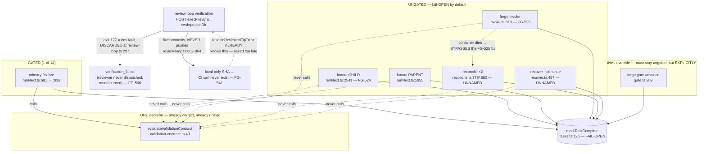

# Foundations Lane B — REVIEW TRUST. Architecture + plan (FG-566 · FG-541 · FG-524 · FG-525)

> **STATUS — SUPERSEDED DISCOVERY INPUT.** Binding contract is `docs/prds/review-execution-trust.md`; where
> they differ, **the PRD GOVERNS.** This document is evidence/architecture/probes, not a normative surface.
> **Known supersessions:**
> - **(a) Red-baseline method.** The PRD's **four-label method** replaces this plan's blanket "every story has
>   a baseline red." An unbuilt contract (e.g. B0's absent finalize-site guard) is **NORMATIVE-UNMET** — it
>   gets an acceptance condition + verification method, **NOT** a "red today by construction" fabricated red.
> - **(b) Finalize-site enumeration unit.** The unit is the PRD's **lineage-classified finalize EVENT**
>   (INV-1), **not** a primitive-call-site allowlist. Because `finalizePrimary` collapses the gated primary
>   and the exempt aggregate onto one `markTaskComplete` write (`runNext.ts:1010`), a call-site allowlist
>   cannot express the gate's classification; the PRD enumerates finalize EVENTS keyed on lineage/role.

**STOP FOR REVIEW. No children filed. No implementation. No source touched.**

**Baseline:** `185afc3` (origin/main). **Runtime of every probe:** node **v24.18.0**, ABI (`NODE_MODULE_VERSION`)
**137**, linux arm64.
**Quality bar / house style:** `docs/plans/fg553-slice1-architecture.md`.

**The rule this plan is written under (inherited from FG-551):** *a property concerning runtime behaviour must be
demonstrated by EXECUTING the artifact. A source-pattern match is not evidence.* Every claim below is labelled
**VERIFIED FACT** (file:line, or captured probe output), **INFERENCE**, or **OPEN QUESTION**.

---

## 0. The thesis, and what the evidence did to it

The brief binds four tickets under one failure class: **a trust gate enforced on one path and silently absent on
another.** The evidence confirms that class and **widens it**. The four tickets name four seams. There are
**seven** finalize seams, and the three the tickets do *not* name are the crash-recovery paths — which means
fixing FG-525 as written would leave a bypass that a container crash walks straight through.

The root cause is one line of architecture, and it is not any of the four tickets:

> **VERIFIED FACT — enforcement lives at the CALLER, not at the PRIMITIVE.** `evaluateValidationContract`
> (`src/v2/validation-contract.ts:49`) is invoked by exactly one function, `holdIfValidationContractFails`
> (`runNext.ts:967`), which is itself called from exactly **one** site: `runNext.ts:681`, inside
> `dispatchSingleStep`. `markTaskComplete` (`src/store/tasks.ts:126`) has **fourteen** production callers
> (declaration and tests excluded): `runNext.ts:936`, `:1010`, `:1381`, `:1661`, `:2541`; `invoke.ts:768`,
> `:813`; `reconcile.ts:779`, `:880`; `gate.ts:209`; `design.ts:138`, `:146`, `:150`; `claude.ts:404`. Only
> the primary finalize (reached through `:1010` from `dispatchSingleStep`) is behind the validation gate; the
> rest are ungated by construction. *(Count corrected from an earlier "ten"; the primitive-call-site framing
> here is superseded by the PRD's lineage-classified finalize-EVENT unit — INV-1. See the header.)*

So a new finalize path is **ungated by default**. The system fails **open**. FG-524 and FG-525 are not two bugs;
they are two *instances* of a defaulting rule, and the instances will keep coming until the default is inverted.

---

## 1. Ground truth — the seams

### 1.1 The finalize seams (the FG-523/524/525 surface)

**VERIFIED FACT — the complete census.** Every writer of `status='complete'` in `src/` (two task-finalize store
functions: `markTaskComplete` `tasks.ts:126`, `markTaskRecovered` `tasks.ts:154`; run-level closers exist too but
are **not** task finalizes and are excluded here). Classification of each call site:

| # | Site | file:line | Implementer-reachable? | Gated? |
|---|---|---|---|---|
| 1 | primary, `dispatchSingleStep` | `runNext.ts:681` → `:838` | yes | **YES** — the only one |
| 2 | **fanout CHILD** | `runNext.ts:2541` | yes | **NO** — *FG-524* |
| 3 | **fanout PARENT** | `runNext.ts:1955` | yes (aggregate) | **NO** — no hold call on this path at all |
| 4 | **`forge invoke`** | `invoke.ts:813` | yes | **NO** — *FG-525* |
| 5 | **reconcile, valid result** | `reconcile.ts:779` | yes | **NO** — ***unnamed by any ticket*** |
| 6 | **reconcile, stream-recovered result** | `reconcile.ts:880` | yes | **NO** — ***unnamed by any ticket*** |
| 7 | **`forge recover --continue`** | `recover.ts:457` (`markTaskRecovered`) | yes | **NO** — ***unnamed by any ticket*** |
| — | red task finalize | `runNext.ts:1381` | no | exempt *by role* |
| — | `forge gate advance` | `gate.ts:209` | yes | **intentionally** ungated — this IS the override |
| — | post-gate re-entry | `runNext.ts:936`, `:1661` | yes | **intentionally** ungated — decision already recorded |
| — | `design.ts:138/146/150`, `claude.ts:404` | — | no | not implementer tasks |

**The fifth/sixth/seventh sites, stated precisely.** `reconcile.ts:779` and `:880` complete a task when
`isInvokeLikeRun` is true (`reconcile.ts:416`, `= !taskHasPipelineFinalize(run)`, `run-kind.ts:22`). A workflow
primary is protected — it lands `failPipelineUnfinalized` instead (`reconcile.ts:771`, `:873`) — so
`validation-contract.ts:12`'s claim *"reconcile never completes a workflow primary"* is **VERIFIED TRUE**. But an
**invoke-like** run's task *is* completed there, and an invoke-like task can carry `agentRole: "engineer"`. FG-525
gates `invoke.ts:813`; it does **not** gate the path that completes the *same task* when its container dies and
reconcile sweeps it. Same for `forge recover --continue` (`recover.ts:457`), which adopts a result into `complete`.

> **INFERENCE (high confidence, from a fully traced guard; NOT executed).** An implementer `forge invoke` whose
> container is orphaned, then reconciled or `recover --continue`'d, completes with no `tests_run` and no waiver
> **even after FG-525 lands as written**. This is a *bypass of the fix*, not merely a fourth instance. It is
> carried below as a required falsification (Story B3/F9), because I did not execute it — reaching it needs a
> container-gone state I could not stage without Docker (see §2.4).

**A suspicion the evidence REFUTED — recorded because refuting it is the discipline.** I initially flagged
`invoke.ts:768` (the FG-337 "inferred result" path) as an eighth ungated site. It is **not** a gap:
`inferredResultFrom` returns `undefined` for any role where `requiresStructuredResult(role)` is true
(`inferred-result.ts:15`), and `requiresStructuredResult` is `!NARRATIVE_ROLES.has(role)`
(`role-capabilities.ts:22`), with `NARRATIVE_ROLES` = {research-specialist, research-primary, research-skeptic,
prompt-author, manual-qa} (`role-capabilities.ts:13-20`). No implementer role can ever receive an inferred
result. **Naturally exempt, not a hole.** (Note the asymmetry: `reconcile.ts:829` composes
`structured ?? inferredResultFrom(...)`, and the `structured` half — `recoverStructuredStreamResult` — is **not**
role-gated, which is exactly why site 6 *is* real.)

**The fanout parent (site 3) deserves its own sentence.** `holdIfValidationContractFails` is never called on the
fanout path at all; `dispatchFanoutStep` goes straight to `finalizePrimary` (`runNext.ts:1955`). The exemption is
deliberate and documented (`runNext.ts:963-966`: the parent's result is a synthetic aggregate that never carries
`tests_run`). That reasoning is sound **only if the children are gated.** They are not. So today the exemption
launders: the parent completes carrying an aggregate of *unvalidated children* — **proven by execution**, §2.3.

### 1.2 The verification seams (the FG-566/FG-541 surface)

**VERIFIED FACT — review-loop verification runs on the HOST, in `ctx.projectDir`, with ambient PATH.**
`makeDefaultRunner` (`review-loop.ts:292-302`) is a bare `execFileSync` with a `cwd`; `runVerification`
(`review-loop.ts:309-321`) runs `npm run --silent <script>`. No container anywhere in this path. There are
**three** host-local `runVerify` call sites, all `{ cwd: ctx.projectDir }` — and the brief only implies one:

| site | `cli/commands/review-loop.ts` | when |
|---|---|---|
| a | `:544` | **dirty tree** — CI is never consulted |
| b | `:622` | CI unavailable → **local fallback** (the FG-566 path the ticket names) |
| c | `:853` | the **fixer's** post-revert pre-commit verification |

> **This matters for FG-566's scope.** A readiness gate placed only at (b) leaves (a) and (c) misclassifying an
> unprepared environment exactly as before. All three must be guarded.

**VERIFIED FACT — the environment signal exists at the exec boundary and is DISCARDED.**
`runVerification` returns `VerificationStep { name, ok, output }` (`review-loop.ts:283`). `makeDefaultRunner`'s
catch (`:297-300`) keeps `stdout`/`stderr` and **throws away `err.status`** — the exit code. My probe shows
`npm run typecheck` in an unprepared clone exits **127** (`sh: 1: tsc: not found`), the canonical shell
"command not found" code. **127 is machine-readable proof of an environment fault, and Forge already has it in
hand and drops it.** A genuine type error and a missing toolchain are then literally the same shape.

**VERIFIED FACT — `ok:false` also fires when there are NO checks at all.** `review-loop.ts:320`:
`ok = steps.length > 0 && steps.every(s => s.ok)`. An empty script set is reported as *verification failed*.

**VERIFIED FACT — the fixer commits and never pushes.** `cli/commands/review-loop.ts:862-864`:
`git add -A` → `git commit -m "fix(review-loop): address <TICKET> review findings (round <N>)"` → `rev-parse HEAD`.
The complete set of git verbs in that file is `add, checkout, clean, commit, rev-parse, rm, status`. **There is no
`push`.** (Probe §2.2 greps both review-loop files and finds none.)

**VERIFIED FACT — the stale comment, quoted.** `cli/commands/review-loop.ts:848-851`:

```
// In-scope changes from this round survive the revert — verify + commit
// them normally rather than aborting the whole round. Fast tier by
// default (FG-501 AC5): the fixer's commit gets pushed and CI runs
// test:extended as a required check; --local-extended restores the full tier.
```

**It asserts the opposite of the code it sits on.** Nothing pushes. Nothing causes CI to run. `test:extended` is
therefore not "delegated to CI" — it is **delegated to nobody**, and the extended tier is simply never run.

**What it should say** (content, not wording — the engineer picks the words):
> The fixer verifies the fast tier (typecheck+test) and commits **locally**. Forge does **not** push. The
> resulting commit is therefore **local-only**: no CI check can exist for it, `test:extended` is **not** covered
> by anything, and the tip cannot become closeable until a human publishes it (FG-502/FG-514 reviewed-tip trust).

**VERIFIED FACT — the false claim is not confined to a comment; it is in the data.**
`cli/commands/review-loop.ts:621`: `const extendedDelegatedToCi = !ctx.localExtended;` — set unconditionally on the
local-fallback outcome (`:624`), including when HEAD is a local-only fixer commit that no CI will ever see. The
`VerificationResult.ciOutcome` type documents this field as *"records whether test:extended was skipped locally
(the review-loop default) or actually run"* (`v2/review-loop.ts:278-280`). On the fixer path it records a
delegation that does not happen.

**VERIFIED FACT — the machinery to detect this ALREADY EXISTS, and is consulted too late.**
`resolveReviewedTipTrust` (`cli/commands/review-loop.ts:454-468`) already returns
`trusted | local_only | remote_ahead | diverged | remote_unavailable`, and `local_only` already withholds
closeability with the correct instruction — *"Push the branch and re-run `forge review-loop`"* (`:1078-1084`,
`process.exitCode = 1`). But it is computed **at the end**, for the closeability verdict only. `verifyWithReuse`
(`:540`) never asks it. So the loop spends a round — and up to a full `CI_WAIT_TIMEOUT` of polling (`:580-594`) —
probing CI for a SHA that **cannot be there**, then reports the generic `CI unavailable: <reason>` (`:620`).

> **This is the whole FG-541 defect in one sentence:** Forge already knows the tip is local-only; it just doesn't
> ask itself until after it has burned the round.

### 1.3 The FG-523 evaluator (what we are extending)

**VERIFIED FACT.** `src/v2/validation-contract.ts` (76 lines, zero imports):
- `IMPLEMENTER_ROLES` = {engineer, frontend-specialist, backend-specialist, security-advisor,
  agentic-platform-builder} (`:32-38`). Everything else — reds, test-engineer, docs, research, manual-qa,
  architect, tech-lead, prompt-author — is exempt **by role** (`:53`).
- Subject only to `status === "complete"` results (`:61`).
- Waiver field `no_validation_reason` (`WAIVER_FIELD`, `:47`); a non-empty string waives, and the waiver is
  **recorded as an event** (`runNext.ts:985-992`).
- Otherwise requires `tests_run` to be a finite number `> 0` (`:67`); else `{held:true, reason}`.
- **Hold semantics:** `markTaskHeldForGate` (`tasks.ts:224`) CAS → `awaiting_gate`; the **named reason travels on
  the event payload**, not a column — `task.awaiting_gate` with `payload:{kind:"validation_contract", reason}`
  (`runNext.ts:977-981`), rendered back by `gateHoldReason` (`show.ts:533-541`).

> **Consequence, and it is a gift: FG-524 and FG-525 need NO schema migration.** `awaiting_gate` already exists
> (`types/index.ts:82`), `markTaskHeldForGate` already exists, and the hold reason is already an event payload
> that `forge show` renders for free.

**VERIFIED FACT — the header comment is now stale in the way FG-525 requires fixing.**
`validation-contract.ts:15-21` names both gaps as knowingly-open. Once FG-525 lands, `:17-19` ("Ungated for now —
a human/orchestrator reads every invoke result. Whether to gate it is FG-525.") becomes false and must state the
invoke path's real status.

---

## 2. Probes — rerunnable, with captured output

All three scripts live in `docs/plans/foundations-lane-b-probes/` and reproduce their `.out` verbatim.

| probe | script | output |
|---|---|---|
| FG-566 falsification #1 | `fg566-unprepared-env.sh` | `fg566-unprepared-env.out` |
| FG-541 evidence reconstruction (+ the stale comment) | `fg541-fixer-commit-never-pushed.sh` | `fg541-fixer-commit-never-pushed.out` |
| FG-524 / FG-525 reachability | `fg524-fg525-ungated-finalize.sh` | `fg524-fg525-ungated-finalize.out` |

### 2.0 An unplanned finding: **the baseline handed to this task WAS the FG-566 condition**

**VERIFIED FACT.** The task brief asserted *"Dependencies installed (Node 24 / ABI 137); `npm run typecheck` and
`npx vitest run <file>` work."* In the container as delivered, `/project/node_modules` contained **0 entries**.
`npm run typecheck` exited **127** (`sh: 1: tsc: not found`); `npm run test` exited **1**
(`ERR_MODULE_NOT_FOUND`). (The brief is also wrong about the runner: this repo uses `node --test`, not vitest —
`package.json` `test:unit`.)

I repaired it with `npm ci` (exit 0), after which `npm run typecheck` exits **0** and `better-sqlite3` loads.
Every probe above was then run against a genuinely prepared host.

> This is not a complaint; it is **evidence**. An orchestrator-prepared environment silently shipped unprepared,
> and the only reason it did not burn a review round is that a human noticed. That is precisely FG-566's failure,
> reproduced by accident, in the campaign that is fixing it. It also quietly raises FG-566's priority: the
> condition is not exotic.

### 2.1 FG-566 — an unprepared environment is misclassified as a code failure *(EXECUTED)*

Method: clone `/project` at HEAD into a scratch dir **without installing deps**; run the **real**
`runVerification` and the **real** `runReviewLoop` (only the reviewer/fixer are instrumented, to observe whether
they were dispatched). Captured:

```
=== step 2: runVerification in the UNPREPARED clone (no node_modules) ===
verification.ok : false
  step typecheck  ok=false output: sh: 1: tsc: not found
  step test       ok=false output: ... ERR_MODULE_NOT_FOUND ...

=== step 3: CONTROL — runVerification on the SAME SHA in the PREPARED repo ===
verification.ok : true

>>> SAME SOURCE. Unprepared env => ok=false ; prepared env => ok=true
>>> The ok:false is attributable to the ENVIRONMENT, not the code.

=== step 4: drive the REAL runReviewLoop with that unprepared-env verification ===
stopReason              : verification_failed
closeable               : false
ROUNDS CONSUMED         : 2 of maxRounds=2
REVIEWER dispatched     : 0   <-- REVIEW NEVER HAPPENED
FIXER dispatched        : 1   <-- the fixer got the ENVIRONMENT error as a code finding

What the fixer was actually asked to fix:
  - deterministic verification step 'typecheck' failed: / sh: 1: tsc: not found
  - deterministic verification step 'test' failed: / node:internal/modules/package_json_reader:301
```

**All three FG-566 claims confirmed by execution:** the reviewer is **never** dispatched (the short-circuit at
`v2/review-loop.ts:441` returns before the `deps.review()` call at `:481`), **both** rounds are consumed, and the
fixer is dispatched to fix *"tsc: not found"* — an unanchored "code finding" manufactured by
`verificationFindings` (`v2/review-loop.ts:402-406`).

### 2.2 FG-541 — the six fixer SHAs *(EXECUTED: git archaeology + source census)*

The probe attacks the question from two independent directions and is explicit about which one carries the weight.

**(A) STRUCTURAL — decisive, and timing-independent.** No `push` exists in either review-loop file (grep returns
no match; the git-verb census is `add checkout clean commit rev-parse rm status`). The next round computes the
SHA to probe as `git rev-parse HEAD` (`:548`) — which *is* the just-created, unpushed commit — and hands it to
`probeCiGateStatus` (`:571-573`). **GitHub cannot hold a check-run for an object it has never received.**

**(B) HISTORICAL — corroborating.** All six SHAs are genuine review-loop fixer commits (subjects match the format
string at `:863` exactly), and each reached `origin/main` only *later*, via a PR merge:

```
SHA       COMMITTED (local)          ON ORIGIN/MAIN BY (merge)  LAG
17087bd   2026-07-11T23:30:47-07:00  2026-07-12T00:36:14-07:00  65m  (via af57d25, PR #109)
afce93d   2026-07-12T00:05:53-07:00  2026-07-12T00:36:14-07:00  30m  (via af57d25, PR #109)
2e701f6   2026-07-11T23:00:08-07:00  2026-07-12T00:36:14-07:00  96m  (via af57d25, PR #109)
8a652ad   2026-07-12T02:00:59-07:00  2026-07-12T03:09:17-07:00  68m  (via 07cb63e, PR #110)
5bc8ae2   2026-07-12T01:39:12-07:00  2026-07-12T03:09:17-07:00  90m  (via 07cb63e, PR #110)
c77c9a4   2026-07-12T02:42:40-07:00  2026-07-12T03:09:17-07:00  26m  (via 07cb63e, PR #110)
```

> **The ticket's corrected conclusion is CONFIRMED.** The "CI registration race / delay" explanation was **wrong**.
> This is an **ABSENCE, not a RACE**: the commit is not on the remote to be registered, so waiting longer cannot
> help. Any blind registration delay is a **non-fix** — which is exactly why FG-541 lists it as a NON-GOAL, and
> the evidence now says *why* rather than merely asserting it.

> **HONEST LIMIT (stated in the probe itself).** A clone carries no reflog of when `origin` *first received* a
> branch push, so (B) bounds *"on origin BY the merge"*, not *"first on origin AT"*. That instant is
> **irrelevant** to the conclusion, because (A) does not depend on any timing. I am not claiming (B) proves the
> case; (A) does, and (B) rules out the coincidence.

### 2.3 FG-524 / FG-525 — both gaps REACHABLE *(EXECUTED, real dispatch paths, real SQLite)*

Method: drive the **real** `runNext` → `dispatchFanoutStep` and the **real** `invoke`, against a real store. The
**only** stub is `dockerExec` — the same injection point the repo's own fanout tests use
(`fg519-fanout-mixed-phase.worktree.test.ts`). The contraband result is
`{status:"complete", summary:"shipped it, trust me"}` — no `tests_run`, no waiver.

```
=== ARM 1 (control) — the FG-523 evaluator, run directly ===
  evaluator says : {"held":true,"reason":"validation contract: engineer returned status=complete with
                    no tests_run and no no_validation_reason waiver — held for a gate decision"}
  >>> CONFIRMED contraband. A PRIMARY carrying this result is HELD at awaiting_gate.

=== ARM 2 (FG-524) — fanout implementer CHILDREN, via the real dispatchFanoutStep ===
  children dispatched : 2
    child task-build-0-b6b95d   agentRole: engineer   STATUS: complete  <-- COMPLETED SILENTLY
    child task-build-1-6953f5   agentRole: engineer   STATUS: complete  <-- COMPLETED SILENTLY
  fanout PARENT status : complete
  parent result        : {"status":"complete","children":[ ...both contraband results... ]}

=== ARM 3 (FG-525) — `forge invoke` ad-hoc implementer, via the real invoke path ===
  taskId: task-engineer-8a1bc1   agentRole: engineer   STATUS: complete  <-- COMPLETED SILENTLY

=== VERDICT ===
  Same role. Same result. Three finalize paths:
    PRIMARY      (runNext.ts:681 holdIfValidationContractFails) -> HELD      (gate enforced)
    FANOUT CHILD (runNext.ts:2541 markTaskComplete)             -> COMPLETE  (gate absent)  FG-524
    INVOKE       (invoke.ts:813  markTaskComplete)              -> COMPLETE  (gate absent)  FG-525
```

**Both gaps are reachable through the real dispatch path.** Neither is a documentation defect. ARM 1 is the
load-bearing control: the evaluator is *real and correct* — it is simply **not called**. And the fanout **parent**
completed too, carrying an aggregate of two unvalidated children (site 3, §1.1).

### 2.4 What I could NOT reach, and what that changes

**Sites 5/6/7 (reconcile ×2, `recover --continue`) were NOT executed.** Reaching them needs a genuine
container-gone state (`docker inspect` evidence), and Docker is unavailable in this container (`docker ps` fails).
I traced the guard (`reconcile.ts:416` → `:768`/`:869`) and the role reachability completely, so the finding is a
**strong INFERENCE**, not a VERIFIED FACT. **This is exactly the distinction the campaign exists to enforce, so I
will not launder it.** It is carried as required falsification **F9** (Story B3) — and it must be executed there,
because if it holds, FG-525-as-written ships with a hole.

**Baseline test health (VERIFIED FACT):** `review-loop.test.ts`, `validation-contract.test.ts`,
`host-verifications.test.ts` → **180 tests, 180 pass, 0 fail.** The suite is green *because nothing tests these
paths* — which is itself the finding.

---

## 3. Decisions

### FG-566 — RESOLVED: **provision the clone in place (host-side, lockfile-keyed, docker-free), detect first, and REFUSE rather than guess a runtime.**

**The decision the ticket left open is forced by a schema key the ticket never mentions.**

`host_verifications` is indexed and queried on **`(ticket_id, project_dir, commit_sha, gate_name)`**
(`store/schema.ts:162-177`), and `project_dir` is an **exact match dimension** — the only normalization is a lexical
`path.resolve` (`host-verifications.ts:45-47`), deliberately confined to path *spelling*, not path *identity*
(FG-431's note at `:39-44`). `deriveRequiredGateList` reads `package.json` **from `projectDir`** (`:27`), and
`resolveCiPairing` reads `.github/workflows` **from `projectDir`** (`:217`, `:252`).

> **Therefore: if local verification EXECUTES somewhere other than `ctx.projectDir`, the entire covering-evidence
> model silently stops matching.** A run in a scratch clone would either be invisible to
> `findCoveringGateEvidence` (different `project_dir` → `null` → pointless re-run), or would have to be recorded
> under the *logical* `projectDir` — a row asserting *"this gate passed in `/Users/steve/src/forge`"* when it did
> not, with **no trace in the row that it ran elsewhere**. That is the manufacture of false gate evidence. It is
> the exact failure class this entire lane exists to eliminate, and we will not introduce it as a side effect of
> fixing it.

**So: verification keeps executing in `ctx.projectDir`, and provisioning installs INTO `ctx.projectDir`.** The
thing we install (`node_modules`) is git-ignored — **not source, not the lockfile** — so this honours the ticket's
*"never mutate the reviewed source/lockfile"* boundary while leaving the evidence model **completely unchanged**
(zero schema change, zero dishonest rows). *The evidence key chose the mechanism; convenience didn't.*

**REJECTED — reuse the FG-376 container dependency cache.** With evidence, because it is superficially the
"obvious reuse":
- Its payload is a **named Docker volume** (`forge-deps-<hash>-<slug>`, `dependency-provisioning.ts:115-118`) and
  its provisioner **is a container** (`spawn.ts:453`, `docker/agent-entrypoint.sh:91-99`). **Docker is required.**
- It is **darwin-gated** and fires **only on worktree-rw dispatch** (`runNext.ts:2839-2845`).
- The review-loop's verification is a **host `execFileSync`** with **no container anywhere** (`review-loop.ts:292`).
  Adopting FG-376 means putting review-loop verification *inside a container* — a hard new Docker dependency on
  `forge review-loop`, which today has none — and it drags runtime selection into exactly FG-555's contested turf.
- **Nothing in either review-loop file imports it.** The seam is real, not incidental.

**ADOPTED — the vocabulary, from both existing contracts, so we invent no third:**
- **The disposition name already exists.** `verification_environment_unavailable` is **already a `FailureKind`**
  (`failure-kind.ts:151`, from FG-376) and is already classified as an **infra fault, not a code fault**, by
  campaign policy (`campaign/policy.ts:62` → `"campaign_system"`). Reusing it means the review-loop's new outcome
  is correctly classified by machinery that already exists. *This is the single biggest reuse win in the lane.*
- **The mechanism shape already exists and is already host-drivable.** `docker/forge-test.sh` maintains a
  fingerprinted, repairable dependency environment, **requires no Docker**, and is *explicitly* designed to be
  driven from the host: `FORGE_SRC_DIR`/`FORGE_WORK_DIR` exist *"so the sync/repair logic can be driven against
  temp dirs from a host-side test"* (`:39-42`), with the fingerprint using `node` rather than `md5sum` precisely so
  it works on a macOS host (`:161-162`). It **already** carries the distinction FG-566 wants, verbatim:
  `forge-test: this is an ENVIRONMENT failure, not a test failure — do not report it as red tests.` (exit 2 +
  `FATAL:`). Its four diagnosis reasons (`:245-253`) and its probes (`_node_modules_is_empty`, `_tsx_loads`,
  `_sqlite_loads`, `_deps_tree_intact`) are the readiness vocabulary — reuse them; do not re-derive them.
- **OPEN QUESTION (for the engineer, not for me):** two cache-key schemes already exist —
  sha256(`package-lock.json`)[:16] (`dependency-provisioning.ts:47`) vs sha1(`package.json`+`package-lock.json`)
  (`forge-test.sh:160-171`). FG-566 must pick **one of these two**, not a third. I have no architectural basis to
  prefer either; the constraint is only *"do not mint a third."*

**Belt AND braces — detect before, classify after.** A pre-check alone can be fooled (a subtly broken tree passes
the probes, then `tsc` still isn't found). So:
1. **Pre-check (prevents the burn):** immediately before **each** of the three real local-run sites — `:544`
   (dirty tree), `:622` (CI-unavailable fallback), `:853` (fixer pre-commit) — assert readiness. Not
   unconditionally: **CI reuse must never pay for provisioning**, so this sits *after* the covering-evidence /
   CI-status branches resolve, exactly where the ticket says (and where F4 will hold us to it).
2. **Post-classify (makes misclassification impossible):** **stop discarding the exit code.**
   `makeDefaultRunner` (`review-loop.ts:297-300`) catches and drops `err.status`. My probe proves `npm` exits
   **127** on a missing toolchain. Preserve the exit status on `VerificationStep` so a 127/ENOENT is *evidence of
   an environment fault* and can never be laundered into a code finding — even if the pre-check passed.

**The disposition.** `verification_environment_unavailable` is a **loop outcome, not a round**: **zero rounds
consumed**, **neither reviewer nor fixer dispatched**, **one** actionable recovery instruction. It must be
distinguishable from `verification_failed` at *every* surface it reaches — CLI, `--json`, the run note
(`review-loop.md`), events, dashboard. **Explicitly: no surface may say a reviewer reviewed anything when
verification prevented reviewer dispatch** (this is FG-566's own AC, and it is the honesty half of the ticket).

**The runtime — where I stop, and why.** FG-566's AC demands provisioning *"using the declared verification
runtime"*. FG-555 owns R3/R4 — the **launched-workload runtime contract** — and FG-566 is instructed not to
pre-empt it. Resolution: **FG-566 declares and RECORDS a runtime; it does not SELECT one.** Default: Forge's own
`process.execPath` / `process.versions.modules`, recorded in the evidence alongside the lockfile hash. If the
project declares a runtime Forge cannot satisfy, **REFUSE before round 1** with
`verification_environment_unavailable` — *do not guess, do not search PATH.* That is a declaration, not a second
selection mechanism, so it cannot contradict FG-555.

> **OPEN QUESTION (human, and it is FG-555's to settle):** "verification runtime == Forge's control runtime" is
> true for forge-reviewing-forge and **false in general** (a reviewed project may require a different Node than
> Forge runs under). I am proceeding on the default above and **refusing rather than guessing** on the mismatch.
> When FG-555 lands its contract, this default is the one line that changes.

> **[PRD D1.4 GOVERNS this decision.]** The PRD names this runtime paragraph advisory and **D1.4 authoritative**
> (declares + records a runtime, refuses on mismatch, never selects). Content matches; when FG-555 lands its
> launched-workload runtime contract, D1.4's default is the one line that re-points (PRD OQ-1).

> **BOUNDARY — do not mutate a checkout Forge does not own.** The ticket forbids mutating the live `main`
> checkout. Installing `node_modules` into a Forge-owned clone/worktree is repair; doing it to the operator's live
> checkout is a side effect they did not ask for. **Decision: provision only into a workspace Forge owns (or on
> explicit operator opt-in); otherwise DETECT and refuse with the recovery instruction.** Detection is the floor
> and is always safe; provisioning is the ceiling and is authority-bounded.

### FG-541 — RESOLVED: **(c) + (b). Default no-push with an HONEST `local_only` outcome (unconditional); `--push-fixes` as an explicit, authority-gated opt-in.**

The three options are **not on one axis**, and conflating them is what produced the stale comment. There are two
independent questions:

**Q1 — is the verification outcome HONEST? (not optional; not a choice)**
Every option needs this. Even auto-push must land honestly when the push fails. So this ships **unconditionally,
first, and alone**:
1. **Ask `resolveReviewedTipTrust` BEFORE probing CI, not after.** The function already exists (`:454-468`) and already
   computes exactly the needed fact; it is simply consulted too late (only at `:1073`, for closeability). If HEAD
   is `local_only`, **skip the CI probe entirely** — do not poll, do not wait out `CI_WAIT_TIMEOUT` (`:580-594`)
   for a check-run that **cannot exist**. *The machinery is there; wire it earlier.*
2. **A distinct `local_only` verification outcome**, separate from generic `remote_unavailable`/"CI unavailable"
   (`:620`), naming the unpushed SHA(s) and the one recovery instruction.
3. **`extendedDelegatedToCi` must be FALSE when the tip is local-only** (`:621`). Today it is unconditionally
   `!ctx.localExtended` — a claim that CI is covering `test:extended` when no CI will ever see the commit.
   **Extended coverage is not delegated; it is absent.** Say so.
4. **Fix the comment** (`:848-851`) to say what the code does (§1.2).

**Q2 — should Forge acquire PUSH authority? (a genuine choice — and I recommend the conservative one)**
Recommend **`--push-fixes`, opt-in, default OFF.** Rationale: the review-loop operates on the operator's **live
checkout** (`projectDir = resolve(opts.project ?? process.cwd())`, `:957`) — **not** an isolated worktree. A push
publishes **whatever is on the branch**, which is not necessarily what the reviewer saw. Silently acquiring publish
authority over a human's working branch is a large, hard-to-reverse escalation to buy a convenience. Default-off
preserves today's authority boundary (Forge never publishes); the opt-in makes the escalation an explicit,
per-invocation human act.

**REJECTED — (a) automatic push as the default:** the authority escalation above, unrequested, on a live checkout.
**REJECTED — (c) alone (pure no-push, no flag):** acceptable but strictly worse than (b); (b) *contains* (c) as its
default and costs one flag.

**The full authority + safety contract for `--push-fixes` (binding whenever it is on):**
- **No force. Ever.** No `--force`, no `--force-with-lease`. Plain fast-forward only. Non-ff → **abort**, report
  `diverged`, no retry, no "fix-up".
- **No branch creation by guess.** Push **only** to the branch's **existing** upstream (`@{u}`). No upstream → no
  push; land `local_only` and say so. (`resolveReviewedTipTrust` already resolves `@{u}` — `:372`.)
- **No push from detached HEAD.** Refuse.
- **Clean tree required at push time.** Assert it; do not infer it from the fixer having just committed.
- **THE SHARP ONE — pre-existing local commits.** Compute the local-only set vs `@{u}` **before the loop's first
  fixer commit**. If it is **non-empty**, the branch already carries unpushed work that **this loop did not author
  and no reviewer in this loop saw**. **REFUSE to push.** Land `local_only` naming that reason. *Forge must never
  publish work it did not author.* A blanket `git push` of the branch would do exactly that, silently.
- **Bounded failure.** One attempt. On failure, land the honest `local_only` outcome with the push error named.
  No retry loop, no backoff, no second mechanism.
- **A push NEVER confers closeability.** It only makes closeability *possible*. Closeable still requires **both**:
  FG-514 **fetched remote-head EQUALITY** (`trusted`, `:1073`) **and** the required CI green **on the published
  exact head** — `test` **AND** `test-extended`. Publishing is not proof; the proof is the green check on the
  exact SHA.

**Can the fixer's pre-commit fast verification be REUSED by the next round? — NO. Decided, with evidence.**
The covering-evidence model is an **all-or-nothing REQUIRED-GATE** model: `findCoveringGateEvidence` requires, for
**every** member of `deriveRequiredGateList`, a row with `commitSha === sha && command === gate && exitCode === 0`
(`host-verifications.ts:452-462`); **partial coverage credits nothing.** The fixer's pre-commit run (`:853`) is the
**fast tier** — `typecheck` + `test`, *not* the required gate command, and *never* `test:extended`
(`localFallbackScripts`, `:522-527`). To make it "cover" the new SHA, we would have to write a host row asserting
the **required gate** passed when it did not run. **That is manufacturing green gate evidence — the precise defect
this lane exists to destroy.** The fail-closed "partial coverage credits nothing" property is **correct**; do not
weaken it to buy one skipped `typecheck`.
**NON-GOAL.** (If re-running the fast tier ever proves genuinely costly, that is a separate memoization ticket, and
its result must be recorded in a shape that **cannot** be mistaken for gate evidence.)

**NON-GOALS restated:** no blind registration delay (§2.2 proves it is a non-fix); no weakening of exact-head CI,
reviewed-tip equality, or closeability; **no force-push authority, ever.**

### FG-524 — RESOLVED: **child holds → parent HOLDS and withholds publication; the operator advances the CHILD; `forge run next` re-drives the parent, which must now RE-AGGREGATE.**

**Why this ticket was never absorbable into FG-523 — now provable.** The gate call at the child's finalize is one
line. The ticket is the **other** thing:

> **VERIFIED FACT — a held child WEDGES the fanout today, permanently.** `dispatchFanoutStep`'s re-entry does not
> re-aggregate: with existing non-red children present, it returns `existingParent.status` and stops
> (`runNext.ts:1668-1671`). And `ChildOutcome` (`runNext.ts:2353`) has **no `held` variant** — aggregation is
> strictly binary: `failed` filter (`:1762`), `every(complete) ? "complete" : "partial"` (`:1791`), `anyFailed`
> (`:1807`).
>
> **Therefore: shipping the gate ALONE converts a silent-advance bug into a permanent-wedge bug.** The gate and the
> re-aggregation are **one story**. This is the single most important sentence in this section.

**The decision:**
- **Child holds** via the *existing* `markTaskHeldForGate` + the *existing* `task.awaiting_gate` event payload
  `{kind:"validation_contract", reason}` — so `forge show`'s `gateHoldReason` (`show.ts:533-541`) renders it for
  free. **No schema migration.**
- **`ChildOutcome` gains a `held` variant**, and the aggregation learns it.
- **Parent HOLDS (`awaiting_gate`), with a named reason enumerating the held children. Publication is WITHHELD.
  Reds do NOT run.** *Why:* the publisher **merges child work into HEAD** (`publishFanoutIntegration`,
  `runNext.ts:1942`). Publishing a subtree containing an unvalidated child's work **is** the silent advance FG-523
  exists to prevent. Withholding is the only fail-safe direction.
- **`failure_mode: "continue"` must NOT swallow a held child.** **Held ≠ failed.** Failed means *"this is bad"*;
  held means *"we do not know if this is good."* Letting `continue` step over a hold would publish unvalidated work
  under a policy written for a different question. Explicitly excluded.
- **Operator verb: `forge gate advance|reject <childTaskId>`, per child, then `forge run next`.** Advancing the
  *child* (not the parent) is what preserves the per-child decision — which is the entire point of gating the
  child. It reuses the existing verb (`gate.ts:209`) with no new surface.
- **The real work: fanout re-entry must RE-AGGREGATE** when the parent is non-terminal and all children are now
  terminal — recomputing the aggregate from the children's **current** results, then proceeding to reds → publish →
  finalize. Today `:1671` makes the re-drive a no-op. Without this, the operator advances the child and *nothing
  happens*.
- **Worktree retention.** A held child is **non-terminal** and its work is **unmerged**, so its worktree must be
  **retained**. Today `childTasksForCleanup` filters `status === "complete"` (`:1620-1626`) — so a held child's
  worktree is retained *by accident*, and **nothing ever collects it** (FG-356's reaper sweeps only
  orphaned/failed). Make the retention **intentional and documented**, and name the reclaim path, or we trade a
  trust bug for a disk leak.

**REJECTED — parent fails the fanout on a held child:** collapses `held` into `failed`, destroying the recoverable/
unrecoverable distinction and (under `failure_mode: continue`) silently dropping the child's work.
**REJECTED — parent advances, dragging held children with it:** that *is* the silent advance.
**REJECTED — operator advances the PARENT to clear held children:** coarse; discards per-child decisions; and the
parent's stored aggregate would still be the stale one computed while the child was held.

**Explicit NON-GOAL — `on_reject` over fanout.** Rejecting a held child has **no** recovery path today:
`on_reject` targeting a fanout step is **forbidden at workflow validation** (`schema.ts:205-220`, *"on_reject
recovery into a fanout step is not supported (tracked in FG-478)"*). So `gate reject <childTaskId>` **fails the
child**, and the parent then follows ordinary `failure_mode` semantics. **Do not build on_reject-over-fanout here.
That is FG-478** (which is, note, a **body-less** ticket — title only — so it will define nothing for us).

### FG-525 — RESOLVED: **GATE it, through the same evaluator. And gate the crash-recovery bypasses with it, or the gate has a hole.**

**The ticket's own argument, taken seriously and then rejected.** It says: ad-hoc invoke has a human orchestrator
present *by construction*, and a held invoke has no watching pipeline to advance it.

**The second half is FALSE.** `forge gate advance <taskId>` (`gate.ts:209`) operates on **any** task and **is** a
human action. A held invoke is advanceable by exactly the verb the ticket says doesn't exist. Worse for the
argument: *the very premise that justifies not gating* — "a human is present" — **is the premise that makes the
hold recoverable.** The objection defeats itself.

**The first half is the argument that already lost.** "A human/orchestrator reads every invoke result"
(`validation-contract.ts:18`) is **prose discipline with no machine backstop**. That is precisely the argument that
was made for the primary path *before* FG-523, and FG-523 exists because it failed. And the decisive fact, from the
brief and worth repeating: **this very campaign is an orchestrator dispatching invokes.** An orchestrator is an
LLM. It is exactly the thing that should not be the only gate.

**Fail-safe direction is unchanged and settles it:** over-holding is recoverable (`gate advance`); a silent advance
is not.

**The honest cost, and its bound.** `forge invoke` is **synchronous** — it returns a status to its caller. A held
invoke must **return `awaiting_gate` honestly** (and a non-zero exit), not silently complete. That is a contract
change for every invoke caller — **but only for implementer roles**, because the evaluator exempts everything else
by role (`validation-contract.ts:53`). The blast radius is *exactly* the set that should be gated. That bound is
what makes this safe to do.

**And it must not ship with a hole (see §1.1, §2.4)** — two claims of different epistemic status, kept
separate per this plan's own §2.4. **VERIFIED FACT:** the three sites `reconcile.ts:779`/`:880` and
`recover.ts:457` **exist and complete an invoke-like task ungated**, including one carrying an implementer
role (`reconcile.ts:416` = `!taskHasPipelineFinalize`, `run-kind.ts:22`; readable in source, §1.1).
**INFERENCE (not yet observed, §2.4):** that a held implementer invoke, whose container then dies, is
**actually completed through** those sites — thereby bypassing the D4 fix. That runtime bypass stays
INFERENCE until the §2.4 probe (F9) is run at implementation, because it needs a container-gone state Docker
could not stage here. **On that basis the gate must still cover those sites** — because if the inference
holds, a container crash launders contraband past it, and F9 is where it gets confirmed or refuted. *There is prior art for exactly this reasoning:* FG-479 already refused to let
reconcile complete a **pipeline** task, because *"adopting the result as complete would recreate the exact bypass"*
(`reconcile.ts:418-425`) — and landed `failPipelineUnfinalized` instead. **We are extending FG-479's principle from
the pipeline finalize to the validation gate.** The precedent is in the file already.

**Finally:** `validation-contract.ts:15-21`'s header must end up naming the invoke path's **real** status (it
currently says "Ungated for now… Whether to gate it is FG-525").

---

## 4. The unified view: is there ONE primitive?

**Yes for the DECISION. No for the LANDING. And the bug is neither — it is that the decision is OPTIONAL.**

The decision is *already* unified and *already* correct: one evaluator, one place, and ARM 1 of the probe proves it
returns the right answer for every site's contraband. Nothing needs abstracting.

The **landings** genuinely differ, and forcing them into one shape would be wrong:

| site | what "held" must DO |
|---|---|
| primary | pause the run at `awaiting_gate`; operator advances; runner resumes |
| fanout child | **withhold publication**, hold the parent, retain the worktree, re-aggregate on re-drive |
| invoke | return `awaiting_gate` **to a synchronous caller** with a non-zero exit |
| reconcile / recover | a **sweeper** — it cannot "pause a run"; it must decline to complete and leave the task non-terminal (FG-479's `failPipelineUnfinalized` shape) |

So the answer to "one primitive?" is: **one decision, N landings** — which is what the code *already* has, minus
the part that matters.

**The actual fix for the failure class — and it is small, which is why it is the right one.** The defect is that
`markTaskComplete` (`tasks.ts:126`) is a **fail-OPEN** primitive: fourteen callers, one gate. Inverting that default is
worth more than all four tickets:

> **Make the finalize sites DECLARED, and make an ungated one an explicit, greppable, reviewable act.**
> The cheapest mechanism that actually holds: **a guard test that enumerates every `markTaskComplete` /
> `markTaskRecovered` call site in `src/` and FAILS on any site not on an annotated allowlist** — each entry
> stating *gated* or *why exempt* (human override, non-implementer role, sweeper-declines).

> **[SUPERSEDED → PRD INV-1.]** The enumeration unit above (a `markTaskComplete`/`markTaskRecovered`
> **call-site** allowlist) is replaced by the PRD's **lineage-classified finalize EVENT**. `finalizePrimary`
> funnels the gated primary (`:838`), the exempt fanout aggregate (`:1955`), and reconcile (`:2180`) through
> one terminal write (`runNext.ts:1010`), so a guard placed at the call site is **blind to which class it is
> finalizing** and cannot express the gate. Classify each finalize event by the lineage/role the FG-523
> evaluator already keys on (`isInvokeLikeRun`/`taskHasPipelineFinalize`, `IMPLEMENTER_ROLES`), not by the
> store function called.

This is a **machine backstop for the failure class**, not a fifth patch. It is what stops FG-524/FG-525 recurring
as FG-6xx when someone adds finalize site #11 next quarter — the *same* way they were added as sites #2 and #4:
by nobody noticing the default. It is a test, not an abstraction — no base class, nothing premature (three similar
landings beat one premature hierarchy), and it costs one file.

**I would ship this even if the operator cut everything else in the lane.**

---

## 5. Architecture



The dashed `invoke → reconcile` edge is the load-bearing claim of this diagram: **it is the path that walks around
the FG-525 fix.** The dashed `resolveReviewedTipTrust` edge is FG-541's: the answer is already computed, just not in
time to be useful.

---

## 6. Proposed child stories — **PROPOSAL ONLY. NOT FILED.**

Ordered. Each is independently implementable and reviewable. Each names a falsification **observable RED against
`185afc3`**. FG-566's five required falsifications are carried as **F1–F5**, verbatim in intent.

> **[SUPERSEDED → PRD four-label method.]** The blanket claim that **every** story has a baseline red is
> replaced by the PRD's acceptance method: a **factual defect / reachable gap** requires an observed-red; a
> contract this cluster *establishes but the system does not yet implement* is **NORMATIVE-UNMET** — it gets
> an acceptance condition + verification method and **no fabricated red.** In particular B0's absent
> finalize-site guard and B4's re-aggregation are NORMATIVE-UNMET, not "red today by construction" (the guard
> can only "go red" because it has not been written yet, which is not evidence of a defect). See PRD §7 / §2.

| # | Story | Scope | Depends on | Falsification (must be RED at baseline) |
|---|---|---|---|---|
| **B0** | **Finalize-site census guard** *(§4 — the failure-class backstop)* | ~~The allowlist guard test over every `markTaskComplete`/`markTaskRecovered` call site.~~ **[SUPERSEDED → PRD INV-1:** the unit is the **lineage-classified finalize EVENT**, not a call-site allowlist — `finalizePrimary` collapses the gated primary and the exempt aggregate onto one `markTaskComplete` write (`:1010`), so a call-site allowlist cannot express the gate.**]** **No behaviour change.** Ships the census of §1.1 as executable truth. | — | **F0:** add an unannotated finalize path → the guard **must** go red. ~~**Red today by construction:** no such guard exists.~~ **[SUPERSEDED → PRD: NORMATIVE-UNMET, not a baseline red** — an unbuilt guard "goes red" only because it has not been written, which is not defect evidence; it gets an acceptance condition (PRD §7 N-1), not a fabricated red.**]** *Mutant: allowlist-by-wildcard → F0 must still redden.* |
| **B1** | **FG-541 honesty** *(no push; unconditional)* | Consult `resolveReviewedTipTrust` **before** the CI probe; distinct `local_only` verification outcome; `extendedDelegatedToCi=false` when local-only; fix the comment at `:848-851`. **No push authority.** | — | **F6:** fixer commits in round 1 → round 2 **must not** probe/poll CI for the local-only SHA, **must** report `local_only` (not generic "CI unavailable"), and **must not** claim extended was delegated. **Red today** (§2.2). *Mutant: restore the unconditional `extendedDelegatedToCi` → F6 reddens.* |
| **B2** | **FG-566 detect + classify** *(no provisioning yet)* | Readiness pre-check at **all three** local-run sites (`:544`, `:622`, `:853`); **stop discarding the exit code** in `makeDefaultRunner`; `verification_environment_unavailable` as a **zero-round** loop outcome; distinguish it on CLI / `--json` / run note / events / dashboard. Reuse `failure-kind.ts:151` + forge-test's reason vocabulary. | — | **F2:** forced install failure → stops **before round 1** as `verification_environment_unavailable`, **no** reviewer/fixer dispatch. **F3:** deps absent **or built for an incompatible ABI** → not accepted as ready; no wall of false product-test failures. **F4:** trusted covering CI evidence → **no** provisioning, reuse semantics unchanged (*guards the ordering constraint*). **F5:** a **real** typecheck/test regression in a **prepared** env → ordinary verification/fixer policy, **unchanged** (*the anti-laundering test*). ~~**All red today** (§2.1).~~ **[SUPERSEDED → PRD §7.2/§7.3 four-label method:** only the underlying misclassification is an observed baseline red (**R-566**, §2.1). **F2/F3/F4/F5 are NORMATIVE-UNMET acceptance conditions** (PRD **N-2/N-3/N-4**) — the `verification_environment_unavailable` disposition, the readiness pre-check, and the ordering/anti-laundering guards do **not exist at baseline**, so they cannot be observed red. **F5** (real regression in a prepared env → policy unchanged) is in fact **green today** (the anti-laundering guard, not a red). They get acceptance conditions + verification methods, not fabricated reds.**]** |
| **B3** | **FG-525 — gate `invoke`, AND its crash-recovery bypasses** | The evaluator at `invoke.ts:813`; held invoke returns `awaiting_gate` + non-zero exit; **and** `reconcile.ts:779`/`:880` + `recover.ts:457` decline to complete contraband (FG-479's `failPipelineUnfinalized` shape). Correct `validation-contract.ts:15-21`. | B0 | **F7:** implementer invoke, `status:complete`, no `tests_run`, no waiver → **held**, not complete. **Red today (EXECUTED, §2.3 ARM 3).** **F9 — THE ONE THAT MATTERS:** the same invoke, container orphaned → reconciled / `recover --continue` → **must NOT complete**. **This is the bypass of the fix.** *Currently INFERENCE only (§2.4) — B3 must EXECUTE it.* *Mutant: gate only `invoke.ts:813` → F9 reddens.* |
| **B4** | **FG-524 — gate the fanout child AND make re-entry re-aggregate** | Evaluator at the child finalize (`runNext.ts:2541`); `held` variant on `ChildOutcome` (`:2353`); aggregation learns it (`:1762`/`:1791`/`:1807`); **parent holds, publication withheld, reds do not run**; `failure_mode:"continue"` must not swallow a hold; **fanout re-entry RE-AGGREGATES** (`:1668-1671`); held child's worktree retained **intentionally**. | B0; **coordinate with FG-527** (§7) | **F8:** fanout implementer child, no `tests_run` → child **held**, **parent held**, **nothing published**. **Red today (EXECUTED, §2.3 ARM 2 — child *and* parent completed).** **F10 — THE WEDGE:** advance the held child → `forge run next` → parent **re-aggregates, publishes, completes**. **[SUPERSEDED → PRD: NORMATIVE-UNMET, not a baseline red** — there is no held-child state at baseline, so the wedge cannot be observed red without first building the gate; the `:1671` no-op is a VERIFIED FACT feeding the design, not a falsification (PRD §2, D3, §7 N-7).**]** `:1671` makes the re-drive a no-op, so *the gate alone wedges the fanout permanently.* **F11:** `failure_mode:"continue"` must **not** step over a held child. |
| **B5** | **FG-566 provision** *(the ceiling)* | Install `node_modules` **into `ctx.projectDir`** (preserving the `project_dir`-keyed evidence model — §3), lockfile-keyed, **host-side, docker-free**, bounded + crash-safe (a failed/interrupted install can **never** be marked ready). Runtime **declared and recorded**, never searched. **Provision only into a Forge-owned workspace; otherwise detect + refuse.** | **B2**; **re-validate against FG-555** (§8) | **F1:** fresh standalone clone, no `node_modules`, forced onto local fallback → prepares deps, runs **real** verification, dispatches the reviewer **as round 1**. **Red today (EXECUTED, §2.1: reviewer dispatched 0×, both rounds burned).** **[SUPERSEDED → PRD §7.3/N-8:** the observed baseline red is the round-burning misclassification (**R-566**, §2.1); **"provisions deps and dispatches the reviewer as round 1" is NORMATIVE-UNMET** (provisioning acceptance **N-8**) — provisioning does not exist at baseline, so that half is an acceptance condition, not a red.**]** *Mutant: mark ready before the install exits 0 → crash-safety test reddens.* |

**Ordering and parallelism.**
- **B0 first.** It is small, has no behaviour change, and it makes B3/B4 *reviewable* — without the census, a
  reviewer cannot tell whether a finalize gate is complete. It also encodes the §1.1 finding so it cannot silently
  rot.
- **B1, B2 are fully independent of everything** (different files, different subsystem) and of each other — run
  them in **parallel**, immediately, with B0.
- **B3 and B4 both depend on B0** and are independent of each other → **parallel**.
- **B5 depends on B2** (detect before provision) and is the only story with an external re-validation gate (FG-555).
  **It is also the only one that can be cut** without losing the trust fix: B2 alone already stops the round-burning
  and the misclassification; B5 only removes the operator's manual `npm ci`.
  > **[SUPERSEDED → PRD D1.3 / N-8:** the PRD makes provisioning a **binding decision** (D1.3) with an
  > **unconditional** shipping-acceptance condition (**N-8**) — unlike `--push-fixes`/N-6, it is **not** carved
  > out as optional. "B5 can be cut" is superseded: provisioning ships. Only the story *decomposition* is
  > non-binding (PRD §6 "No decomposition"); the FG-555 re-validation gate still applies to the runtime
  > declaration (PRD OQ-1).**]**
- **B1+B2 deliver the local_only/honesty portion of the fix with zero new authority — but the FG-566 trust fix as a
  whole REQUIRES B5 provisioning** (unconditional per PRD D1.3 / N-8; see the marker directly above). B5 is the only
  story that acquires any new power (writing into a workspace), and `--push-fixes` (deferred, see below) is the only
  other. FG-541's honesty lands with B1; FG-566 is not fully delivered until B5 ships.

**Deferred out of this lane, deliberately:** `--push-fixes` itself. B1 lands the honesty; the *authority* to push is
a separable, opt-in convenience with its own safety contract (§3, FG-541 Q2). **Do not bundle an authority
escalation into a correctness fix** — that is how the stale comment got written in the first place.

---

## 7. Cross-lane coupling — specifics, for the integration artifact

### 7.1 FG-527 (lineage classifier) × **B4** — *same file, adjacent regions, one real semantic seam*

**The brief expected a head-on collision. The evidence says: mostly not — but the one seam that IS real is subtle,
and it would be easy to walk into.**

**VERIFIED FACT — FG-527 does not touch the child finalize.** `markTaskComplete(childTaskId, …)` at
`runNext.ts:2541` lives in **`runFanoutChild`** (declared `runNext.ts:2363`) — a *different function* from
`dispatchFanoutStep` (`:1549`). FG-527's four touch points are all in `dispatchFanoutStep`'s **parent
dispatch/re-entry prologue**:

| FG-527 site | line | what it changes |
|---|---|---|
| `existingParent` lookup | `:1572-1574` | gains the FG-507 ad-hoc exclusion (`isAdHocInvokeRow`) |
| `activeWithChildren` | `:1582-1588` (the `red-` prefix at `:1587`) | `agentRole.startsWith("red-")` → `red_review` kind |
| `childTasksForCleanup` | `:1620-1626` (`:1624`) | same |
| `pendingHasChildren` | `:1668-1670` (`:1669`) | same |

**So the collisions are:**
1. **`:1620-1626` — a REAL overlap.** FG-527 rewrites this filter's *predicate*; **B4 changes its
   *semantics*** (a **held** child is non-terminal and its worktree must be **retained**, so it must not be
   swept). **Both lanes edit the same six lines.** Sequence them, or B4's retention rule is silently reverted by
   FG-527's mechanical rewrite.
2. **`:1668-1671` — a REAL overlap.** FG-527 rewrites the `red-` predicate here; **B4 replaces this branch
   outright** (today it returns `existingParent.status`; B4 must make it **re-aggregate**). Same six lines. **B4's
   change subsumes FG-527's** at this site — coordinate explicitly or one lane silently reverts the other.
3. **The semantic seam — and the trap.** To ask *"is this child an implementer child (gate it) or a red child
   (exempt)?"* at finalize time, the obvious reach is `agentRole.startsWith("red-")` — **the exact heuristic FG-527
   is deleting**, and FG-477's migration-freeze rule says to route any new lineage-adjacent code through
   `classifyTaskLineage` *immediately, even out of the planned slice*.
   > **DECISION: B4 must not ask that question at all.** The evaluator is **already role-scoped** —
   > `IMPLEMENTER_ROLES` (`validation-contract.ts:32-38`) excludes reds by construction (`:53`). So B4 calls the
   > evaluator unconditionally at the child finalize and lets **role** do the exempting. **This dodges FG-527's
   > heuristic entirely, adds no lineage dependency, and is strictly less code.** *Do not introduce a `red-` check;
   > you would be adding the one line FG-527 is removing.*

**Everything else is merge-conflict risk in `runNext.ts` (and `runNext.integration.test.ts`), not semantic
conflict.** The aggregation region B4 rewrites (`:1762`, `:1791`, `:1807`) and the publish/finalize region
(`:1942`, `:1955`) are untouched by FG-527.

### 7.2 FG-478 (`on_reject` over fanout) × **B4**

`on_reject` into a fanout step is **forbidden at workflow validation** (`schema.ts:205-220`). Fanout children never
reach a gate at all today — **reds run per-parent on the aggregate, not per-child** (`runNext.ts:1882`) — so
`awaiting_gate` **on a fanout child is a state that has never existed**. FG-478 is **body-less** (title only) and
will define nothing for us. **B4 defines the held-child semantics; it must NOT attempt on_reject-over-fanout**
(explicit non-goal, §3).

### 7.3 Workspace isolation (FG-559 / FG-345 / FG-356) × this lane — **no finalize collision; two soft edges**

**VERIFIED FACT — none of the three touches `runNext.ts:2541`, `runNext.ts:1955`, or `invoke.ts:813`.** FG-559 is a
container **mount** problem (linked worktree's `.git` is a `gitdir:` pointer outside the bind mount) → spawn/mount
layer. FG-345 is a design brief, not a code lane in flight. FG-356 touches **`reconcile.ts` only**, adding
`git worktree remove` on **orphan finalization**.

**Two soft edges that matter:**
1. **B4 × FG-356 — the worktree of a held child.** B4 leaves a **non-terminal** child pinning a worktree.
   `childTasksForCleanup` filters `status === "complete"` (`:1620-1626`), and **FG-356's reaper sweeps only
   orphaned/failed** — so **nothing collects a held child's worktree.** Today that retention is accidental; B4 must
   make it **intentional** and name the reclaim path, or we trade a trust bug for a disk leak. **Tell FG-356 that
   `awaiting_gate` is now a reachable child state.**
2. **B5 × FG-559 — both care about what a "workspace" is.** B5 installs `node_modules` into a workspace and must
   only do so for a workspace **Forge owns**; FG-559 is changing what a Forge-owned workspace *is* (linked worktree
   vs standalone clone). **B5's ownership predicate must be written against whatever FG-559 lands, not against
   today's assumption.** (FG-566 explicitly disclaims folding into FG-559 — *"working Git and an execution-ready
   verification environment are distinct contracts"* — and this plan honours that: B5 does not fix git-in-container,
   and FG-559 does not fix deps.)

### 7.4 Shared files / contracts — the specific list for the integration artifact

| artifact | this lane | other lane |
|---|---|---|
| `runNext.ts:1620-1626` | **B4** (hold-aware retention) | **FG-527** (lineage predicate) — **DIRECT OVERLAP** |
| `runNext.ts:1668-1671` | **B4** (re-aggregate) | **FG-527** (lineage predicate) — **DIRECT OVERLAP** |
| `runNext.ts:2541` / `runFanoutChild` | **B4** (gate) | — (FG-527 does **not** reach here) |
| `runNext.ts:1762/1791/1807/1955` | **B4** (aggregation, `held`) | — |
| `invoke.ts:813` | **B3** (gate) | — (no lane touches it) |
| `reconcile.ts:779/:880` | **B3** (decline contraband) | **FG-356** (worktree removal on orphan finalize) — same file, different region |
| `recover.ts:457` | **B3** (decline contraband) | — |
| `validation-contract.ts` | **B3/B4** (header + call sites) | — |
| `lifecycle-evaluator.ts` | **not touched** (§7.1 decision) | FG-527/FG-477 own it |
| `cli/commands/review-loop.ts:544/:622/:853` | **B2** (readiness) | — |
| `cli/commands/review-loop.ts:454-468/:621/:848-851/:1073` | **B1** (trust, honesty) | — |
| `v2/review-loop.ts:292-321/:441` | **B2** (exit code; zero-round outcome) | — |
| `store/host-verifications.ts` + `host_verifications` schema | **read-only — deliberately NOT changed** (§3) | — |
| Task row / `tasks` schema | **no migration** (§1.3) | — |
| `failure-kind.ts:151` (`verification_environment_unavailable`) | **B2 reuses** | FG-376 owns |
| `campaign/policy.ts:62` | **B2 inherits** the infra classification | — |
| `docker/forge-test.sh` | **B2/B5 reuse** its vocabulary + host-drivable shape | — |

---

## 8. Post-FG-561 revalidation triggers

FG-553 (control-runtime isolation) and FG-555 (launched-workload environment) are in flight on the primary
orchestrator's lane. **Named conclusions that must be re-verified when they land:**

1. **B5's runtime declaration — FG-555 is the gate. (highest)** FG-555 owns **R3/R4** — the launched-workload
   runtime contract — and explicitly states *"Closing FG-553 therefore does not close this."* Choosing the Node/ABI
   that runs `npm ci` in a clone **is** selecting a launched-workload runtime. **This plan therefore deliberately
   DECLARES-and-RECORDS a runtime rather than SELECTING one, and REFUSES on mismatch** (§3) — chosen precisely so
   it *cannot* contradict FG-555. **When FG-555 lands, B5's default (`process.execPath`/ABI) is the one line that
   must be re-pointed at FG-555's resolution.** The open question — *"may a reviewed project be verified under a
   different Node than Forge runs under?"* — is **FG-555's to answer, not mine.**

2. **"Verification runs on the HOST under ambient PATH" — re-verify after FG-553.** §1.2's VERIFIED FACT
   (`execFileSync("npm", …)`, ambient PATH) is true **today**. FG-553's Child 4 lands an **env-sanitization
   contract** (neutralising `NODE_OPTIONS`/`NODE_PATH`) for the **control plane** — but the review-loop **spawns
   `npm` as a child**, and that child is a *launched workload*, not the control runtime. Whether the sanitized env
   propagates to it, and *which* interpreter `npm` then resolves, is **exactly the seam between FG-553 and FG-555**.
   **Re-run probe `fg566-unprepared-env.sh` after both land.**

3. **"`forge` executes the working tree" — FG-553 deliberately kills this.** FG-553's OQ-6 makes *"commit and it is
   live" dead for the control plane* (release closure + atomic `current` + pinned interpreter). **Every probe in
   §2 ran the working tree via `tsx`.** After FG-553, `forge review-loop` runs the **promoted release**, so a fix
   landed in `src/` is **not live until promoted** — which changes **how these children are verified**: each
   falsification must be executed against the *right artifact*, or it proves nothing about the shipped one. This is
   FG-551's rule applied to our own acceptance tests.

4. **ABI/runtime identity of the probes.** All §2 probes ran **node v24.18.0 / ABI 137 / linux arm64**. FG-553's
   Child 3 replaces `node-preflight`'s minimum-major floor with an **exact ABI assertion** against a manifest. If
   the pinned interpreter differs from 137, **F3** (ABI-incompatible deps not accepted as ready) must be re-derived
   against the pinned ABI, not against 137.

5. **B0's census is a snapshot.** It is VERIFIED at `185afc3`. Any lane adding a finalize site invalidates it — which
   is **the entire point** of shipping it as a *guard test* rather than a table in this document. It will fail loudly
   rather than rot silently.

---

## 9. Risks / open

- **HIGH — B4's gate WITHOUT B4's re-aggregation is a regression, not a partial fix.** A held child would wedge the
  fanout permanently (`:1671`). **They must ship together.** If B4 must be split, the split cannot be
  "gate now, re-entry later."
- **HIGH — FG-525-as-written ships with a hole.** Sites 5/6/7 (`reconcile.ts:779`/`:880`, `recover.ts:457`) walk
  around it via a container crash. Currently **INFERENCE** (§2.4) — **F9 must execute it.** If F9 refutes me, B3
  shrinks; if it confirms me, B3 was mis-scoped in the ticket.
- **MEDIUM — held child ⇒ pinned worktree with no reaper** (§7.3). A trust fix that leaks disk is a bad trade;
  name the reclaim path in B4.
- **MEDIUM — B1 changes when `resolveReviewedTipTrust` is called**, and it performs a **bounded network fetch**
  (`:456-458`). Moving it *earlier* moves a network dependency earlier in the loop. Its `remote_unavailable` arm
  already fails closed, so a fetch failure must **not** become a new way to skip verification. Watch this in review.
- **MEDIUM — two cache-key schemes already exist** (§3). B5 must adopt **one**, not mint a third. I have no
  architectural basis to prefer either; flagged, not decided.
- **LOW / accepted — gating `invoke` changes a synchronous contract.** Bounded to implementer roles by the
  evaluator's role scope (`:53`). Accepted deliberately: that bound *is* the safety argument.
- **OPEN QUESTION (human) — `--push-fixes` at all?** B1 makes the loop honest with **no** new authority. Whether
  Forge should ever hold push authority over a human's working branch is a **policy call, not an architecture
  call.** My recommendation is opt-in, default-off, under the §3 safety contract — but the *honest* default is
  fully functional without it, and I have deliberately kept it out of the critical path so the answer can be "no."
- **OPEN QUESTION (human) — may Forge write `node_modules` into the operator's live checkout?** I have defaulted to
  **no** (provision only a Forge-owned workspace; otherwise detect + refuse), because the ticket forbids mutating the
  live checkout and detection alone already captures most of the value.

---

## 10. Gate

**STOP. Operator review required before any implementation begins.** No child tickets filed; no source touched.

On approval, the recommended dispatch is **B0 first** (it makes B3/B4 reviewable and encodes the seven-site census
as executable truth), with **B1 and B2 in parallel immediately** (independent files, no new authority, and together
they deliver the local_only/honesty portion of the fix — the FG-566 trust fix as a whole also requires B5
provisioning, see the marker below). **B3 and B4 follow, in parallel, after B0.** **B5 is the only
story gated on another lane (FG-555); per PRD D1.3 / N-8 it ships unconditionally and does not get cut.**

> **[SUPERSEDED → PRD D1.3 / N-8:** provisioning is a **binding decision** (D1.3) with **unconditional
> acceptance** (**N-8**); it is not optional and does not "get cut." The FG-555 gate applies only to the
> *runtime declaration* (PRD OQ-1/§10), not to whether provisioning ships.**]**

**If only one thing ships from this lane, make it B0.** The four tickets are instances; B0 is the default that
produced them.
