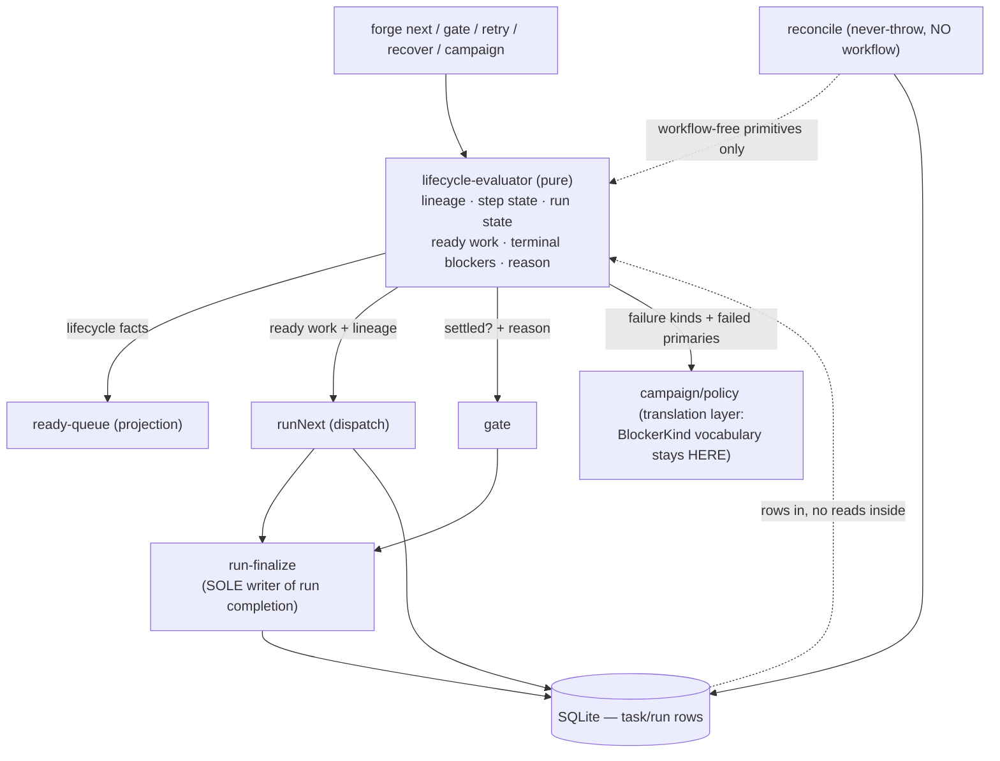

# Lane C — lifecycle semantics (FG-477 + FG-527). Architecture + plan. **PLANNING ARTIFACT ONLY. No implementation. No tickets filed.**

**Baseline:** `185afc3` (standalone clone). **Probes:** `docs/plans/foundations-lane-c-probes/` (4, all rerunnable, output captured).
**Evidence rule (inherited from FG-551/FG-553):** every claim below is labelled **VERIFIED FACT** (file:line at
this SHA, or captured probe output), **INFERENCE**, or **OPEN QUESTION**. A source-pattern match is not evidence
of a runtime property; runtime properties are demonstrated by EXECUTION.

---

## 0. The headline: FG-527's acceptance criterion #2 is wrong, and the probe proves it

FG-527 says: *"a failed shipping-reviewer (or any non-`red-`-prefixed red) on a fanout step is retryable as
red_review"* — i.e. migrate `retry.ts` to the classifier and **allow the retry**. The classifier's
classification is right; **the retry is not.**

`retry.ts` mints its replacement row with **`parentId` deliberately left undefined** — a PRIMARY row
(`src/v2/retry.ts:427-466`, and the comment at `:435-438` says so explicitly). So "allow the retry of a red"
means: mint a parent-less row, in the fanout step's phase, carrying the RED's `agentRole`.

**VERIFIED BY EXECUTION** (`p2-retry-shipping-reviewer.out`, real `seeds/workflows/feature.yml`, real
`retry()`, real `computeReadyQueue`):

```
### B. POST-MIGRATION SHAPE (retry --force mints the same row a migrated retry.ts would)
new row: {"id":"task-build-e55d65","phase":"build","agentRole":"shipping-reviewer","parentId":null,"status":"pending"}
classifier kind of the NEW row: retry_replacement
rows in phase `build`: build-primary[blocked_by_red,parent=-,kind=primary]  red-build-sr[failed,parent=build-primary,kind=red_review]  task-build-e55d65[pending,parent=-,kind=retry_replacement]
computeReadyQueue -> build
isRunSettled -> false
dispatchFanoutStep existingParent (mirror of runNext.ts:1572-1574) -> task-build-e55d65 (agentRole=shipping-reviewer)
```

The retried red becomes a **detached second primary of the fanout phase** (`retry_replacement`), the ready
queue re-admits `build`, and the next `forge next` **adopts the red's row as the fanout PARENT of a fresh
wave**. That is precisely the damage `FanoutChildRetryError` was created to prevent (`src/v2/retry.ts:72-88`,
FG-455 p3) — it just names the reason wrongly ("fanout child") because it asks the wrong question.

**So the refusal is right today for the wrong reason.** The correct FG-527 outcome for `retry.ts` is:
*classify with the evaluator, and keep refusing — with an accurate message.* Allowing the retry is only safe
once red re-runs have a row shape that is not a primary, which is a separate design decision (§4, OQ-1).

This is the single most load-bearing finding in the lane, and it is why FG-527 must not ship as one ticket.

---

## 1. Ground truth at 185afc3

### 1.1 What actually shipped (slice 1)

**VERIFIED FACT.** `src/v2/lifecycle-evaluator.ts` (204 lines) exports exactly four things:
`classifyTaskLineage` (`:110`), and three single-row primitives — `isWorkflowPrimaryRow` (`:74`),
`isAdHocInvokeRow` (`:182`), `isOnRejectRecoveryRow` (`:188`), `isPhasePrimaryRow` (`:202`). The 7-kind union
is at `:22-61`. **There is no step-state, run-state, ready-work, terminal-blocker or operator-reason surface
yet.** FG-477's evaluator *proper* is entirely unbuilt; what exists is its lineage layer.

**VERIFIED FACT (import census).** The classifier is imported by exactly three production modules —
`ready-queue.ts:22-28`, `runNext.ts:53`, `reconcile.ts:43` (`isPhasePrimaryRow` only) — plus
`fg530-harness.ts:37`. Every other lifecycle consumer still hand-rolls its predicate: `gate.ts`, `retry.ts`,
`recover.ts`, `invoke.ts`, all of `src/campaign/`, `notify/trigger.ts`, `metrics.ts`, `runs-query.ts`,
`report.ts`, `review-loop.ts`. That is **26 live `parentId === undefined` predicates and 5 live
`startsWith("red-")` predicates** in production source (full census in §1.4).

### 1.2 Where the ticket prose is now wrong

| Ticket claim | Status at 185afc3 | Evidence |
|---|---|---|
| FG-527 AC: "a failed shipping-reviewer … is retryable as red_review" | **WRONG.** Allowing it mints a detached primary that hijacks the fanout parent. | `p2` output; `retry.ts:427-466` |
| FG-477 slice 5 ("fold verdict aggregation in; gate.ts ignores `gate_on_verdict` — the F16 divergence") | **STALE.** F16 is already CLOSED by FG-523: `verdictBlocksGate` (`gate.ts:59-65`) is one predicate, consumed by `aggregateVerdicts` (`gate.ts:68`) and by dispatch (`runNext.ts:1220`), reading the persisted flag, NULL fail-closed. Slice 5 is now a **relocation**, not a convergence — no behavior change left in it. | `gate.ts:59-68`, `runNext.ts:1220` |
| FG-477 AC: "abandoned/cancel races cannot be overwritten by completion on any finalization path" | **ALREADY DONE.** `completeRun` has exactly one caller — `run-finalize.ts:40` — and all seven finalization sites route through `finalizeRunIfSettled`, which re-reads and refuses a non-`active` run (`run-finalize.ts:38-39`). Sites: `gate.ts:460`, `runNext.ts:220`, `runNext.ts:307`, `runNext.ts:2289`, `reconcile.ts:1342`, `invoke.ts:312`, `review-loop.ts:923`. | grep of `completeRun(` — one hit outside run-finalize |
| FG-477 "remaining slices" note | **INCOMPLETE.** It omits three unmigrated ad-hoc-exclusion sites and three *mutually different* fanout-parent probes. See §1.3–1.4. | §1.4 census |
| FG-477 slice-3/4 line refs, and the 2026-07-07 artifact's decision table | Superseded (already flagged in the ticket's own supersession note). Do not re-derive from them. | — |

### 1.3 The true remaining work at this SHA

Of FG-477's original 8 slices: **1 and 2 are DONE**; **3 and 4 are PARTIALLY consumed** (`dispatchSingleStep`
and `finalizeOrphanedPrimaries` migrated; `retry.fanoutParentOf`, `dispatchFanoutStep`, `dispatchManualStep`,
and reconcile's fanout-parent sweeps are not); **5 has lost its behavior change** (FG-523); **6, 7, 8 untouched**;
and **the evaluator proper (step state / run state / ready work / terminal blockers / operator reason) does not
exist** — it is not in the original 8 slices at all, which is the largest gap between the ticket's AC and its
plan.

### 1.4 Census of unmigrated lifecycle heuristics (this is the real remaining-slice list)

**VERIFIED FACT**, all cited at current lines.

*Ad-hoc (FG-507) exclusion missing — a pending `forge invoke` row can be adopted as a workflow row:*
- `runNext.ts:1572-1574` — `dispatchFanoutStep.existingParent`. **Proven destructive by execution** (§2, probe 3).
- `gate.ts:384-386` — request-changes dedup. Same predicate shape, **not named in FG-527 or FG-477**.
- `runNext.ts:3180-3182` — `dispatchManualStep`'s existing-row lookup (no ad-hoc exclusion **and no status
  filter**).

*`red-` role-prefix heuristic (misclassifies `shipping-reviewer`):*
- `runNext.ts:1587` (`activeWithChildren`), `:1669` (`pendingHasChildren`), `:1624` (`childTasksForCleanup`).
- `retry.ts:356` (`fanoutParentOf`), `retry.ts:263` (mount-mode fallback — *different question*, leave it: it
  asks "was this a read-only mount", which the FG-350 receipt answers; only the no-receipt fallback uses the
  prefix).
- `project-auth.ts:79` — **not lifecycle**; a security predicate. Out of scope, deliberately.

*"Is this row a fanout parent?" — answered three different ways, none of them the classifier's:*
- `gate.ts:178` — `typeof task.taskPackage.inputs["fanout"] === "object"`.
- `reconcile.ts:1261-1263` — children carry `inputs.fanoutIndex`.
- `recover.ts:285` — `parentId === undefined && allTasks.some(t => t.parentId === task.id)`.
- `reconcile.ts:1120` — raw `parent.parentId !== undefined` gate on the fanout-parent sweep.

**INFERENCE (high confidence):** "is this a fanout parent" is *not a lineage question at all*. It is
`kind === primary` **and** the phase's step declares `fanout` — a workflow-shape lookup. All three probes above
are structural guesses at a fact the workflow states directly. This is what the evaluator should end.

*Raw failed-primary scans (campaign):* `executor.ts:494`, `executor.ts:2183` — `parentId === undefined &&
status === "failed"`. **A failed ad-hoc invoke row is included today**, so an ad-hoc failure is classified as a
workflow terminal blocker. **INFERENCE** from the predicate + `classifyTaskLineage`'s rule 0; falsification test
named in §5 (C6).

---

## 2. Probes (rerunnable; output captured beside them)

| Probe | What it establishes | Verdict |
|---|---|---|
| `p1-recorded-disagreements.sh` | The pinned classifier spec, incl. the two "recorded disagreements", at this SHA. | **32/32 pass.** Both disagreement tests pass *as divergence assertions* today (`lifecycle-evaluator.test.ts:603`, `:623`). After FG-527 they must be rewritten to assert **agreement** — the legacy fixtures at `:596-601` and `:642` get deleted, not inverted. |
| `p2-retry-shipping-reviewer.sh` | FG-527 disagreement #1, end to end, with the real `feature.yml`. | **Refusal reproduced** (`FanoutChildRetryError` on a failed `shipping-reviewer` whose kind is `red_review`), **and the naive migration's damage reproduced**: detached `retry_replacement` primary → `computeReadyQueue -> build` → fanout parent adoption. |
| `p3-fanout-adopts-invoke-row.sh` | FG-527 disagreement #2(b), **through the real `runNext`** (no mock, no container). | Worse than the ticket says. `forge next` doesn't merely *adopt* the operator's pending invoke row — it **FAILS it**: `status = failed`, `error = fanout: upstream 'plan' has no array at 'steps'`. On the happy path it would instead attach fanout children and an integration merge to an ad-hoc row. |
| `p4-resolve-phase-primary.sh` | Whether `ready-queue.ts:155-161`'s reason for not absorbing `resolvePhasePrimary` still holds. | **Still true, and precisely bounded.** Absorbing narrows *only* marker-stamped `adhoc_invoke` rows (`NARROWED? true`); marker-less legacy rows are unaffected (`NARROWED? false`, they stay in `isWorkflowPrimaryRow`). And it exposes that **today `deriveUpstream` folds an ad-hoc invoke row's result into a downstream workflow step's inputs** — the same bug family as p3. |

**Method honesty.** p2, p3 and p4 build their row sets **directly in an in-memory store** rather than reaching
them through a live containerized run; each probe's header says so. The *shapes* are production-minted:
`dispatchReds` inserts exactly p2's failed-`shipping-reviewer` row (`runNext.ts:1067-1090`) on missing required
context, and `feature.yml`'s `build` step is genuinely both a `fanout` step and the carrier of the
`shipping-reviewer` red (`seeds/workflows/feature.yml:76-113`). p3 executes the real `runNext` →
`dispatchFanoutStep` path; only the container is never reached, because the fanout fails on its upstream array
first. p2's part B uses `retry --force` **because `--force` bypasses exactly the refusal under discussion and
mints exactly the row a classifier-migrated `retry.ts` would mint** — it is the post-migration row shape, not a
simulation of it.

**Environment note (affects reproduction, not conclusions):** the clone's `node_modules` was empty on arrival;
`npm install` + `npm rebuild better-sqlite3 --foreground-scripts` was required before any DB-touching probe
could run. `tsc` is not installed, so `npm run typecheck` does **not** work here; tests run via
`node --import tsx --import ./src/test-setup.ts --test <file>` (the repo's own `test:unit` mechanism), which does.

---

## 3. The evaluator's target surface, and where it lives

### 3.1 Module boundary — the architecture pass's call still holds. **VERIFIED.**

`src/v2/lifecycle-evaluator.ts`, **not** under `src/campaign/`. The boundary is intact at this SHA:
`campaign/policy.ts` imports only `types/index.js` and `v2/failure-kind.js`; the `BlockerKind` vocabulary lives
in `types/index.ts:291-303` and is mapped from `FailureKind` in `policy.ts:31-108`. Campaign is a **translation
layer** over lifecycle facts, and folding `BlockerKind` into the evaluator would push campaign policy into a
module that `ready-queue`, `gate`, `runNext` and `reconcile` all depend on. Keep the direction of dependency:
**evaluator → (failure kinds, lineage, states); campaign → maps them to policy.**

### 3.2 The five surfaces, as architecture (not as type names)

The engineer picks the names. These are the constraints the surfaces must satisfy:

1. **Lineage/attempt kind** — shipped. Pure, total, `(workflow, rows) → kind per row`.
2. **Step state.** One derivation, **two projections**: today `computeReadyQueue` (`ready-queue.ts:63-134`) and
   `computeStepSettleStates` (`:221-307`) walk the same rows with *different* vocabularies (a 3-state settle
   union vs. an ad-hoc ready check) and only agree by careful hand-maintenance — the comment at `:169-187`
   exists solely to explain why they differ. The evaluator must compute the richer step state **once**, and both
   "ready work" and "settled" must be *filters over it*, so they cannot drift. **This is the AC line
   "computeReadyQueue becomes a thin wrapper (or is made impossible to drift)."**
3. **Run state.** `abandoned` is an **input, not a derivation** — `run.status` is authoritative and the
   evaluator must never be able to resurrect it. **Boundary decision: `run-finalize.ts:31-46` remains the ONLY
   writer of run completion** (verified single-caller of `completeRun`); the evaluator answers *"is it settled"*,
   it does not answer *"write complete"*. Anything else re-opens the AWN-2 race that is currently closed.
   > **SUPERSEDED BY PRD (this claim is stale — the PRD governs).** This plan is a point-in-time discovery
   > record. Its "ONLY writer of run completion" is disproved: `design.ts` and `claude.ts` independently call
   > `updateRunStatus(runId, "complete")`, so `run-finalize.ts` is the sole caller of **`completeRun`** but NOT
   > the sole writer of run completion. The PRD (`docs/prds/workflow-lifecycle-semantics.md`, N-2) documents the
   > real completion-writer set and the store-layer guards that hold INV-2; where this plan and the PRD differ on
   > it, the PRD is authoritative.
4. **Ready work.** Must name the **task attempt to dispatch**, not just the step — because `dispatchSingleStep`
   already re-derives that pick from rows (`runNext.ts:441-449`) and `dispatchFanoutStep` re-derives it
   *differently and wrongly* (`:1572-1574`, probe 3). The ready-work result is what kills that second derivation.
5. **Terminal blockers.** Failure kinds + the *lineage-correct* failed-primary set, with SHARED-wins
   aggregation over **all** failed primaries (the aggregation already exists at `executor.ts:496-503`; what is
   wrong is the row set it aggregates over — `:494`). The evaluator returns lifecycle facts; `policy.ts` keeps
   the vocabulary.
6. **Operator reason.** This is an **API contract to surfaces** (`show`, `report`, dashboard, campaign hold
   reasons), not an internal union. Do not ship the internal step-state union to the dashboard; every future
   state added to the evaluator would become a client-breaking change. **INFERENCE** — I did not audit the
   dashboard's transport; flagged as OQ-4.

**Purity constraint (load-bearing).** The evaluator stays pure: `(workflow, rows [, verdict rows]) → states`.
No DB reads inside it. Two consumers depend on that: `reconcile`'s never-throw sweeps, which have **no workflow
in hand by design** (`lifecycle-evaluator.ts:192-201`), and the property/parity test harness that made slice 1
safe (`lifecycle-evaluator.test.ts:399-585`). Verdict rows must be **passed in**, not fetched — that is the only
way slice 5 can absorb `verdictBlocksGate` without dragging the store into the evaluator.

### 3.3 The bigger lever (proposal, not a slice): persist the attempt kind

**INFERENCE / RECOMMENDATION.** FG-512 already proved the pattern: it stopped *inferring* provenance and started
*recording* it (`dispatchSource`), and rule 0 of the classifier now reads the record instead of guessing. The
same move is available for lineage: stamp the attempt kind at insert time. It would (a) make the classifier a
*verification* rather than an inference, (b) give `reconcile` — which has no workflow — an **exact** answer
instead of the three divergent structural probes in §1.4, and (c) let `legacy_ambiguous_invoke` finally shrink
to a historical-rows-only kind. Cost: a schema migration + backfill, a dual-write window, and it collides
head-on with the store-version policy being decided in FG-553 (§7). **Not proposed as a child here** — it is a
decision for the operator, and Lane C is shippable without it. OQ-3.



---

## 4. FG-527: **split it into three.** Order and risk.

**Decision: three children, not one ticket.** They are three different risk classes with three different
revert surfaces, and — decisively — **FG-527's own AC #2 is wrong** (§0). Correcting it inside a bundle would
bury the correction in a commit that also touches the dispatch hot path.

**C1 — `retry.ts`: classify correctly, keep refusing (accurately).** Operator-visible message change; **no
change to the decision**. Risk: low. This is the ticket amendment.

**C2 — the FG-507 ad-hoc exclusion, completed: `dispatchFanoutStep.existingParent` (`runNext.ts:1573`),
`gate.ts:385`, `dispatchManualStep` (`runNext.ts:3181`).** One predicate, three sites, one revert. It is a
**pure bug fix** — no red semantics, no lineage judgement — and probe 3 is its RED test. Risk: medium
(dispatch hot path), but the blast radius today is *already* a destroyed operator row, so the status quo is not
the safe option.

**C3 — kill the `red-` prefix in `dispatchFanoutStep`'s three child filters** (`:1587`, `:1624`, `:1669`).
Risk: medium, and this is **the top migration risk in the lane** — a wrong answer here re-drives a wave or
attaches children to a dead lineage (the FG-364 failure the `existingParent` comment at `:1567-1571` records).

**Migration order: C1 → C2 → C3.** C1 is independent (different file) and can land in parallel, but ship it
*first* so the operator-visible retry semantics are settled before the dispatch path moves. C2 before C3
because C2 changes *which row is the parent* and C3 changes *which rows are its children* — landing them
together makes a bisect useless.

**Top risk, named and mitigated.** *A wrong lineage answer inside `dispatchFanoutStep` silently re-drives a
fanout wave.* Mitigations, in order of strength:
1. **Reuse the mechanism that made slice 1 safe**: the frozen-legacy parity oracle over the seeded generated
   corpus (`lifecycle-evaluator.test.ts:534-585`). For C3, the oracle asserts the classifier's `red_review` set
   equals the legacy prefix set **on every shape except non-`red-`-prefixed reds**, and that the divergence set
   is exactly `{shipping-reviewer}` for the shipped seeds.
2. **Promote probe 3 to an integration test** at the `runNext` level — it drives the real dispatch path with no
   container and is RED against this baseline.
3. **Coincidence check before C3, not after**: today the three prefix filters agree with the classifier *by
   accident* — reds are inserted with **no `worktreePath`** (`runNext.ts:1298-1308`; children get one at `:2505`
   / `:2559`), so a `shipping-reviewer` wrongly admitted to `childTasksForCleanup` (`:1620-1633`) contributes no
   worktree to clean and no branch to merge (`:1839-1846`). **VERIFIED FACT.** That accident is what makes C3
   *look* like a no-op — and it is exactly the kind of thing lane A's worktree work can break underneath us
   (§6). C3 must land with a test that fails if a red ever acquires a `worktreePath`.

---

## 5. Proposed child stories — **PROPOSAL ONLY. Not filed.**

Each is independently shippable **and** independently revertable (one predicate group, one commit). "RED today"
= a falsification test that is observably failing against `185afc3`.

| # | Story | Falsification test (RED against baseline) | FG-477 AC line |
|---|---|---|---|
| **C1** | `retry.ts` asks the classifier, and **refuses a red with an accurate message** (not "fanout child"). `FanoutChildRetryError` keeps firing for real `fanout_child` rows. `--force` on a red row is *also* refused (it mints the corrupting primary — see OQ-1). | `p2` part A: today the message says "fanout child (parent build-primary)" about a `red_review` row. New test: retrying a failed `shipping-reviewer` refuses **as a red**, and no `retry_replacement` row exists in the phase afterwards. Delete the legacy fixture at `lifecycle-evaluator.test.ts:596-601`; flip `:603` to an agreement assertion. | (lineage/attempt kind) |
| **C2** | FG-507 exclusion completed at the three remaining sites (`runNext.ts:1573`, `gate.ts:385`, `runNext.ts:3181`) via `isWorkflowPrimaryRow`. | `p3`, promoted: a pending invoke row on a `task`-named fanout step is **failed by `forge next`** today (`error = fanout: upstream 'plan' has no array at 'steps'`). After: the invoke row is untouched and a fresh fanout parent row is minted. Flip `lifecycle-evaluator.test.ts:623` to agreement. | *"runNext uses the evaluator for dispatch decisions"* |
| **C3** | `red-` prefix dead in `dispatchFanoutStep`'s three child filters. | New: a **complete** `shipping-reviewer` red on a fanout parent is today admitted to `childTasksForCleanup` (`:1620-1626`) and counted by `activeWithChildren`/`pendingHasChildren`. Assert it is excluded; plus a guard test that fails if a red row ever carries `worktreePath`. | same |
| **C4** | **Evaluator layer 2: step state.** One derivation; `computeReadyQueue` and the settle states become projections of it. No consumer-visible behavior change. | Property test over the seeded corpus (the slice-1 harness): the projection equals today's `computeReadyQueue` / `isRunSettled` on every generated shape. RED by construction (the surface doesn't exist). | *"computeReadyQueue becomes a thin wrapper … or made impossible to drift"* |
| **C5** | **Run state + run completion** through the evaluator: `runNext.ts:298-303`'s `topLevelByPhase` / `anyFailed` superseded-primary logic is a **fourth** lineage heuristic — it must become evaluator-derived. `gate.ts:457-461` (advance/reject) and `run-finalize.ts` keep the single-writer boundary. | Today `runNext.ts:299` counts an ad-hoc invoke failed row in `anyFailed`; assert a failed `forge invoke` row no longer marks a workflow run's completion as `anyFailed`. | *"runNext uses the evaluator for run-completion"*, *"gate uses it after advance/reject/request-changes"* |
| **C6** | **Terminal blockers**: `executor.ts:494` and `:2183` consume the evaluator's failed-primary set instead of `parentId === undefined`. SHARED-wins stays in `policy.ts`. | A failed ad-hoc invoke row attached to a campaign workflow run is today classified as a workflow terminal blocker (`executor.ts:494` → `classifyFailureKind`). Assert it is excluded. Plus the mixed local/shared case (`policy.ts:139-149`) as a regression pin. | *"campaign resume uses evaluator-derived terminal blocker state"*, *"mixed failed-primary runs classify conservatively"* |
| **C7** | **Operator reason** — one explanation, consumed by `show`/`report`/dashboard/campaign hold reasons. Must render the validation-contract hold distinctly (`runNext.ts:977-981` logs `kind: "validation_contract"`), not as "awaiting human gate". | Today the three surfaces phrase "why nothing can run" independently; assert one source. (Weakest RED in the set — scope it against the actual surfaces before filing.) | *"operator surfaces consume the same lifecycle explanation"* |
| **C8** | **Absorb `resolvePhasePrimary`** (deliberate, bounded narrowing). | `p4` case A: today `deriveUpstream` folds a complete **ad-hoc invoke** row's result into a downstream workflow step's inputs. After: it does not. Case B (legacy rows) must stay unchanged — that bound is the test. | *(prerequisite for "impossible to drift")* |

**Dependencies / parallelism.**
`C1 ∥ C2` (different files). `C2 → C3` (same function, ordered — see §4). `C8` may go in parallel with C1/C3 but
**must land after C2**: both are the ad-hoc-adoption family, and shipping the narrowing before the dispatch fix
would make the two behavior changes indistinguishable in a bisect. `C4` gates `C5`, `C6`, `C7` — do not start
them before the step-state surface exists, or they will each grow a private derivation and the lane will have
*more* heuristics than it started with. `C6` is otherwise independent of runNext and can be worked in parallel
with `C5`.

**FG-477's closure condition.** No single child closes it. FG-477 closes when **C4–C7** are all in and the
census in §1.4 is empty of *lifecycle* predicates (`project-auth.ts:79` and `retry.ts:263` are deliberately out
of scope: they ask security and mount-mode questions, not lineage questions). FG-527 closes on **C1+C2+C3**.

---

## 6. Cross-lane coupling — be specific, this feeds the integration artifact

### 6.1 `reconcile.ts` × Lane A (FG-356, worktree reaper in orphan finalization)

- **Where they touch:** Lane C owns `finalizeOrphanedPrimaries` (`reconcile.ts:1361-1397`, already on
  `isPhasePrimaryRow` at `:1371`) and the fanout-parent sweeps (`:1120`, `:1261-1263`). FG-356 adds reaping to
  `reconcileRun`'s orphan finalization — the same tail of the same function (`reconcileRun` is
  `:393-1353`; worktree removal already happens at `:570`, `:682`, `:1003`).
- **Nature of the conflict — not textual, semantic.** Reconcile **has no workflow in hand, by design**
  (`lifecycle-evaluator.ts:192-201`). If FG-356's reaper needs to know *"is this row a fanout child (owns a
  worktree) vs. a red (owns none) vs. a primary"*, it cannot get an exact answer without loading the workflow —
  and it must never throw. **Architectural recommendation to Lane A: answer worktree ownership from the ROW
  (`worktreePath` presence), never from lineage.** That keeps A independent of C entirely. If A instead adds a
  fourth structural lineage probe, Lane C inherits it as debt.
- **Order:** the cross-cluster **landing order (Lane A / FG-356 vs. Lane C's reconcile work) is owned by the
  integration artifact, not decided here** (PRD §5.2 opening / §5.2b). The **constraint that survives**,
  whichever lands first: Lane C changes what "primary" *means*, so Lane A must not be re-deriving it in the same
  window — and worktree ownership is answered from the ROW (`worktreePath`), never from lineage.

### 6.2 `runNext.ts` `dispatchFanoutStep` × Lane B (FG-524, validation contract on fanout children)

**This is the sharpest collision in the program.**

- **Same function, same session.** C2/C3 edit the parent lookup and child filters (`:1572-1587`, `:1620-1671`).
  FG-524 adds the validation-contract gate to the fanout **children's** finalize (`runNext.ts:2541`
  `markTaskComplete(childTaskId, …)`; today the contract runs only on the single-step primary, at `:680-685`).
  Textually adjacent-but-separate — a rebase, not a merge disaster.
- **The real conflict is a state-space one, and it is invisible in the diff.** FG-524's hold puts a fanout
  **child** into `awaiting_gate` — a status that is **neither complete nor failed**. Today three places assume
  children settle terminally: `dispatchFanoutStep`'s child-settlement path, reconcile's "all children terminal"
  fanout sweep (`reconcile.ts:1124`), and reconcile's awaiting_red sweep (`:1261-1263`). **If Lane C's
  step-state union (C4) is frozen before FG-524 lands, FG-524 breaks it; if FG-524 lands first without C4
  knowing, a held child is an unmodelled state that the settle logic will read as "not terminal" forever
  (wedge).**
  **Constraint (survives, binding): C4's step-state union must model "child held for validation" as ACTIVE
  (work outstanding, human decision pending) — never as blocked/terminal; whichever of {FG-524's hold, C4's
  union} lands first must not freeze a shape the other needs.** C2/C3 are unaffected either way and can go
  first regardless.
  > **Cross-cluster LANDING ORDER not decided here (superseded by PRD).** This plan is a point-in-time
  > discovery record. An earlier draft of this line fixed "FG-524 lands BEFORE C4"; that ordering is **owned by
  > the integration artifact**, not chosen here. The PRD (`docs/prds/workflow-lifecycle-semantics.md`, §5.2a /
  > OQ-6) deliberately does NOT pick the order and binds only the ACTIVE-not-terminal invariant above. The
  > constraint stays; the order does not.
- **Order:** C2 → C3 first — this part is intra-cluster and PRD-bound (D-5a before D-5b). The relative
  placement of **FG-524 and C4** around them is a **cross-cluster landing order owned by the integration
  artifact, not decided here** (see the note above; PRD §5.2a / OQ-6). C2/C3 lead because they are small and
  mechanical.

### 6.3 The Task row / `worktreePath` / `merge_conflict` failure kind × Lane A

Lane A's retain-on-conflict predicate (keep the worktree when the failure kind is `merge_conflict`) and Lane C's
lineage/terminal-blocker semantics meet on one row. Two constraints:
- `merge_conflict` maps to a **SHARED** blocker (`policy.ts:4-16` + `:31-108`) — so a retained-worktree conflict
  **holds the campaign**. If Lane A broadens what fails as `merge_conflict`, it broadens campaign holds. That is
  a policy consequence of a worktree change, and it should be stated in Lane A's ticket, not discovered in a
  campaign.
- **VERIFIED FACT:** reds carry no `worktreePath` (`runNext.ts:1298-1308`). Lane C's C3 depends on that
  accident being *true*, and Lane A owns worktree assignment. If Lane A ever gives a red a worktree (e.g. for a
  read-only checkout), C3's cleanup filter must already be classifier-driven or it will start deleting a red's
  worktree via `childTasksForCleanup`. **C3 ships the guard test for exactly this.**

### 6.4 `validation-contract.ts` + the finalize sites × Lane B (FG-524, FG-525)

`evaluateValidationContract` (`validation-contract.ts:49-76`) has exactly **one** production consumer today —
`holdIfValidationContractFails` (`runNext.ts:967-994`), called only from `dispatchSingleStep` (`:680-685`).
Lane B is adding it to fanout children (FG-524) and to `invoke` (FG-525). Those are precisely the finalize sites
Lane C's C5 re-derives run/step state for. Two hard requirements:
- The evaluator must treat a validation-contract hold as **ACTIVE**, not blocked (else `isRunSettled` completes
  a run with unfinished work).
- The operator reason (C7) must render `kind: "validation_contract"` (`runNext.ts:977-981`) distinctly from a
  human gate, or the operator sees "awaiting gate" and looks for a gate that isn't there.

### 6.5 Review trust (FG-566/FG-541/FG-524/FG-525) × Lane C slice 5

`verdictBlocksGate` (`gate.ts:59-65`) is now the single gate-blocking predicate, shared by `aggregateVerdicts`
(`gate.ts:68`) and dispatch (`runNext.ts:1220`). Lane C's slice 5 *relocates* it into the evaluator; Lane B may
*change* it (trust weighting, authority semantics). **Recommendation: the predicate stays in `gate.ts` until
C-slice-5 explicitly moves it, and Lane B edits it in place.** Two lanes must not fork it — a forked
gate-blocking predicate is the F16 divergence FG-523 just closed, reintroduced.

---

## 7. Post-FG-561 revalidation triggers (FG-553 control-runtime isolation, FG-555)

Name the conclusions that must be **re-verified**, not the ones that merely sound related.

1. **BD-15 / store-version policy — the one that actually bites.** `185afc3`'s own commit message corrects the
   premise: *migrations run on EVERY open, not just writable*. Lane C's classifier depends on a **provenance
   marker written by the current Forge version** (`taskPackage.dispatchSource`, FG-512 — rule 0,
   `lifecycle-evaluator.ts:116-127`). If FG-553 lands a store-version policy under which **more than one Forge
   version can write the same store**, then marker-less rows become reachable on **live** runs, not just
   historical ones — and `legacy_ambiguous_invoke` stops being a legacy kind. **Re-verify: probe 4's bound**
   ("narrowing touches only marker-stamped rows") and **C8's whole safety argument**, which rests on it.
2. **Single-version-owns-the-store.** `classifyTaskLineage` is deterministic *given a workflow and a row set* —
   but two Forge versions with different classifier rules, writing the same store, can disagree about the same
   row. Terminal-blocker derivation (C6) and reconcile's orphan sweeps would then be **version-dependent**.
   Re-verify C6's conclusions if FG-553 permits version coexistence.
3. **The run lock.** Reconcile's crash-window sweeps gate on `liveRunLockHolder` (`reconcile.ts:642`, `:1231`).
   Lane C does not own those sweeps, but C4/C5 will read the states they produce. If FG-553/FG-555 change lock
   ownership or staleness semantics, re-verify that the evaluator's "active" states still correspond to a live
   holder.
4. **Explicitly NOT a trigger:** FG-553's exec-not-spawn / pinned-interpreter work changes *how* `forge next`
   is launched, not what it decides. No Lane C conclusion depends on it. Saying so is part of the evidence
   discipline — the temptation is to list it.
5. **If OQ-3 (persist the attempt kind) is ever accepted**, it needs a migration + backfill and therefore lands
   *inside* whatever store-version policy FG-553 decides. Sequence it after FG-553, never beside it.

---

## 8. Open questions (operator decisions — defaults stated, work proceeds on the default)

- **OQ-1 — Should a failed red be re-runnable at all, and should `--force` still mint a primary?** Today
  `--force` bypasses the refusal and mints the corrupting detached primary (probe 2B). **Default taken: refuse
  reds outright in C1 — including under `--force` — and point at `forge recover <parent> --re-drive`.** If the
  operator wants red re-runs, that is a *new dispatch path* (a parented red row re-dispatched under its
  existing parent), not a `retry.ts` classification change. It is not in this plan.
- **OQ-2 — Is `retry.ts:263`'s `red-` prefix fallback (mount mode when no receipt exists) in scope?** Default:
  **no.** It asks a security question, not a lineage one, and it fails *closed* (a non-prefixed red gets a
  writable mount — which is arguably a **security finding for Lane B**, not a Lane C refactor). **Flagged, not
  fixed.** Someone should own it.
- **OQ-3 — Persist the attempt kind on the task row (the FG-512 move, applied to lineage)?** Default: not now
  (§3.3). Biggest available lever; blocked behind FG-553's store-version decision.
- **OQ-4 — What is the dashboard's actual transport for run/step state?** I did not audit it. C7's "don't ship
  the internal union to the client" constraint is an **inference** until someone reads `dashboard/`.
- **OQ-5 — `dispatchManualStep`'s lookup has no status filter** (`runNext.ts:3180-3182`): it reuses *any*
  parent-less row in the phase, including a `failed` one, returning its status. Is that intentional (a manual
  step, once failed, stays failed) or a latent bug? Default: preserve behavior in C2 (add only the ad-hoc
  exclusion), and flag it.

---

## 9. Gate

Nothing here is implemented. Four probes are rerunnable with captured output. The one thing this plan asks for
before any code is written: **acknowledge that FG-527's AC #2 is wrong** (§0), because C1 is a *ticket
amendment* first and a migration second.
