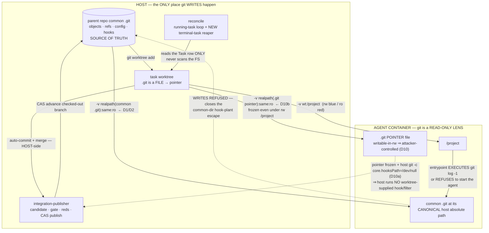

# PRD — Agent workspace isolation (FG-559 + FG-345 + FG-356)

**Status:** proposed — **corrected after adversarial SECURITY review** (HIGH: blue worktree-local `.git` pointer
seam → D10/I-10/AC-7/N-9, **observed-red probe P6b** — with **P6 retained as a NEGATIVE CONTROL**; MEDIUM: plan
§2.3 normative drift → §8.7 supersession clause).
**Baseline:** `f001552` (branch `planning/foundations-lane-a`). **Epic:** FG-561 foundations campaign.
**Cluster:** FG-559 (container git blindness) · FG-345 (worktree isolation remaining scope) · FG-356 (worktree reaper).

---

## 0. Normative status of this document

**This PRD is the sole normative surface for this cluster.** It owns the binding decisions, invariants,
boundaries, non-goals, and acceptance.

`docs/plans/foundations-lane-a-workspace-isolation.md` and `docs/plans/foundations-lane-a-probes/*` are
**architecture and discovery input**: evidence, executed probes, ground truth, stale-ticket corrections. The
plan is **not a contract and is not accepted**. Where the plan contains prose that reads as a decision, **this
PRD supersedes it.** Where this PRD needs evidence it **cites** the plan by section rather than restating it —
two documents asserting the same rule is how they drift apart.

§8 lists every place this PRD **corrects or supersedes** the plan. Read it before relying on the plan for
anything.

### Evidence labels used throughout

| label | meaning |
|---|---|
| **VERIFIED FACT** | a `file:line` citation, or output captured from a probe that was actually executed. |
| **INFERENCE** | reasoning from verified facts, declared as such. A source-pattern match is never evidence of a runtime property. |
| **OPEN QUESTION** | unsettled; states what would settle it and who owns it. |
| **NORMATIVE-UNMET** | a decision/invariant/contract **this PRD establishes** that the system does not implement today. It is **not a bug**, has **no baseline**, and gets **no red**. It is UNMET, not falsified. |

**The red-baseline rule.** An existing **factual defect** or a **named hollow/partial implementation** requires
**observed-red** evidence against the pre-fix baseline. A **normative decision that is simply not implemented**
is **NORMATIVE-UNMET**: it gets an acceptance condition and a verification method, and **no fabricated red**. A
falsification test that can only go red against code invented for the purpose is evidence of nothing. §7 applies
this split rigorously, and §8.6 records where the plan's own child table violated it.

---

## 1. Problem

In worktree mode a task's `/project` is a **linked git worktree**, whose `.git` is a 58-byte **file** containing
`gitdir: <host-absolute-path>` into the parent repo's common dir. Bind-mounting the worktree directory alone
conveys **none of the repository** — no objects, no refs, no `HEAD`, no config. (Plan §2.1, probe P1.)

**The failure is silent.** Git does not degrade; it denies the repository exists, and the agent proceeds anyway
with no history at all.

**VERIFIED FACT — executed in a REAL Docker container on the macOS host**
(`docs/plans/foundations-lane-a-probes/p5-docker-container-git.out`, DIRECTION 1):

```
      git log    -> FAIL fatal: not a git repository: (null)
      git diff   -> FAIL fatal: not a git repository: (null)
      git show   -> FAIL fatal: not a git repository: (null)
      git blame  -> FAIL fatal: not a git repository: (null)
```

Three defects follow, and they are this cluster's scope:

1. **FG-559** — containers in worktree mode have **no usable git**, and **nothing detects it**.
2. **FG-345** — worktree isolation's remaining scope, which is **not what the ticket says it is** (§4).
3. **FG-356** — terminal tasks leak their worktree **and** their branch, and **no reconcile pass ever revisits
   them** (§5).

---

## 2. Binding decisions

### D1 — The mount contract

> **When the effective mount root's `.git` is a FILE (a linked worktree), forge MUST additionally bind-mount the
> parent repository's common `.git` directory at its CANONICALIZED HOST ABSOLUTE PATH, READ-ONLY, for EVERY
> agent class — blue, red, provisioner, and every future class alike.**

Mounting the whole common dir also covers the per-worktree gitdir, which lives inside it at
`.git/worktrees/<name>` — **one mount, not two**.

**VERIFIED FACT — the chosen shape works in a real container** (`p5-docker-container-git.out`, DIRECTION 2):
`git log`, `git diff A..B`, `git show`, `git blame` **all OK**. This is executed, not inferred.

### D2 — Read-only is the SECURITY BOUNDARY, not a hardening tweak

> **The `.git` mount is `:ro` for every agent class. There is no fine-grained middle ground and no blue
> exception.**

The load-bearing argument (plan §2.3), which this PRD adopts as binding: an in-container `git commit` must write
**objects** *and* update `refs/heads/forge/<run>/<task>` — **both live in the common dir** (a linked worktree's
branch ref is not worktree-local). **Therefore any mount permissive enough to allow a commit is permissive
enough for the full escape.** Read-write is not "commit"; read-write is "arbitrary host repository mutation".

**VERIFIED FACT — the escape is real, executed in a real container**
(`p5-docker-container-git.out`, DIRECTION 4 — the REJECTED rw shape):

```
      *** container REWROTE the host repo main ref ***
      *** container PLANTED a hook in the shared .git/hooks ***
    now the HOST runs forge's merge-back auto-commit (worktree-lifecycle.ts:274-279):
      *** HOST EXECUTED THE CONTAINER'S HOOK: PWNED ***
```

Git hooks live in the **common** `.git/hooks`, shared by every linked worktree. The container writes one file;
**forge's own host-side plumbing executes it, on the host, as the host user, on the ordinary success path.** No
agent misbehaviour beyond a single file write is required.

> **⚠ D2's `:ro` common mount is necessary but NOT the whole boundary.** It closes the *common-dir* escape (the
> shared `.git/hooks`). It does **NOT** close the escape available to a **blue** agent whose `/project` is `rw`:
> the worktree-local `.git` **pointer file** lives inside `/project`, is writable, and can be repointed at an
> agent-controlled config that names a `core.hooksPath`/filter forge's host-side commit then honors. **P5 never
> tested this — every P5 direction mounted `/project:ro`.** The seam and its closure are **D10**; read it before
> treating the escape as closed.

**VERIFIED FACT — `:ro` closes it** (`p5-docker-container-git.out`, DIRECTION 3 — `/project:ro` + `.git:ro`):
reads work; ref write **refused**; object write **refused**; hook plant **refused**:

```
sh: can't create /Users/.../proj/.git/hooks/pre-commit: Read-only file system
```

### D3 — Path-identity mounting MUST be canonicalized. This is the fix's most dangerous failure mode.

> **The mount host path and the container target path MUST be derived via `realpath` on the host. The fail-loud
> detector (D6) MUST compare CANONICAL paths.**

**VERIFIED FACT — observed BOTH ways on the host**
(`docs/plans/foundations-lane-a-probes/p5b-symlinked-tmpdir-hazard.out` + its operator annotation). Under macOS's
default `$TMPDIR` (`/var/folders/...`, a **symlink** to `/private/var/folders/...`), the `.git` pointer file
records the **resolved** path while the mount was constructed from the **unresolved** one. DIRECTION 2 — *the
chosen fix* — then failed:

```
      git log    -> FAIL fatal: not a git repository: (null)
```

The **same script, same Docker, same mount shape**, under a non-symlinked prefix (`/Users/...`), **passes**.

**Why this is a binding invariant and not a footnote:** the failure mode of an uncanonicalized mount is
`fatal: not a git repository: (null)` — **byte-for-byte the error the unfixed system produces.** The fix
**silently no-ops and is indistinguishable from the defect it was shipped to eliminate.** A detector that
compares uncanonicalized paths would report PASS on a machine where the fix does not work. Canonicalization is
therefore part of the contract, not part of the implementation.

### D4 — The security boundary MUST be constructed in code. It MUST NOT be expressible in runtime config.

> **The `.git` mount and its `:ro` mode MUST be constructed in the mount-building code path with the mode as a
> literal constant. It MUST NOT be added as a runtime-template mount entry, and its mode MUST NOT be derived from
> any template/context variable.**

**This decision is new in this PRD; the plan does not state it.** It rests on two verified facts that compose
into a privilege-escalation surface:

- **VERIFIED FACT.** The project mount's mode is a **template substitution**, not a constant: runtime mount
  entries carry `mode: "${PROJECT_MODE:-rw}"` (`src/v2/spawn.test.ts:31`), substituted at
  `src/v2/spawn.ts:255-257` from `SpawnContext.PROJECT_MODE` (`src/v2/spawn.ts:40`, set at
  `src/v2/runNext.ts:2934`).
- **VERIFIED FACT.** Runtime definitions are loaded **project-local first**: `<projectDir>/.forge/runtimes/<name>.yml`
  takes precedence over `~/.forge/runtimes/<name>.yml` (`src/v2/loader.ts:90-92`).

**INFERENCE (from those two facts).** A blue agent's `/project` is writable. `.forge/runtimes/*.yml` is a file
**inside the project**. If the `.git` mount were expressed as a runtime-template mount entry, then **a file the
agent can write would control the mode of the mount that is supposed to contain it** — and the next dispatch
would honor it. That converts D2's security boundary into agent-editable configuration and re-opens DIRECTION 4
through a config door. The boundary must live where the agent cannot reach it.

*(Not executed. Labeled INFERENCE. It does not need execution to be binding: it is a constraint on where we put
the code, and the cost of honoring it is zero.)*

### D5 — The container's git is a READ-ONLY HISTORY LENS. In-container `git commit` FAILS, by design.

> **Every git WRITE — auto-commit, merge, publication — stays host-side, where it already is. The container may
> READ the repository and may NEVER write it.**

**VERIFIED FACT.** In-container commit fails under the shipped shape (plan §2.2 probe P3/B5; corroborated in a
real container by `p5-docker-container-git.out` DIRECTION 3, where both object and ref writes are refused — a
commit requires both).

**This is an accepted cost, and it MUST be made contractual rather than discovered.** An agent that meets this as
a bare permission error burns turns and may report a false failure. Therefore:

- **D5a.** The **agent-facing contract** (task package / seed text) MUST state it: *"`/project` is a git worktree
  with READ-ONLY history. Use git to READ (`log`/`diff`/`show`/`blame`). Do NOT commit — forge commits and
  publishes for you."*
- **D5b.** The **detector's refusal message** (D6) MUST state the same contract, so the failure mode is
  self-explaining.

**The plan's OPEN QUESTION here is RESOLVED for the in-repo seed corpus (VERIFIED FACT, this PRD).** I grepped
`seeds/agents/**` for commit instructions. **No containerized agent seed instructs an agent to `git commit`.**
The only hits are `seeds/agents/documentation-maintainer/CLAUDE.md:47` (about commit *message* attribution, not
an instruction to commit) and `seeds/agents/backend-specialist/CLAUDE.md:27,29` (database transaction commits —
unrelated domain). `seeds/orchestrator-template.md:52,405` does instruct committing, but the orchestrator is the
**host-side** agent, not a containerized task agent, and is unaffected by D5.

**Consequence: D5 retracts no existing seed instruction.** D5a is purely additive. The residual is drift between
`seeds/` and the operator's installed `~/.forge` copy — see **OQ-1**.

### D6 — Fail-loud detection: two layers. Silent degradation MUST be impossible.

> **This requirement is independent of which mount fix is chosen. It is FG-559's actual demand.**

**Layer 1 — host-side preflight** (home: alongside `preflightProjectMount`, `src/v2/spawn.ts:479`).
Inspects the **effective mount root's** `.git`. A directory → ordinary checkout, nothing to do. A **file** →
parse `gitdir:`, resolve the common dir, and **assert both are present in the mount set being built, compared as
CANONICAL paths (D3)**. A pointer dangling on the host → the worktree is corrupt → refuse. Refuse the dispatch
with a named error **before any container starts**.

**Layer 2 — container-side EXECUTED assertion** (home: `docker/agent-entrypoint.sh`, which has **zero git
awareness today — VERIFIED FACT**, grep for `git` returns nothing).
If `/project/.git` exists at all, **EXECUTE** `git -C /project rev-parse --git-dir && git -C /project log -1`.
On failure, **exit non-zero with a named error BEFORE the agent process starts.**

**Why Layer 2 is the layer that actually discharges FG-559:** it tests the runtime property **by executing it**,
rather than inferring it from the docker argv that was *supposed* to produce it. A plausible-but-wrong mount set
— including **the symlink no-op of D3** — passes Layer 1 and **dies at Layer 2**.

**Policy: REFUSE for ALL containerized dispatches. No role-conditional trust.** "Warn for blue, refuse for red"
is precisely the reasoning by which a reviewer eventually ends up reviewing without git — the outcome FG-559
exists to prevent, re-introduced through a policy door.
**Escape hatch:** `FORGE_ALLOW_DANGLING_GITDIR=1` downgrades Layer 2 to a loud warning, matching forge's existing
kill-switch idiom (`FORGE_NO_WORKTREES`, `FORGE_WORKTREE_IGNORE_DIRTY`).

### D7 — Preflight the path that is actually mounted

> **`preflightProjectMount` MUST be handed the EFFECTIVE MOUNT ROOT (`worktreePath ?? projectDir`), not
> `projectDir`.**

**VERIFIED FACT.** The dir actually mounted is `repoRootForMount = args.worktreePath ?? args.projectDir`
(`src/v2/runNext.ts:2838`), but **every** call site passes `args.projectDir` — the MAIN CHECKOUT:
`runNext.ts:572`, `:2467`, `:2957`, `invoke.ts:548`. **The preflight is structurally blind to this bug: it
inspects a path that is not the one mounted.** Every check in D6 keys off this argument; if it lands later, D1/D6
would be written against the wrong path and would *look* correct.

### D8 — FG-345: the ticket's merge-back framing is DEAD CODE. This PRD legislates the TRUE remaining scope.

**VERIFIED FACT — independently re-verified against the code for this PRD, not carried on trust.**
`mergeWorktreeBranch` (`src/v2/worktree-lifecycle.ts:244`) and `mergeIntegrationBranchToHead` (`:487`) have
**ZERO production call sites**. Grepping `src/` excluding tests yields only their own definitions and comments
(`integration-publisher.ts:301`, `worktree-lifecycle.ts:177`, `:404` — all prose). **FG-425's serialized
publisher superseded them**, and there is an enforcement test asserting it (`fg425-publisher-scope.test.ts:182`).

> **A PRD that legislated merge-back semantics would be legislating code that no longer runs.** This PRD does not.

**FG-345's true remaining scope, and it is all this cluster owns of FG-345:**

1. **Ignored files are invisible twice.** `createWorktree` collects untracked files with
   `git ls-files --others --exclude-standard` (`worktree-lifecycle.ts:146-158`), and `--exclude-standard`
   **excludes ignored files**. So `.env`, local configs, and everything gitignored are **absent from the worktree
   AND absent from the diagnostic**.
   **DECISION: report, do not copy.** Copying them would defeat FG-376's dependency-volume design
   (`spawn.ts:289-299`) and risks leaking secrets into a branch the publisher will commit. Emit a **second**
   diagnostic list ("present in the main checkout, absent from your worktree") and **surface it to the agent**,
   not only to stderr. **The gap becomes visible instead of silent — the same principle as FG-559.**
2. **The stale FG-354 advisory lies to the operator.** `createWorktree` prints a `console.warn` saying FG-354 has
   not landed and the persistence check "may false-fail" (`worktree-lifecycle.ts:130-134`). **FG-354 HAS landed**
   (`runNext.ts:665`, `invoke.ts:798`). **DECISION: delete the advisory.**
3. **Sequential chaining is emergent, not explicit.** Step N+1's worktree branches off `projectDir`'s HEAD, which
   the publisher has already advanced with step N's work. **DECISION: accept the emergent mechanism (it works and
   it is simpler) but PIN it with a test**, so a future change to the publish target or dispatch order cannot
   silently degrade it to all-off-a-stale-HEAD.

### D9 — FG-356: the reaper sweeps TERMINAL tasks. A reaper in reconcile's orphan loop CANNOT fix the leak.

**VERIFIED FACT — independently re-verified for this PRD.** `reconcileRun`'s sweep is **running-only**:

```
  for (const t of tasksForRun(runId)) {
    if (t.status !== "running") continue;          // src/v2/reconcile.ts:452
```

The FG-530 crash lane kills at `finalizePrimary:between-complete-status-and-event`
(`src/v2/fg530-crash-worktree.worktree.test.ts:350`) — **after** the terminal status is written, **before**
cleanup runs. On restart the task is `complete`, so **reconcile's loop `continue`s past it forever, and its
worktree and branch are never revisited by anything.**

Separately, both existing `removeWorktreeIfSafe` calls in reconcile (`reconcile.ts:569-571`, `:681-683`) omit
`provenMerged`, so it defaults false, so the guard at `worktree-lifecycle.ts:187`
(`if (EPHEMERAL !== "1" && !provenMerged) return;`) **returns immediately — outside EPHEMERAL test mode reconcile
has no filesystem side-effect at all.**

> **Therefore a reaper bolted into the running-task loop would fix only the orphan case, would look correct, and
> would leave the demonstrated leak wide open** — the exact adjacent-thing-satisfying-the-assertion failure this
> campaign forbids.

**BINDING: the reaper is a SEPARATE pass over every task of the run whose `worktree_path` is NOT NULL and whose
status is TERMINAL** (complete, failed, cancelled, blocked_by_red). One predicate covers **both** the
crashed-after-status-write leak (FG-530) and the orphaned-and-finalized case.

**D9a — Input: the Task row, and nothing else.** `worktreePath`, `status`, failure kind, `runId`, `taskId`, plus
`run.projectDir`. **NO filesystem scanning of the worktrees directory.** This is a hard constraint, not a
preference: forge supports **concurrent runs**, so a directory scan **cannot distinguish another live run's
worktree from an orphan**. A scan-based reaper eventually deletes live work.

**D9b — The retain predicate. RETAIN (do NOT remove) if ANY of:**
- **(a) the worktree has CHANGED FILES** — reconcile already computes exactly this (`changedWorktreeFiles`,
  `reconcile.ts:229-240`). **This clause is load-bearing**: it keeps the reaper safe *even if the kind list in (b)
  is later extended and someone forgets to update it*.
- **(b) the failure kind is in the INSPECTION-RETAIN set** — FG-352's retain-on-conflict, generalized to every
  kind whose **diagnosis requires the tree** (`merge_conflict`, `integration_failed`, `integration_gate_timeout`,
  `integration_gate_crashed`, `publish_base_churn`, `dirty_publish_target`, `publication_refused`,
  `orphaned_work_may_persist`, `orphaned_needs_finalize`, `oom_killed`, `fanout_wave_orphaned` —
  `failure-kind.ts:125-143`).
- **(c) the task is not terminal.**

**REAP only when: terminal AND kind ∉ retain-set AND the worktree is CLEAN.** That is provably-nothing-to-lose.

**D9c — Do not lie with `provenMerged`.** `removeWorktreeIfSafe` permits removal on exactly two conditions today:
`EPHEMERAL` or `provenMerged` (`worktree-lifecycle.ts:187`). The reaper needs a **third: proven-empty**, and it
**MUST be an explicit new condition**. Passing `provenMerged: true` would be a **false claim that a merge
happened**; it would silently widen the no-discard invariant **for every other caller**, and a later reader could
not tell the two apart. **This is the single easiest way to implement FG-356 wrongly.**

**D9d — The branch is part of the leak.** `forge/<runId>/<taskId>` MUST be pruned under the **same** predicate. A
reaper that removes the directory and leaves the ref has **half-fixed FG-356**: refs accumulate forever, and
`git worktree prune` will not touch them.

### D10 — The BLUE seam: a rw worktree makes the worktree-local `.git` pointer ATTACKER-CONTROLLED. D2's `:ro` common mount does NOT close it.

> **For any agent whose `/project` is writable (blue, provisioner, any future rw class), forge MUST treat the
> worktree-local `.git` pointer file, its resolved `gitdir`, and every git config/attribute it can name as
> ATTACKER-CONTROLLED — and the host MUST execute NO worktree-supplied git hook, filter, or attribute-driven
> command when it operates in that worktree.**

**Why D2 does not already cover this — the defect in the prior decision.** D2 mounts the parent **common** `.git`
`:ro`, and D2/AC-2 proved that closes the *common-dir* hook-plant escape. But a **linked worktree's root `.git`
is not in the common dir** — it is a ~58-byte **pointer FILE inside `/project`** (§1). For a blue agent `/project`
is **rw** (`spawn.ts:40` `PROJECT_MODE`, `runNext.ts:2934`; the mermaid edge already labels it *"rw blue / ro
red"*). **The agent can therefore rewrite `/project/.git`.** P5 never exposed this: **every P5 direction mounted
`/project:ro`** (`p5-docker-container-git.out` DIRECTIONS 3–4 test `.git` writes under a **read-only** project),
so the blue-only seam was structurally outside its coverage.

**The escape, concretely (VERIFIED FACT — observed-red, executed on the host 2026-07-14,
`docs/plans/foundations-lane-a-probes/p6b-real-vector-standalone-alternates.out` STEP 1):**

1. The blue agent rewrites `/project/.git` to `gitdir: <dir under /project the agent controls>` — a **STANDALONE**
   fake gitdir with **NO `commondir`**. Because it has no `commondir`, git treats it as a standalone repository
   and **DOES read that gitdir's own `config`**, so `core.hooksPath` (and `filter.*`, `diff.*.textconv`, …) are
   **honored**. Objects are supplied by an `objects/info/alternates` file pointing at the `:ro`-mounted common
   object store; the branch ref is copied in so `HEAD` resolves. (`p6b` STEP 1, verbatim: `hooksPath IS honored`.)
   **⚠ The naïve LINKED variant does NOT work — this is what P6 tested, and why P6 false-negatives:** a fake
   gitdir *with* a `commondir` is a *linked* worktree, and git reads a linked worktree's config from the **common
   dir**, never from a plain `config` in the per-worktree gitdir. `git config --get core.hooksPath` returns EMPTY
   there. P6's clean result is a **false negative against a vector git already defeats — NOT evidence the seam is
   closed.** P6b, using a standalone gitdir, is the reproduction.
2. **The D6 Layer-2 detector still PASSES:** `git rev-parse --git-dir` and `git log -1` succeed against the
   hijacked pointer, because the alternates + copied ref preserve a usable git view. Layer 2 verifies *history
   resolves*, not *the pointer is authentic*. (`p6b` STEP 1: `D6 Layer-2 detector PASSES (blind — objects resolve
   via alternates)`.)
3. Forge's **live host-side commit path** — `autoCommitSource` (`integration-publisher.ts:304-312`): `git status`
   → `git add .` → `git -c user.name=forge … commit`, all with **`cwd` = the agent's worktree**
   (`integration-publisher.ts:323`) — reads the attacker's standalone config and **executes the hook/filter AS THE
   HOST USER**. `p6b` STEP 1 captured, verbatim: `*** HOST EXECUTED AGENT HOOK: pre-commit-RCE — container->host
   RCE ***`. This is the same container→host code execution D2 exists to prevent, reached through a seam D2 does
   not cover. (The dead `mergeWorktreeBranch` path is **not** the live site — D8; the live site is the publisher's
   auto-commit.)

**VERIFIED FACT — the live host-side git sites that run IN the agent's worktree** (so would honor its config):
`autoCommitSource` `git status`/`add`/`commit` (`integration-publisher.ts:305,307,308`), and any host git run
with that cwd. Hook-bearing operations there are `add` (clean **filters**) and `commit` (**pre-commit /
commit-msg / post-commit**); `status` honors **`core.fsmonitor`**. `git worktree add/remove/prune` and
`branch -D` run with `cwd = projectDir` (the main checkout), not the agent worktree.

**The fix is TWO parts; part B is load-bearing, part A is necessary-not-sufficient:**

- **D10a — host hardening (PARTIAL — necessary, NOT sufficient; VERIFIED by `p6b` STEP 2).** Every host-side git
  invocation that runs with `cwd` inside an agent worktree MUST disable worktree-supplied hooks, e.g.
  `-c core.hooksPath=/dev/null`. `autoCommitSource` already prepends `-c` identity flags, so this composes at zero
  cost. **VERIFIED FACT — `p6b` STEP 2: under `-c core.hooksPath=/dev/null` the hook is DEAD.** **But it is
  hook-scoped and closes ONLY the hook vector.** clean/smudge **filters** (`filter.*.clean/smudge`),
  `diff.*.textconv`, `core.fsmonitor`, and custom **merge drivers** are *separate* config-defined command
  execution that a hook-scoped flag does not touch — and as long as the agent's standalone gitdir `config` is read
  at all (which it is, until D10b), they remain honored. **(INFERENCE from git config semantics — a hook flag
  cannot disable config reads that are not hooks; `p6b` STEP 2 confirms only the hook death, not filter closure.)**
  So D10a alone leaves the seam OPEN.
- **D10b — structural closure (SUFFICIENT and LOAD-BEARING; VERIFIED by `p6b` STEP 3).** The worktree-local `.git`
  **pointer file MUST be non-writable to the container**: bind-mount `realpath(/project/.git)` **`:ro` OVER
  itself**, on top of the rw `/project` mount (canonicalized per D3). This is coherent with a rw worktree — the
  agent still writes everywhere in `/project` **except** the pointer. With the pointer frozen the agent cannot
  substitute a standalone gitdir at all, so the resolved `gitdir`/`config` stays in the `:ro` common dir and
  **no agent-writable git config exists** — every exec driver **DEFINED in an agent-controlled config** (hooksPath,
  filters, textconv, fsmonitor, merge drivers) is **all** inert. **VERIFIED FACT — `p6b` STEP 3:
  `pointer overwrite REFUSED — standalone-gitdir substitution impossible => no agent-writable config =>
  hooksPath/filter/textconv/alternates ALL inert`.** This — not D10a — is the closure that removes the attack's
  precondition. **Scope boundary (do NOT overstate):** D10b closes **config-DEFINED** execution only. It does NOT
  close a LEGIT exec driver that is **defined in the trusted `:ro` common config** (e.g. a `git-lfs` smudge/clean
  or `diff.*.textconv` the operator installed) but **TRIGGERED on agent-chosen tracked paths via an in-tree
  `.gitattributes` the agent writes** — that path routes attacker-influenced *input* through operator-trusted code
  and remains a **named residual, OPEN under D10b** (residual-table last row; **OQ-7**), not covered here. D10a is
  defense-in-depth for the case where a rw class is added without the pointer freeze; **the PRD does NOT present
  D10a as sufficient on its own.**

**THREAT MODEL — the real vector and its precondition (VERIFIED FACT, `p6b` STEP 1).** The attack's precondition
is **REPOINTING the worktree-local `/project/.git` pointer at a STANDALONE fake gitdir** (no `commondir`, under the
rw `/project`), with **`objects/info/alternates`** into the `:ro` common object store and the branch ref copied so
HEAD resolves. The standalone gitdir's `config` is then read by git, which turns on every config-driven exec vector
below. **D10a is hook-scoped; only D10b removes the precondition.** Coverage per vector — VERIFIED where `p6b`
executed it, INFERENCE (git config semantics) where it did not:

| config-driven exec vector | mechanism (once the standalone gitdir's config is read) | FIX-A alone (D10a `hooksPath=/dev/null`) | FIX-B (D10b pointer `:ro`) |
|---|---|---|---|
| worktree hooks (`core.hooksPath`, `$GIT_DIR/hooks`) | hook run on `add`/`commit` | **CLOSED** — VERIFIED `p6b` STEP 2 (`hook DEAD`) | **CLOSED** — no agent-writable config |
| clean/smudge **filters** (`filter.*.clean/smudge`) | config-defined command on `git add`/checkout | **OPEN** — hook flag does not touch filters (INFERENCE, git config semantics) | **CLOSED** — config `:ro` |
| `diff.*.textconv` (config form); `GIT_EXTERNAL_DIFF` (env form) | config-defined command on diff / host env | config-form **OPEN**; env-form never reachable (agent cannot set host env) | config-form **CLOSED**; env-form n/a |
| custom **merge drivers** (`merge.*.driver`) | config on `git merge` | **OPEN** (INFERENCE) | **CLOSED** |
| `core.fsmonitor` | config-defined command on `status`/`add` | **OPEN** (INFERENCE) | **CLOSED** |
| `objects/info/alternates` (object supply — the vector's enabler, not itself exec) | file in the standalone gitdir → resolves objects into `:ro` common store | still supplies objects (no exec if hooks/filters are otherwise blocked) | **CLOSED** — no standalone gitdir can exist to hold it |
| **a LEGIT common-config driver** (e.g. git-lfs smudge) triggered on agent-chosen paths via tree `.gitattributes` | trusted config in the `:ro` common dir, attacker-influenced *input* | **OPEN, accepted** | **OPEN, accepted** — driver is operator-trusted code; the agent controls only which tracked paths route through it. Out of this cluster's scope; **OQ-7**. |

**Load-bearing conclusion (VERIFIED, `p6b` STEPS 2–3):** **FIX-A (D10a) is PARTIAL** — it kills only the hook
vector; filters/textconv/fsmonitor/merge-driver survive it because they are separate config reads. **FIX-B (D10b,
immutable / `:ro`-bound worktree-local `.git` pointer) is the LOAD-BEARING fix** — it removes the attack's
precondition (repointing `.git` at a standalone gitdir) and closes **every** config-driven exec vector at once.

**Evidence discipline.** The blue seam is a **FACTUAL DEFECT of the prior decision** → it takes **observed-red**,
and it now **HAS one**: probe **P6b** (`p6b-real-vector-standalone-alternates.{sh,out}`, executed on the host
2026-07-14) reproduces the container→host RCE (STEP 1). **The HIGH is VERIFIED FACT, no longer inference.** Probe
**P6** (`p6-blue-worktree-git-pointer-hijack.{sh,out}`) is retained as a **NEGATIVE CONTROL**: it planted a
`config` in a *linked* fake gitdir (one with `commondir`), which git ignores, so it shows "attack did not
reproduce" — a **false negative against a vector git already defeats, NOT evidence the seam is closed**. P6b, using
a *standalone* gitdir, is the reproduction; P6 is not — no future reader should read P6's clean result as "the
escape doesn't work." The **fix ranking** (D10a PARTIAL, D10b LOAD-BEARING) is **VERIFIED FACT** (`p6b` STEPS
2–3). The **fix** (D10a/b) is **NORMATIVE-UNMET** in the shipped forge → acceptance condition + verification method
(N-9), **no fabricated red** for the fix itself.

**This also reclassifies §5 non-goal 4.** Disabling hooks in forge's plumbing is no longer "gratuitous authority,
deferred": for a rw worktree it is **part of the security boundary** (D10a). Non-goal 4 is narrowed accordingly.

---

## 3. Invariants

These must hold no matter how the cluster is built. Each is the property; the implementation is free.

| # | invariant |
|---|---|
| **I-1** | **No container-writable path into the host object store, refs, or hooks — for any agent class, at any time.** (D2) |
| **I-2** | **Path identity is CANONICAL.** Every host path used to construct a mount, and every path the detector compares, is `realpath`-resolved. An uncanonicalized comparison is a defect even when it passes on the tester's machine. (D3) |
| **I-3** | **The security boundary is code-constructed and unreachable from project-writable config.** No template variable, no runtime YAML entry, may determine the `.git` mount's presence or mode. (D4) |
| **I-4** | **No silent history-blindness.** A container whose git cannot resolve the repository MUST NOT run an agent. The check is by **execution**, never by inspecting the argv that was supposed to produce the mount. (D6) |
| **I-5** | **Every git write is host-side.** The container is a read-only history lens; forge owns commit, merge, and publication. (D5) |
| **I-6** | **Retain-on-conflict: unmerged or dirty work is NEVER discarded by reconcile or the reaper.** Discarding is never reconcile's call (`reconcile.ts:678-679`, invariant 4). (D9b) |
| **I-7** | **Reaping is idempotent and state-free.** Running it twice ≡ once. It never writes task state, performs no status transitions, and emits no event that changes control flow. (An audit event recording *what was reaped* is wanted; it must not be load-bearing.) |
| **I-8** | **The object store stays SHARED.** No design in this cluster may give an agent a separate object graph. (See §6 — this is a dependency, not a preference.) |
| **I-9** | **Concurrency safety.** The reaper is safe to run on every reconcile pass and concurrently with a live run on the same project — it can never select a live run's worktrees, because they are not terminal. (D9a) |
| **I-10** | **The host executes NO exec driver DEFINED in an agent-writable git config — no worktree-supplied hook, filter, textconv, fsmonitor, or merge driver — for any agent class.** The worktree-local `.git` pointer is treated as attacker-controlled for a rw class: it is non-writable to the container, and host-side git in an agent worktree runs with worktree hooks disabled. `I-1`'s "no writable path into hooks" is hereby understood to include the worktree-local `.git` pointer, not only the common `.git/hooks`. **EXPLICIT EXCLUSION (not promised by I-10):** a LEGIT driver defined in the trusted `:ro` **common** config (e.g. `git-lfs` smudge/clean, a repo `diff.*.textconv`) TRIGGERED on agent-chosen tracked paths via an in-tree `.gitattributes` the agent writes — attacker-influenced input to operator-trusted code — stays **OPEN / NORMATIVE-UNMET**, owned by **OQ-7**. I-10 covers config-DEFINED exec, not attribute-TRIGGERED legit-driver exec. (D10b closes what I-10 promises; OQ-7 owns the residual.) |

---

## 4. Boundaries — what this cluster owns, and what it must not touch

**Owns:** the container mount set for git (`spawn.ts` mount construction + Layer-1 preflight); the container-side
git assertion (`docker/agent-entrypoint.sh`); the preflight argument at its four call sites; the FG-356 reaper as
a **new terminal-task pass** in `reconcileRun`; the FG-345 diagnostics and the stale advisory.

**Must not touch:**

- **Reconcile's running-task loop** (`reconcile.ts:452`). The reaper is additive. It writes **no task state**.
- **The failure-kind union.** The reaper **reads** it. It adds no kind.
- **The `Task` row / `worktree_path` column.** Read-only. No schema change, no new column.
- **The merge-back functions.** They are dead (D8). Do not revive, do not "fix", do not legislate.

### 4.1 — FG-425's shared object store is a DEPENDENCY, not a choice. Do not silently re-open it.

**This is the boundary most likely to be re-litigated by a well-meaning reviewer, so it is stated as a
constraint.** FG-425's publication model **validates a candidate SHA and CAS-publishes that exact commit**
(`integration-publisher.ts:393`+). That model **assumes a shared object store**. The "give the agent a standalone
clone" direction is rejected **for that reason** — a clone is a **different object graph**; the task branch would
have to be pushed back, re-introducing exactly the merge semantics FG-425 deleted. **Any proposal in this cluster
that separates the object graph breaks FG-425's CAS model and is out of contract** (I-8).

### 4.2 — The mount does NOT give reds git. Nobody may claim that benefit.

**VERIFIED FACT, and it CORRECTS the plan (§8.1).** Red agents are declared read-only with **no Bash**:
`seeds/agents/red-wide/settings.json` is `{"tools": ["read"], "notes": "Red-wide is read-only. The host enforces
this with -v <project>:/project:ro."}`, and every red seed says so in prose — *"You have read-only access, no
Bash; you cannot run `git diff`"* (`seeds/agents/red-wide/CLAUDE.md:15`, `red-narrow/CLAUDE.md:15`,
`red-backend/CLAUDE.md:13`, `red-frontend/CLAUDE.md:13`, `red-security/CLAUDE.md:13`).

**Reds do not invoke git today, so the mount changes nothing for them.** It is a **precondition** for reds ever
getting git reads — and D2 is what makes that safe when it happens (`p5` DIRECTION 3 proves reads work and writes
are refused under `/project:ro` + `.git:ro`) — but **whether reds get a git-read capability is the review-trust
lane's decision, not this cluster's** (OQ-4).

**The demonstrated live victim is `test-engineer`**, whose seed **instructs** it to run git reads:
*"Read the recent diff in `/project` (check `git diff HEAD~1` or `git log --oneline -3`)"*
(`seeds/agents/test-engineer/CLAUDE.md:13`). In worktree mode that instruction fails with
`fatal: not a git repository: (null)` — **a seed-instructed path that is silently broken today.** That, not the
reds, is FG-559's present-tense harm.

### 4.3 — Escalated to other lanes, deliberately not decided here

- **The integration gate is a silent no-op for any project with no `test:unit` script**
  (`integration-gate.ts:63-65` returns `{ok:true, …"integration gate skipped"}`). HARD CONSTRAINT 1 is therefore
  discharged **for forge** and **not** for such projects. This is squarely a **review-trust** question. **Not
  decided here** (OQ-3).
- **`review-loop.ts` / the lineage classifier** — not touched by this cluster. Stated so the integration artifact
  can record it.

---

## 5. Non-goals

1. **Linux worktree support.** `preflightWorktreeGate` hard-fails on Linux (`worktree-lifecycle.ts:63-68`);
   FG-358 owns it.
2. **Making worktree mode the default.** It stays opt-in (`FORGE_WORKTREES=1`). This cluster is a precondition
   for that, not the change itself.
3. **Giving reds Bash or a git-read capability** (§4.2, OQ-4).
4. **Hooks hardening BEYOND the agent-worktree commit paths.** Disabling hooks on host git that runs **inside an
   agent worktree** is now IN scope — it is part of D10a's security boundary, not optional hygiene. What stays a
   non-goal is broadening `-c core.hooksPath=/dev/null` to forge's git commands that run against the **main
   checkout** or fresh candidate worktrees (where no agent has written), which would suppress a repo's legitimate
   `pre-commit` formatter for no security gain. **That broader change belongs in its own reviewable story with an
   operator decision — not smuggled into the mount fix** (OQ-5). *(Correction: the prior draft deferred ALL host
   hook-disabling; D10 pulls the agent-worktree case in.)*
5. **Deciding the `test:unit` integration-gate hole** (§4.3, OQ-3).
6. **Any change to the merge-back functions** — they are dead code (D8).

---

## 6. Architecture — the trust boundary



The **dashed edges are the architectural claim**: the container may read the repository and may **never** write
it, **and the host executes nothing the worktree supplies**. The common mount is one-directional by construction
(D2); freezing the worktree-local `.git` pointer plus disabling worktree hooks host-side (D10) is what closes the
blue-only seam D2 leaves open; the executed entrypoint assertion (D6) is what makes the read claim **checked**
rather than **asserted**; canonicalization (D3) is what stops the whole thing — including the D10b pointer bind —
from silently evaporating on a symlinked path.

---

## 7. Acceptance

**Method, per §0.** Factual defects and hollow behavior require **observed red**. Norms this PRD establishes get
an **acceptance condition + verification method** and **no fabricated red**. Where the red is **already captured**,
it is cited — not re-derived.

### 7.1 — FACTUAL DEFECTS (observed-red required; six of seven are already captured — only AC-5 remains a gate)

| # | defect | RED baseline — status | acceptance |
|---|---|---|---|
| **AC-1** | **Container git is dead in worktree mode** | ✅ **OBSERVED, real container.** `p5-docker-container-git.out` DIRECTION 1: `git log/diff/show/blame -> FAIL fatal: not a git repository: (null)`. | Under the shipped mount, the **same four commands SUCCEED inside a real container** — as `p5` DIRECTION 2 already demonstrates for the shape. **Reject the hollow version: asserting the docker argv contains the `-v` string is a source-pattern match and is NOT acceptance.** The assertion is **git succeeding inside the container**. |
| **AC-2** | **RW `.git` is a container→host code-execution escape** | ✅ **OBSERVED, real container.** `p5` DIRECTION 4: `*** HOST EXECUTED THE CONTAINER'S HOOK: PWNED ***`. | Under the shipped `:ro` mount, ref write, object write, and hook plant are **all refused** — as `p5` DIRECTION 3 already demonstrates (`can't create …/.git/hooks/pre-commit: Read-only file system`). |
| **AC-3** | **Path-identity mounting silently no-ops on a symlinked path** | ✅ **OBSERVED, both ways.** `p5b-symlinked-tmpdir-hazard.out`: under `/var/folders/...` (a symlink) the **chosen fix's** DIRECTION 2 fails with the **identical** `fatal: not a git repository: (null)`; the same script under `/Users/...` passes. | The mount is built from `realpath`'d paths and the detector compares canonical paths (D3). **The regression test MUST execute under a SYMLINKED path prefix** — a test that only runs under a canonical prefix cannot observe this defect and is worthless against it. |
| **AC-4** | **The preflight inspects a path that is not the one mounted** | ✅ **OBSERVED** (probe P4, plan §1.5, cases 1–2): handed the main checkout the predicate says `OK plain-checkout`; handed the worktree it says `NEEDS_MOUNT`. Every call site passes the main checkout (`runNext.ts:572`, `:2467`, `:2957`; `invoke.ts:548`). | The preflight receives `worktreePath ?? projectDir` at all four call sites (D7). |
| **AC-5** | **FG-530: a terminal task's worktree + branch leak forever** | ⚠️ **NOT YET OBSERVED — PREDICTED ONLY.** `reconcile.ts:452` makes it a near-certainty, but the planning container could not execute the test (empty `node_modules`; `*.worktree.test.ts` hard-fails on Linux by design). **This red is a GATE, not a formality** — see below. | The leak is reaped; a `merge_conflict` worktree is **RETAINED**; a worktree with changed files is **RETAINED even under a reapable kind**; a **concurrent live run's** worktrees are untouched; the **branch** is pruned with the directory. |
| **AC-6** | **The FG-354 advisory lies to operators on every worktree creation** | ✅ **OBSERVABLE, trivially:** the `console.warn` at `worktree-lifecycle.ts:130-134` says FG-354 has not landed; `runNext.ts:665` and `invoke.ts:798` show it has. | The advisory is gone. |
| **AC-7** | **BLUE seam: a rw agent hijacks the worktree-local `.git` pointer → forge's host-side auto-commit runs an agent-supplied hook/filter as the host user** (D10) | ✅ **OBSERVED, on the host 2026-07-14.** `p6b-real-vector-standalone-alternates.out` STEP 1, verbatim: `hooksPath IS honored`; `D6 Layer-2 detector PASSES (blind — objects resolve via alternates)`; `*** HOST EXECUTED AGENT HOOK: pre-commit-RCE — container->host RCE ***`. The vector is a **STANDALONE** fake gitdir (no `commondir`) + `objects/info/alternates` into the `:ro` common store, against the **live** site `autoCommitSource` (`integration-publisher.ts:304-312`, cwd = agent worktree per `:323`). **P5 could not observe it — every P5 direction mounted `/project:ro`. Probe P6 is a NEGATIVE CONTROL** — its *linked*-gitdir config is ignored by git, so its clean result is a false negative, NOT evidence the seam is closed; P6b is the reproduction. | Under D10: (i) the pointer bind (`realpath(/project/.git):same:ro`) makes the agent's overwrite **fail** — VERIFIED `p6b` STEP 3 (`pointer overwrite REFUSED`); (ii) with the frozen pointer, config resolves into the `:ro` common dir, so **no** filter/textconv/fsmonitor/merge-driver survives, and host git run as `-c core.hooksPath=/dev/null` executes **no** hook. **`p6b` STEP 2 shows FIX-A alone kills only the hook (`hook DEAD`), leaving the filter/textconv vectors OPEN — proving why D10b, not just D10a, is load-bearing.** |

> **AC-5 is a HARD GATE on the FG-356 work.** Run
> `src/v2/fg530-crash-worktree.worktree.test.ts` (crash point `finalizePrimary:between-complete-status-and-event`,
> `:350`) **on the macOS host** and **observe the leak** — a worktree + branch that **no reconcile pass ever
> removes** — **before a line of the reaper is written.** **If the red does not reproduce, D9's premise is wrong
> and the reaper spec MUST be re-derived, not implemented.** Owner: implementer, on the host. (This is the same
> discipline that turned P5 from inference into fact — and P5's symlink run is precisely why we do not trust
> predictions.)

### 7.2 — NORMATIVE-UNMET (acceptance condition + verification method; **NO red, and none may be fabricated**)

These are contracts **this PRD establishes**. The system does not implement them today. That is **not a defect and
has no baseline.** Inventing a strawman implementation merely to have something to turn red would be evidence of
nothing.

| # | norm | verification method |
|---|---|---|
| **N-1** | **The `.git` mount applies to EVERY agent class uniformly — blue and red alike** (D1/D2). | Assert the mount is present and `:ro` for a dispatch of each class. No role-conditional branch exists in the mount path. |
| **N-2** | **The read-only-history-lens contract** (D5): in-container `git commit` fails **by design**, and every git write is host-side. | Execute `git commit` inside a container under the shipped shape; it fails. Confirm forge's own commit/merge/publish paths are unaffected (they are host-side and already are). |
| **N-3** | **The agent-facing contract text** (D5a) and **the self-explaining refusal** (D5b). | The task-package/seed text states the read-only-lens rule; the D6 refusal message states it too. Verified by reading the shipped text — **there is nothing to redden here, and no test should pretend otherwise.** |
| **N-4** | **The two-layer detector's required behavior** (D6): Layer 1 refuses before any container starts; Layer 2 **executes** git and exits non-zero **before the agent process starts**; REFUSE for all classes; `FORGE_ALLOW_DANGLING_GITDIR=1` downgrades Layer 2 to a warning. | Dispatch against a worktree with a dangling/absent `.git` mount → **the agent process never starts.** (The *fact* that silent degradation happens today is AC-1; the *detector's specified behavior* is the norm.) **Test-strength check on the delivered code (NOT baseline evidence):** a mutant that makes Layer 2 merely check `/project/.git` **exists** rather than executing `git log -1` must be caught — today's broken shape has a `.git` file that exists and is useless. |
| **N-5** | **The security boundary is code-constructed** (D4/I-3). | A project-local `.forge/runtimes/*.yml` cannot add, remove, or change the mode of the `.git` mount. **No baseline red exists — there is no `.git` mount today at all.** |
| **N-6** | **The reaper's retain predicate, `provenEmpty` condition, branch pruning, and idempotency** (D9b/c/d, I-6/7/9). | Terminal + reapable-kind + clean → reaped (dir **and** branch). Any retain clause → retained. Twice ≡ once. Never writes task state. **Test-strength check on the delivered code (NOT baseline evidence):** a mutant passing `provenMerged: true` in place of the new condition must redden the retain tests. |
| **N-7** | **The ignored-files second diagnostic is surfaced to the agent** (D8.1). | The agent's context contains the "present in the main checkout, absent from your worktree" list. |
| **N-8** | **Sequential chaining is pinned** (D8.3). | Step N+1's worktree base **contains** step N's published commit. |
| **N-9** | **The host executes no exec driver DEFINED in an agent-writable git config — no worktree-supplied hook, filter, textconv, fsmonitor, or merge driver** (D10/I-10). *(Scope matches I-10: a legit driver defined in the trusted `:ro` common config but triggered on agent-chosen paths via an agent-written `.gitattributes` is the named residual OQ-7, not covered by this norm.)* Two obligations: **(a)** every host-side git run with `cwd` inside an agent worktree (`autoCommitSource` `status`/`add`/`commit`, `integration-publisher.ts:305-311`, and any future such site) passes `-c core.hooksPath=/dev/null`; **(b)** the worktree-local `.git` pointer is bind-mounted `:ro` over itself for every rw class. | **(a)** grep/assert the host git wrapper injects hooks-disabled for worktree-cwd invocations; an in-worktree `pre-commit` hook does not run on `autoCommitSource`. **(b)** the mount set for a blue dispatch contains a `:ro` bind of `realpath(worktreePath/.git)`; an in-container attempt to overwrite `/project/.git` with a **standalone** gitdir fails. **The observed-red for the underlying defect is AC-7 / probe P6b (`p6b` STEP 1) — do NOT fabricate a second red here.** **Test-strength check on delivered code (NOT baseline evidence):** a mutant that drops `hooksPath=/dev/null` **while the pointer bind is also absent** must redden; with the pointer bind present, dropping `hooksPath` still leaves the filter/textconv vectors (P6b STEP 2 shows FIX-A closes only the hook) — so the pointer-bind test is the load-bearing one. |

### 7.3 — A revalidation trigger that would make green tests worthless

**FG-553** moves the control runtime behind a promoted release directory. **If it lands first, an acceptance test
that edits `spawn.ts` and then runs `forge` would exercise the OLD mount logic, pass green, and prove nothing.**
**Every executed acceptance test in §7.1/§7.2 MUST be confirmed to run against the artifact it thinks it is
testing** (`forge-dev` vs `forge`). This is the highest-value revalidation trigger in this cluster.
*(P1–P5's conclusions are about **git's** path resolution, not forge's runtime, and are insensitive to FG-553 —
which is exactly why `p5` remains the acceptance probe for AC-1/AC-2 across that change.)*

---

## 8. Corrections to the plan, and reclassifications this PRD makes

Stated explicitly, because the plan is discovery input and this PRD supersedes it where they differ.

**8.1 — The plan overstates FG-559's impact on reds; this PRD corrects it.** Plan §1.4 says *"every red/reviewer
today runs in a container where `git` is 100% broken — including `git diff`, which is the reviewer's primary
instrument"*, and §6 claims *"after Child 1, reds get working `git diff` for the first time."* **Both are false as
stated.** Reds have `tools: ["read"]` and **no Bash**, and their seeds explicitly tell them they cannot run
`git diff` (§4.2). Reds never invoke git, so nothing is broken for them today and nothing is granted to them by
the mount. **The real present-tense victim is `test-engineer`, whose seed instructs `git diff HEAD~1` /
`git log --oneline -3` (`seeds/agents/test-engineer/CLAUDE.md:13`).** The cross-lane note that review-trust must
re-derive its assumptions **still stands** — but as a *precondition*, not a delivered capability.

**8.2 — The plan miscites the red mount path.** Plan §1.4 cites `spawn.ts:462` as "the red/reviewer path". That
line is inside **`buildProvisionerDockerArgs`** — the dependency provisioner. The project mount's mode actually
comes from `SpawnContext.PROJECT_MODE` (`spawn.ts:40`, substituted at `:255-257`, set at `runNext.ts:2934`).

**8.3 — NEW, and the plan does not state it: the mount mode must not be template-derived (D4/I-3).** Runtime YAML
is project-local-first (`loader.ts:90-92`) and carries the mount mode as a template variable
(`spawn.test.ts:31`). Expressing the `.git` mount in that layer would put the security boundary in a file the
agent can write.

**8.4 — NEW, from the operator's host run: canonicalization (D3/I-2/AC-3).** The plan predates `p5b`. Its chosen
fix **silently no-ops on any symlinked checkout**, failing with the identical error as the unfixed system. This
PRD makes canonicalization an invariant and an acceptance case.

**8.5 — The plan's OPEN QUESTION on seeds is RESOLVED for the in-repo corpus (D5).** No containerized agent seed
instructs `git commit`. The residual (installed-copy drift) is **OQ-1**.

**8.6 — Reclassification of the plan's child table under the corrected red-baseline rule.** The plan asserted that
**every** proposed change carries "a falsification test observable RED against this baseline." **That is correct
for defects and wrong for norms.** Retroactively, per §0:

- Plan Child 3 (**agent-facing read-only-git contract**) — the plan implies a red. **There is no baseline to
  redden: no such contract exists.** → **NORMATIVE-UNMET (N-3).**
- Plan Child 2's Layer-2 **mutant** and Child 4's `provenMerged:true` **mutant** — these mutate **code that does
  not exist yet**. They are legitimate **test-strength checks on the delivered code**, and they are retained as
  such (N-4, N-6) — but they are **NOT baseline red evidence** and must not be reported as such.
- Plan Child 1 (**the mount**) and Child 4's **FG-530 leak** — genuine defects. Reds required. **AC-1 is already
  captured; AC-5 is NOT and is a hard gate.**
- Plan Children 0 and 5 (**preflight argument**, **stale FG-354 advisory**) — genuine defects with real reds
  (AC-4, AC-6). Retained unchanged.

**8.7 — SUPERSESSION CLAUSE for plan §2.3 DECISION (and §2.5 detector prose).** The plan's **§2.3 DECISION**
(`docs/plans/foundations-lane-a-workspace-isolation.md:241-297`) and its **§2.5** two-layer-detector prose are a
**point-in-time discovery record**. They still prescribe the mount/detector contract in the plan's **original**
form — *"Bind-mount the parent repo's common `.git` at its **HOST ABSOLUTE PATH**, READ-ONLY"* (`:243`), with
**no canonicalization**, **no blue worktree-local-`.git` seam**, and **no host hook disabling**. A reader who
follows the plan's §2.3 prose instead of this PRD would ship the **uncanonicalized** mount (silently no-ops on a
symlinked checkout — D3/AC-3) and would leave the **blue pointer seam** wide open (D10/AC-7).

> **Where plan §2.3/§2.5 and this PRD differ, THIS PRD GOVERNS and the plan text is SUPERSEDED.** Specifically the
> plan's §2.3/§2.5 is superseded on: **(1) canonicalization** — the mount is built from `realpath`'d paths and
> the detector compares canonical paths (D3), not the plan's bare "host absolute path"; **(2) the blue
> worktree-local `.git` seam** — the pointer file is attacker-controlled for a rw class and MUST be frozen
> (D10b), which §2.3 does not contemplate; **(3) host hook disabling** — host-side git in an agent worktree runs
> with worktree hooks disabled (D10a), which §2.3 lists only as a deferred aside (plan `:337`).

The plan is **not edited into silence** — doing so would turn it into a second contract and re-create the very
drift this clause removes. It remains valid **discovery input** (its P1–P5 evidence is cited throughout). This
clause makes the PRD unambiguously authoritative over that specific plan section, per §0.

---

## 9. Open questions

| # | question | default if unanswered | owner |
|---|---|---|---|
| **OQ-1** | Does the operator's **installed** `~/.forge` seed copy drift from in-repo `seeds/` (custom or edited seeds that instruct `git commit`)? In-repo seeds are clean (D5); `scripts/install-seeds.sh` installs from `seeds/`, but a hand-edited installed copy is invisible from here. | **Ship the read-only mount; reinstall seeds from `seeds/`.** The D6 refusal message makes any surviving stale instruction self-diagnosing rather than silent. | Operator |
| **OQ-2** | **Does the FG-530 leak actually reproduce at this SHA?** (AC-5.) | **None — this is a GATE, not a default.** The reaper is not written until the red is observed. If it does not reproduce, D9's premise is wrong and the spec is re-derived. | Implementer (on the macOS host) |
| **OQ-3** | The integration gate is a **silent no-op** for any project with no `test:unit` script (`integration-gate.ts:63-65`) — semantic cross-file breakage merges clean and ships. Keep skipping / record a durable "gate not enforced" marker / refuse to publish without a gate? | **Record a durable, visible "gate not enforced" marker on the publication attempt** — makes the trust gap auditable without breaking every non-JS project. | **Review-trust lane** — not this cluster's to decide (§4.3) |
| **OQ-4** | Now that D1/D2 make it **safe** (reads work, writes refused — `p5` DIRECTION 3), **should reds get a git-read capability** (Bash, or a narrower git-read tool)? | **No change in this cluster.** Reds keep `tools: ["read"]`. The mount is a precondition; the capability is a separate, reviewable decision. | **Review-trust lane** (§4.2) |
| **OQ-5** | Should hook-disabling extend BEYOND the agent-worktree commit paths — i.e. to forge's git that runs against the **main checkout** / fresh candidate worktrees, where no agent has written? (The agent-worktree case is no longer optional — it is D10a.) Trade-off: a repo's legitimate `pre-commit` formatter would stop running on those bookkeeping commits too. | **Do NOT broaden by default.** D10a already covers the security-relevant sites (git run in an agent worktree). Broadening to non-agent sites is a behavior change with no security gain and belongs in its own story (non-goal 4). | Operator |
| **OQ-7** | **Residual after D10 (§D10 residual table):** a LEGIT operator-installed common-config driver (e.g. `git-lfs` smudge, a repo `diff.*.textconv`) can still be triggered on **agent-chosen tracked paths** via a `.gitattributes` the agent writes in the worktree tree. The driver is trusted code; the agent controls only which paths route through it. Neutralize (e.g. `-c filter.<name>.process=`/`GIT_LFS_SKIP_SMUDGE` on host bookkeeping git) or accept? | **Accept for this cluster.** The driver is operator-trusted; the exposure is attacker-influenced input to trusted code, not arbitrary agent code. Flagged so a project that ships sensitive filters can revisit. | **Review-trust lane** — out of this cluster's scope |
| **OQ-6** | On macOS, Docker Desktop only mounts host paths inside its **configured file-sharing roots**. A parent repo outside those roots will make the `.git` mount **fail at `docker run`**. | **Accept**: a Docker mount refusal is a **loud** failure (the dispatch dies), which satisfies I-4. Flagged so it is not mistaken for the FG-559 defect when it appears. | Implementer — surface Docker's error verbatim in the refusal path |

---

## 10. Decomposition

**Deliberately absent.** Decomposition into child stories is **gated on this PRD passing adversarial review** and
is not part of this document. This PRD defines the **acceptance** a later decomposition must satisfy; it does not
contain the child list. (Plan §5 contains a *proposed* ordering — it is **discovery input, not a contract**, and
§8.6 above reclassifies its acceptance claims before any of it may be used.)
