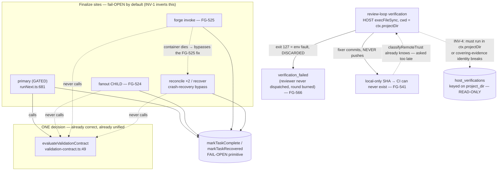

# PRD — Review Execution Trust (FG-566 · FG-541 · FG-524 · FG-525)

**Status:** proposed — binding on approval. **Cluster baseline:** `185afc3` (origin/main).
**Discovery input (evidence, NOT a contract):** `docs/plans/foundations-lane-b-review-trust.md` and
`docs/plans/foundations-lane-b-probes/*`.

> **Normative split.** This PRD is the **sole normative surface** for this cluster: it owns the binding
> decisions, invariants, boundaries, non-goals, and acceptance. The lane plan is architecture/discovery
> input — evidence, probes, ground truth, stale-ticket corrections. Where this PRD needs evidence it
> **cites** the plan (path + section) rather than restating it. **Where the plan's prose reads as a
> decision, this PRD is authoritative and supersedes it.** Two documents asserting the same rule is how
> they drift; that is the failure this split exists to prevent.

> **Evidence labels used below.** **VERIFIED FACT** — file:line or executed-probe output. **INFERENCE** —
> reasoning from verified facts. **OPEN QUESTION** — unsettled; names who settles it. **NORMATIVE-UNMET** —
> a contract this PRD *establishes* that the system does not implement today; it is **unmet, not
> falsified**, and it gets an acceptance condition + verification method, **never** a fabricated red.

---

## 1. Problem and thesis

The four tickets are four instances of **one** failure class: a trust gate enforced on one path and
silently absent on adjacent ones — the system **fails open** when a new finalize or verification path is
added. Discovery confirmed the class and widened it (plan §0): the FG-523 validation gate is enforced at
exactly one of the task-finalize call sites, and the review-loop's verification path misclassifies an
unprepared environment as a code failure and reports a delegation to CI that never happens.

**The root cause is architectural, and it is not any single ticket** (plan §0, §4; verified:
`evaluateValidationContract` at `src/v2/validation-contract.ts:49` is reached only through
`holdIfValidationContractFails` at `runNext.ts:967`, itself called from the single site `runNext.ts:681`;
`markTaskComplete` at `src/store/tasks.ts:126` has many callers, one gated). A new finalize path is
**ungated by default**. FG-524 and FG-525 are not two bugs — they are two instances of a defaulting rule,
and the instances will keep arriving until the default is inverted.

---

## 2. Central invariant — declared finalize sites (the cluster's spine)

**Enforcement lives at the finalize DECISION, not at the terminal-write primitive.**
`evaluateValidationContract` is a correct pure function (VERIFIED FACT, plan §2.3 ARM 1 — the evaluator
returns the right hold decision for every site's contraband); the gap is that most finalize paths never
reach it. But the enumeration unit must be chosen at the granularity where the gate actually discriminates,
because **the store primitive is the wrong granularity to enumerate at:**

> **VERIFIED FACT — the wrapper collapses classes the gate must separate.** `finalizePrimary`
> (`runNext.ts:997`) is the **fail-open finalize wrapper** and the semantic boundary between a *gated
> workflow primary* and an *exempt synthetic aggregate*. It is called from three sites — the gated
> single-step primary (`:838`), the **exempt** fanout parent aggregate (`:1955`), and the
> publication/crash-recovery reconcile (`:2180`) — and **all three funnel through its single terminal
> write, `markTaskComplete` at `:1010`.** A guard placed literally at that `markTaskComplete` call site is
> **blind** to which class it is finalizing: `:838` (must enforce `tests_run`) and `:1955` (exempt by
> FG-524's design) are indistinguishable there. The discriminating information lives in `finalizePrimary`'s
> **caller class**, not at the primitive. Enumerating `markTaskComplete`/`markTaskRecovered` call sites
> (INV-1's prior unit) therefore cannot express the gate, and does not match the plan's census, which keys
> `:838` and `:1955` on their *`finalizePrimary` call sites* — **two different units** the PRD must
> reconcile.

Therefore the enumeration unit is the **finalize EVENT, classified by the lineage/role the FG-523 evaluator
already keys on** — not a flat list of terminal-write call sites, and never an `agentRole.startsWith("red-")`
heuristic (§9.1):

> **INV-1 (DECLARED FINALIZE SITES).** Every path that writes a task to a terminal `complete`/`recovered`
> status is an **enumerated, annotated, machine-checked** member of a declared set, and each member is
> classified **by the semantic class the gate treats differently** — not by the name of the store function
> it calls. A guard must be able to look at a finalize event and know **which class it is** from the run's
> lineage (`isInvokeLikeRun` / `taskHasPipelineFinalize`, `run-kind.ts`) and the task's role
> (`IMPLEMENTER_ROLES`, `validation-contract.ts:53`) — the SAME signals the evaluator uses. The classes and
> their gate disposition (this table reconciles the plan §1.1 census — keyed by store-function call site —
> into the buildable semantic unit; plan §1.1 carries the line-level evidence):
>
> | Finalize class | Terminal write path | Disposition |
> |---|---|---|
> | **gated workflow primary** | `finalizePrimary` ← single-step `runNext.ts:838` → `:1010` | **gated** by the validation contract |
> | **exempt synthetic aggregate** | `finalizePrimary` ← fanout parent `runNext.ts:1955` → `:1010` | **exempt by construction** — the aggregate carries no `tests_run`; sound **only if the children are gated** (D3) |
> | **gated fanout implementer child** | `markTaskComplete` direct, `runNext.ts:2541` | **gated** — FG-524 (D3); this is the child site D3 acts on, distinct from the parent aggregate above |
> | **exempt red-review child** | `markTaskComplete` direct, `runNext.ts:1381` | **exempt by role** (reds ∉ `IMPLEMENTER_ROLES`) |
> | **gated ad-hoc invoke** | `markTaskComplete` direct, `invoke.ts:813` | **gated** — FG-525 (D4) |
> | **exempt inferred-result invoke** | `markTaskComplete` direct, `invoke.ts:768` (FG-337 inferred-result) | **exempt by role** — the inferred-result composer returns `undefined` for every implementer role (`requiresStructuredResult` true; only `NARRATIVE_ROLES` reach it), so no gated role can finalize here; a live invoke-lineage terminal write the census must still classify, not omit (plan §1.1) |
> | **crash-recovery finalize** | `reconcile.ts:779`/`:880`, `recover.ts:457` (`markTaskRecovered`), `finalizePrimary` ← `:2180` | **sweeper-declines** — must not complete contraband (D4); `reconcile`/`recover` are the sites *unnamed by any ticket* until this cluster |
> | **intentional human override** | `gate.ts:209` | **exempt** — this IS the override |
> | **post-gate re-entry** | `runNext.ts:936`, `:1661` | **exempt** — the advance decision was already recorded |
> | **non-implementer task** | `design.ts`, `claude.ts` | **exempt by role** |
>
> Adding a terminal-status write that is not classified is a **build failure**, not a silent omission.
> **An unclassified terminal-write path is a defect** — the exact hole (the reconcile/recover sites, plan
> §1.1) this invariant exists to close. An ungated implementer-reachable finalize is thereby an explicit,
> greppable, reviewable act.

This is a **machine backstop for the failure class**, not a fifth patch. It is what stops FG-524/FG-525
recurring when finalize path #N is added later — the same way they were added: by nobody noticing the
default (plan §4).

- **Classification: NORMATIVE-UNMET.** No such guard exists today; the census in plan §1.1 is prose, not
  executable truth. The plan (§6, story B0) framed its falsification as "red today by construction — no
  such guard exists." **This PRD reclassifies that as NORMATIVE-UNMET and says so explicitly:** a guard
  that can only "go red" because it has not been written yet is not evidence of a defect — it is an
  unbuilt contract. It gets an acceptance condition (§8), not a fabricated baseline red.
- **Prior art / evidence:** the class boundaries above are already documented in prose at the evaluator's
  header (`validation-contract.ts:12-21` — it names the invoke and fanout-child paths as knowingly ungated,
  and asserts "reconcile never completes a workflow primary"); the guard makes that prose executable and
  extends it to the reconcile/recover sites the header does not mention. The line-level census (one gated,
  six ungated by construction, plus the intentional/role-exempt sites) is enumerated in plan §1.1.

---

## 3. Binding decisions

### D1 — FG-566: detect environment readiness first; provision the clone in place; refuse rather than guess a runtime

**Decision.** The review-loop must distinguish an **unprepared verification environment** from a **code
failure**, at every local-run site, and must never spend a review round or dispatch a reviewer/fixer on an
environment fault.

1. **Detect + classify (the floor, always safe).** Readiness is asserted immediately before **each** of
   the three host-local verification sites (`cli/commands/review-loop.ts:544` dirty-tree, `:622`
   CI-unavailable fallback, `:853` fixer pre-commit — VERIFIED, all `runVerify(..., {cwd: ctx.projectDir})`).
   Independently, the verification runner must **stop discarding the child exit code** (the env signal
   already exists at the exec boundary and is dropped — plan §1.2; an unprepared toolchain exits `127`),
   so a `127`/`ENOENT` can never be laundered into a code finding even if a pre-check passed.
2. **A distinct disposition.** An unprepared environment resolves to
   **`verification_environment_unavailable`** — reuse the existing `FailureKind`
   (`src/v2/failure-kind.ts:151`) already classified as an infra fault, not a code fault
   (`src/campaign/policy.ts:62` → `campaign_system`). It is a **loop outcome, not a round**: **zero rounds
   consumed, neither reviewer nor fixer dispatched, one actionable recovery instruction.** It must be
   distinguishable from `verification_failed` at **every** surface it reaches (CLI, `--json`, run note,
   events, dashboard). **No surface may state that a reviewer reviewed anything when verification prevented
   reviewer dispatch.**
3. **Provision the clone in place.** Dependency provisioning installs `node_modules` **into
   `ctx.projectDir`** — host-side, lockfile-keyed, **docker-free** — leaving verification executing where
   it executes today. Rationale is forced by the evidence schema, see INV-4. Reuse the readiness
   vocabulary and host-drivable shape already present in `docker/forge-test.sh` (VERIFIED — env-fault
   distinction, `FORGE_SRC_DIR`/`FORGE_WORK_DIR`, `_node_modules_is_empty`/`_sqlite_loads` probes) and pick
   **one of the two existing cache-key schemes**, never a third (see OQ-3).
4. **Declare a runtime; do not select one.** FG-566 **declares and records** the runtime used to provision
   (default: Forge's own `process.execPath` / `process.versions.modules`, recorded alongside the lockfile
   hash). If the project declares a runtime Forge cannot satisfy, **refuse before round 1** with
   `verification_environment_unavailable` — **do not guess, do not search PATH.** Runtime *selection* is
   FG-555's contract and is out of scope (see OQ-1).

- **Classification.** The misclassification being fixed is a **FACTUAL DEFECT with observed-red evidence**
  (plan §2.1, EXECUTED, with a prepared-repo control arm: same SHA, unprepared → `ok=false`, prepared →
  `ok=true`; reviewer dispatched 0×; both rounds burned; fixer handed `tsc: not found` as a code finding).
  The new zero-round disposition, the readiness gate, and provisioning are **NORMATIVE-UNMET** (contracts
  to build; acceptance in §8).
- **Superseded plan prose:** the FG-566 default-runtime paragraph in plan §3 is advisory; this PRD's D1.4
  is authoritative and is the line that FG-555 will re-point (OQ-1).

### D2 — FG-541: default no-push with an honest `local_only` outcome; `--push-fixes` is an explicit, authority-gated opt-in

There are **two independent questions**; conflating them is what produced the stale comment (plan §1.2).

**(a) Is the verification outcome HONEST? — ships unconditionally, first, and alone.**
- Consult `classifyRemoteTrust` **before** probing CI, not after (VERIFIED — the function exists and
  computes `local_only` at `review-loop.ts:465`, but is consulted only at `:1078` for the closeability
  verdict). If HEAD is `local_only`, **skip the CI probe entirely** — do not poll, do not wait out
  `CI_WAIT_TIMEOUT` for a check-run that cannot exist.
- Emit a **distinct `local_only` verification outcome**, separate from generic "CI unavailable"
  (`review-loop.ts:620`), naming the unpushed SHA(s) and the one recovery instruction.
- **`extendedDelegatedToCi` must be FALSE when the tip is local-only** (VERIFIED — unconditionally
  `!ctx.localExtended` at `:621`). Extended coverage on a local-only fixer commit is **absent, not
  delegated.** Say so.
- Correct the stale comment (`:848-851`) so it states what the code does.

**(b) Should Forge acquire PUSH authority? — `--push-fixes`, opt-in, default OFF, implementation deferred.**
The review-loop operates on the operator's **live checkout** (`projectDir = resolve(opts.project ??
process.cwd())`), not an isolated worktree. Silently acquiring publish authority over a human's working
branch is a large, hard-to-reverse escalation bought for a convenience. Default-off preserves today's
authority boundary (Forge never publishes); the opt-in makes the escalation an explicit per-invocation
human act. **The push authority is deferred out of the critical path** so that the honest default is fully
functional even if the answer to OQ-2 is "never."

**Scope split — do not conflate the three parts.** (1) Only (a) — the default no-push behavior and the
honest `local_only` outcome — **ships and is verified in this cluster** (N-5); that is the FG-541 design
stance's required-now surface ("no production push behavior changes under this design ticket alone").
(2) The full `--push-fixes` safety contract is **fully designed here and binding whenever the flag is on**
(INV-5) — but building the flag is a **separable opt-in whose implementation is NORMATIVE-UNMET and NOT
part of this cluster's shipping acceptance** (N-6 is conditional). The invariant governs the design; it
does not force the feature into this cluster. (3) Whether Forge should ever hold push authority at all
stays the **open human policy question** (OQ-2); the default in force now is no-push, and enabling push
authority is the deferred opt-in gated on that answer.

- **Classification.** The underlying defect is a **FACTUAL DEFECT with observed-red evidence** (plan §2.2,
  EXECUTED — the structural census is decisive: no `git push` verb exists in either review-loop file
  [VERIFIED — the git-verb set is `add checkout clean commit rev-parse rm status` + `fetch`; no `push`],
  so the next round probes CI for a SHA GitHub never received; the historical six-SHA reconstruction
  corroborates and rules out coincidence). **The plan's corrected conclusion — this is an ABSENCE, not a
  CI-registration race — is confirmed; carry its stated HONEST LIMIT** (a clone carries no reflog of when
  `origin` first received a push, so the historical arm bounds "on origin BY the merge," not "first on
  origin AT"; the conclusion does not depend on that instant — the structural arm carries it). The
  `local_only` outcome is **NORMATIVE-UNMET** and **must be built and verified in this cluster** (N-5). The
  `--push-fixes` safety contract is likewise **NORMATIVE-UNMET**, but it is a **design-only obligation
  here**: binding whenever the flag is on (INV-5), while its implementation is the deferred opt-in of
  D2(b) — **not** part of this cluster's shipping acceptance (N-6 is conditional, gated on OQ-2).

### D3 — FG-524: gate the fanout child, AND couple the gate to parent re-aggregation

**Gating the child alone is a regression, not a partial fix.** A held child would **wedge the fanout
permanently** today: re-entry does not re-aggregate — with non-red children present it returns
`existingParent.status` and stops (VERIFIED — `runNext.ts:1668-1671`), and `ChildOutcome`
(`runNext.ts:2353`) has no `held` variant. So the gate and the re-aggregation are **one indivisible
decision.** (plan §3 FG-524, §9 HIGH.)

**Decision:**
- A held implementer child holds via the **existing** `markTaskHeldForGate` + the existing
  `task.awaiting_gate` event payload — **no schema migration** (VERIFIED — `awaiting_gate` and the hold
  reason payload already exist; plan §1.3).
- `ChildOutcome` gains a **held** variant; aggregation learns it.
- **The parent HOLDS (`awaiting_gate`), publication is WITHHELD, reds do NOT run**, with a named reason
  enumerating the held children. *Why:* the publisher merges child work into HEAD
  (`publishFanoutIntegration`, `runNext.ts:1942`/`:1973`); publishing a subtree containing an unvalidated
  child's work **is** the silent advance the contract exists to prevent. Withholding is the only fail-safe
  direction (INV-2).
- **`failure_mode: "continue"` must NOT swallow a held child.** Held ≠ failed. `continue` is a policy for
  "this is bad"; a hold means "we do not know if this is good." Explicitly excluded.
- **Operator verb: `forge gate advance|reject <childTaskId>`, per child, then `forge run next`** — reuses
  the existing override verb (`gate.ts:209`), preserving the per-child decision.
- **Fanout re-entry must RE-AGGREGATE** when the parent is non-terminal and all children are now terminal:
  recompute the aggregate from the children's current results, then proceed to reds → publish → finalize.
  Without this, the operator advances the child and nothing happens.
- **Held-child worktree retention is INTENTIONAL and its reclaim path is named.** A held child is
  non-terminal and unmerged, so its worktree must be retained; today `childTasksForCleanup` filters
  `status === "complete"` (VERIFIED — `runNext.ts:1620-1626`), so retention is *accidental* and no reaper
  collects it (plan INV-3 / §9.2). **Acceptance: N-9.**

- **Classification.** The gap is a **FACTUAL DEFECT with observed-red evidence** (plan §2.3 ARM 2,
  EXECUTED via the real `dispatchFanoutStep` against real SQLite — contraband child *and* parent both
  completed silently). **The re-aggregation behavior is NORMATIVE-UNMET.** The plan (§6, F10) framed
  "advance held child → parent re-aggregates" as "red today." **This PRD reclassifies that as
  NORMATIVE-UNMET and says so:** there is no held-child state at baseline, so the wedge cannot be observed
  red without first building the gate — the `:1671` no-op is a VERIFIED FACT feeding the design, not a
  falsification. It gets an acceptance condition (§8), not a fabricated red. Likewise the
  `continue`-must-not-swallow-a-hold rule is NORMATIVE-UNMET.

### D4 — FG-525: gate `forge invoke`, and gate its crash-recovery bypasses, or the gate has a hole

**Decision.** Route the ad-hoc `forge invoke` implementer completion (`invoke.ts:813`) through the same
evaluator. A held invoke **returns `awaiting_gate` honestly with a non-zero exit** to its synchronous
caller (not a silent complete). The blast radius is **exactly the implementer roles** — the evaluator
exempts everything else by role (VERIFIED — `validation-contract.ts:53`), which is what makes this safe.

**And it must not ship with a hole.** Gating `invoke.ts:813` alone leaves three crash-recovery finalize
sites that a container crash walks straight through (VERIFIED these are real invoke-reachable finalize
sites: `reconcile.ts:779` and `:880` complete an invoke-like task when `isInvokeLikeRun` is true at
`reconcile.ts:416`; `recover.ts:457` adopts a result via `markTaskRecovered`). **The gate must cover those
sites too** — as a **sweeper decline** (the crash-recovery paths cannot "pause a run"; they must decline to
complete contraband and leave the task non-terminal, in the shape of the existing
`failPipelineUnfinalized`). **Prior art:** FG-479 already refused to let reconcile complete a *pipeline*
task for exactly this reason (VERIFIED — the `!isInvokeLikeRun` branch at `reconcile.ts:768`/`:869` lands
`failPipelineUnfinalized`); this cluster extends that principle from the pipeline finalize to the
validation gate.

The header comment at `validation-contract.ts:12-21` must end up naming the invoke path's **real** status
(it currently says "Ungated for now… Whether to gate it is FG-525").

- **Classification.** The primary gap is a **FACTUAL DEFECT with observed-red evidence** (plan §2.3 ARM 3,
  EXECUTED — a real implementer invoke with `status:complete`, no `tests_run`, no waiver completed
  silently). **The crash-recovery bypass is a REACHABLE GAP whose red is currently INFERENCE only** (plan
  §2.4 — reaching it needs a genuine container-gone state, and Docker is unavailable in the discovery
  container). **Its observed-red is REQUIRED at implementation** and must be produced there (§8 F9); the
  probe must be **written for the operator to run on the host** and its claim stays INFERENCE until
  executed. The held-invoke honest-return contract is NORMATIVE-UNMET.

### D5 — The failure-class backstop is the highest-leverage item and lands first

INV-1's declared-finalize-site guard is the highest-leverage item in the cluster. It is a test, not an
abstraction — no base class, three similar landings beat one premature hierarchy (plan §4). **This is a
sequencing/leverage claim, not an acceptance claim: the guard is the single most valuable item and the one
to land first — it does not, on its own, satisfy the cluster's acceptance.** Acceptance remains the full set
of §7 normative conditions, each unconditional in its own right (e.g. N-8's FG-566 provisioning ceiling is
required regardless of what else ships); nothing in this cluster's acceptance is discharged by the guard
alone. Its leverage is that it makes D3 and D4 reviewable (a reviewer cannot otherwise tell whether a
finalize gate is complete) and encodes the seven-site census as executable truth that fails loudly rather
than rotting — which is why it is prioritized first, not why it stands in for the rest.

---

## 4. Invariants

- **INV-1 — DECLARED FINALIZE SITES.** As §2. The enumeration unit is the **finalize event classified by
  lineage/role** (the signals the FG-523 evaluator keys on), **not** a flat `markTaskComplete`/
  `markTaskRecovered` call-site list — because `finalizePrimary` collapses the gated primary and the exempt
  aggregate onto one terminal write (`runNext.ts:1010`), a primitive-site guard cannot tell them apart.
  Every finalize event is classified (gated / exempt-with-reason / sweeper-declines); an unclassified
  terminal-write path is a build failure.
- **INV-2 — GATE COUPLES TO RE-AGGREGATION / NO SILENT PUBLICATION.** A held fanout child holds its parent
  and **withholds publication**; the parent's stored aggregate is recomputed from the children's current
  results on re-drive. Publication of a subtree containing an unvalidated child is forbidden. Held ≠
  failed; `failure_mode: "continue"` may not step over a hold.
- **INV-3 — ZERO ROUNDS ON ENVIRONMENT-UNAVAILABLE.** `verification_environment_unavailable` consumes zero
  review rounds and dispatches neither reviewer nor fixer, and is distinguishable from `verification_failed`
  at every surface. No surface may claim a reviewer reviewed anything when verification prevented reviewer
  dispatch.
- **INV-4 — COVERING-EVIDENCE IDENTITY.** Local verification executes in `ctx.projectDir` and nowhere else.
  The covering-evidence model keys `host_verifications` on `project_dir` as an **exact-match dimension**
  (VERIFIED — `store/schema.ts` `project_dir` column; `host-verifications.ts` resolves paths lexically,
  not by identity). Verifying in a scratch clone would either be invisible to covering-evidence lookup or
  force a row asserting a gate passed in a directory where it did not run — the manufacture of false gate
  evidence, the exact failure class this cluster destroys. **Therefore provisioning installs into
  `ctx.projectDir`; the covering-evidence schema is read-only and unchanged** (plan §3).
- **INV-5 — `--push-fixes` SAFETY CONTRACT (binding whenever on).** No force push, ever (no `--force`,
  no `--force-with-lease`; non-fast-forward → abort + report `diverged`, no retry). No branch creation by
  guess — push only to the existing upstream `@{u}`; no upstream → land `local_only`. No push from detached
  HEAD. Clean tree asserted at push time (not inferred from the fixer's commit). **No silent publication of
  pre-existing unrelated local commits:** compute the local-only set vs `@{u}` **before** the loop's first
  fixer commit; if non-empty, the branch carries unpushed work this loop did not author and no reviewer in
  this loop saw — **refuse to push**, land `local_only`. One attempt; on failure land the honest
  `local_only` with the push error named. **A push never confers closeability** — closeable still requires
  BOTH FG-514 fetched remote-head EQUALITY AND the required CI green (`test` AND `test-extended`) on the
  published exact head. **This contract is fully designed here and binds whenever the flag is on; building
  the flag is the deferred opt-in of D2(b), gated on OQ-2 — it is not part of this cluster's shipping
  acceptance (N-6 is conditional).**

---

## 5. Boundaries

- **Do not mutate a checkout Forge does not own.** Never the live `main`, its shared bindings, the reviewed
  source or lockfile, or another clone's deps. Provisioning writes only the git-ignored `node_modules`, and
  only into a **Forge-owned workspace** (or on explicit operator opt-in). Otherwise **detect and refuse**
  with the recovery instruction. Detection is the floor and always safe; provisioning is the ceiling and is
  authority-bounded (plan §3).
- **The covering-evidence schema is read-only** for this cluster (INV-4).
- **No task-row / `tasks` schema migration** — the hold state and reason payload already exist (plan §1.3).

---

## 6. Non-goals

- **No blind CI-registration delay.** The FG-541 defect is an ABSENCE, not a race (plan §2.2); waiting
  longer for a check-run on an unpushed SHA is a non-fix.
- **No force-push authority, ever** (INV-5).
- **No weakening of exact-head CI, reviewed-tip equality, or closeability.** Partial covering-evidence
  credits nothing; the fixer's fast-tier pre-commit run may **not** be recorded as covering the required
  gate (that would manufacture green gate evidence). If fast-tier re-run ever proves costly, that is a
  separate memoization ticket whose result must be un-mistakable for gate evidence.
- **No third dependency-readiness vocabulary.** Reuse FG-376's `verification_environment_unavailable` and
  `docker/forge-test.sh`'s reason/probe vocabulary; adopt one of the two existing cache-key schemes.
- **No `on_reject`-over-fanout.** It is forbidden at workflow validation today (VERIFIED — `schema.ts:198`+,
  tracked in FG-478, a body-less ticket). `gate reject <childTaskId>` fails the child; the parent then
  follows ordinary `failure_mode`. Do not build on_reject-over-fanout here.
- **No decomposition.** This PRD defines the acceptance a later decomposition must satisfy; it does not
  contain the child list.

---

## 7. Acceptance

Method (corrected): a **factual defect or reachable gap** requires **observed-red** against baseline
`185afc3`; a **NORMATIVE-UNMET** contract gets an **acceptance condition + verification method and NO
fabricated red**. Where the plan asserted a red for an unimplemented norm, this PRD has reclassified it
(§2, D3) and says so.

### 7.1 Observed-red required (the plan already has these)

| Ref | Defect | Evidence (plan) | Status |
|---|---|---|---|
| R-566 | Unprepared env misclassified as code failure: reviewer dispatched 0×, both rounds burned, fixer handed `tsc: not found`. **Prepared-repo control arm** proves attribution to the environment. | §2.1 EXECUTED | red captured |
| R-524 | Contraband fanout implementer child **and** its parent complete silently, via the real `dispatchFanoutStep` against real SQLite. | §2.3 ARM 2 EXECUTED | red captured |
| R-525 | Contraband ad-hoc implementer `invoke` completes silently, via the real invoke path. | §2.3 ARM 3 EXECUTED | red captured |
| R-541 | Fixer commits and never pushes (source census: no `git push` verb) → next round probes CI for a SHA GitHub never received; `extendedDelegatedToCi` unconditionally true; stale comment. | §2.2 EXECUTED (structural decisive + historical corroborating) | red captured |
| R-525b (**F9**) | Held implementer invoke whose container dies is completed **ungated** by `reconcile.ts:779`/`:880` or adopted by `recover.ts:457`, bypassing the D4 fix. **Currently INFERENCE only** (§2.4). | §2.4 | **observed-red REQUIRED at implementation** — needs a container-gone state; write the probe for host execution; claim stays INFERENCE until run |

### 7.2 NORMATIVE-UNMET (acceptance condition + verification method; no fabricated red)

- **N-1 (INV-1, declared finalize sites).** *Acceptance:* a terminal-status write reachable by an
  implementer role that is not classified into one of the §2 finalize classes fails the build — including a
  new `finalizePrimary` caller (whose class is decided at the caller, not at `:1010`) and a new direct
  `markTaskComplete`/`markTaskRecovered` site. *Verification:* the guard test enumerates the §2 classes
  (reconciled with the plan §1.1 census), asserts each of the census sites maps to its declared class, and
  rejects a wildcard/blanket allowlist; it keys class membership on lineage/role, not on
  `agentRole.startsWith("red-")` (§9.1). *(Reclassified from plan B0/F0 — "red by construction" is not a
  baseline red.)*
- **N-2 (INV-3 + D1, zero-round env-unavailable).** *Acceptance:* a forced install failure stops **before
  round 1** as `verification_environment_unavailable` with no reviewer/fixer dispatch; deps absent **or
  built for an incompatible ABI** are not accepted as ready. **And the outcome is DISTINGUISHED from
  `verification_failed` at every named operator/machine surface FG-566 requires (D1.2, INV-3) — human CLI
  output, structured/`--json` output, run notes, and dashboard — with, at each, NO statement or implication
  that a reviewer reviewed anything (verification blocked reviewer dispatch: zero rounds, reviewer never
  invoked).** *Verification:* exercise the readiness gate and the preserved exit code at all three local-run
  sites (`review-loop.ts:544`/`:622`/`:853`); then, on the same env-unavailable run, assert the distinction
  **per surface** — (i) **CLI human output** names `verification_environment_unavailable` (not "verification
  failed"), carries the one recovery instruction, and contains no "reviewed"/round-consumed language; (ii)
  **structured `--json`** emits the env-unavailable outcome as a machine value distinct from
  `verification_failed`, with rounds-consumed = 0 and no reviewer-dispatched record; (iii) **run notes**
  record the env-unavailable disposition, not a code failure and not a reviewer verdict; (iv) **dashboard**
  renders the env-unavailable state distinctly from a `verification_failed`/code-failure state. Each surface
  assertion additionally proves the negative: no reviewer-reviewed claim appears on that surface when
  verification prevented reviewer dispatch.
- **N-3 (D1 ordering constraint).** *Acceptance:* trusted covering CI evidence → **no** provisioning, reuse
  semantics unchanged. *Verification:* the readiness gate sits after the covering-evidence / CI-status
  branches resolve; CI reuse never pays for provisioning.
- **N-4 (anti-laundering regression guard).** *Acceptance:* a **real** typecheck/test regression in a
  **prepared** env follows ordinary verification/fixer policy, unchanged. *Verification:* the prepared-env
  control arm (plan §2.1) stays green; a genuine code failure is never reclassified as environment-unavailable.
- **N-5 (D2, `local_only` honesty).** *Acceptance:* after a round-1 fixer commit, round 2 does **not**
  probe/poll CI for the local-only SHA, reports `local_only` (not generic "CI unavailable"), and does not
  claim extended was delegated. *Verification:* drive the loop; assert the pre-CI `classifyRemoteTrust`
  consult and `extendedDelegatedToCi === false`.
- **N-6 (INV-5, `--push-fixes`) — CONDITIONAL; NOT part of this cluster's shipping acceptance.**
  *Acceptance:* **IF/when `--push-fixes` is implemented** (the deferred opt-in of D2(b), gated on OQ-2),
  each INV-5 clause holds under the flag (no force, upstream-only, no detached HEAD, clean tree, refuse on
  pre-existing unrelated local commits, one attempt, no closeability from push alone). *Verification:*
  per-clause tests against a real upstream, run when the flag lands. The invariant **governs the design
  now**; it does **not** require the feature to be built in this cluster — only (a)/N-5 ships here.
- **N-7 (INV-2, re-aggregation + hold semantics).** *Acceptance:* a held fanout child holds the parent with
  publication withheld and reds not run; advancing the child then `forge run next` makes the parent
  **re-aggregate, publish, and complete**; `failure_mode: "continue"` does not step over a hold.
  *Verification:* drive the real fanout re-entry; assert the `:1668-1671` branch now re-aggregates rather
  than returning `existingParent.status`.
- **N-8 (D1 provisioning ceiling).** *Acceptance:* a fresh standalone Forge-owned clone with no
  `node_modules`, forced onto local fallback, provisions and dispatches the reviewer **as round 1**; a
  failed/interrupted install can **never** be marked ready; the operator's live checkout is never mutated.
  *Verification:* crash-safety test around the install; ownership-predicate test.
- **N-9 (INV-2 coupling + §9.2, held-child worktree retention → reclaim).** Distinct from N-7 (which accepts
  re-aggregation + hold *semantics*); this accepts the worktree *lifecycle* D3's reclaim decision names.
  *Acceptance:* **(a) retained while held** — while a fanout child is held (`awaiting_gate`, non-terminal,
  unmerged), its worktree is **RETAINED** and is **not swept** by any cleanup/reaper pass; retention is
  **intentional**, not the accidental side effect of `childTasksForCleanup` filtering `status === "complete"`
  (`runNext.ts:1620-1626`), and the FG-356 reaper treats `awaiting_gate` as a live child state, not an
  orphan (§9.2). **(b) reclaimed on resolve/run-end** — once the held child **resolves** (`forge gate
  advance|reject <childTaskId>`) and the parent **finalizes**, **or the run ends** with the child still
  held, the worktree is **RECLAIMED**, never leaked. *Verification:* a test driving the full arc — hold a
  child → assert its worktree **survives** a cleanup/reaper pass while held → resolve the child and drive
  parent finalize → assert the worktree is **reclaimed**; plus a run-end arm (child still held at run
  termination) asserting reclaim, not leak. *(NORMATIVE-UNMET: today's retention is accidental and no reaper
  collects a held child — plan §9.2 / D3; this establishes the contract, not a fabricated red.)*

### 7.3 FG-566's five required falsifications, mapped

| Ticket falsification | Maps to |
|---|---|
| F1 — fresh clone, no deps → reviewer dispatched as round 1 | R-566 (baseline red, §2.1) + N-8 (provisioning acceptance) |
| F2 — forced install failure → stop before round 1, no dispatch | N-2 |
| F3 — deps absent / ABI-incompatible → not accepted as ready | N-2 (re-derive against the pinned ABI, not 137 — §9.4) |
| F4 — trusted covering CI evidence → no provisioning | N-3 |
| F5 — real regression in prepared env → policy unchanged | N-4 |

---

## 8. Architecture

The dashed `invoke → reconcile` edge is the load-bearing claim: it is the path that walks around the D4
fix (INV-1 sweeper-declines closes it). The dashed `classifyRemoteTrust` edge is D2's: the answer is
already computed, just not in time. The dashed `host_verifications` edge is INV-4: verifying anywhere other
than `ctx.projectDir` manufactures false gate evidence.

---

## 9. Cross-cluster boundaries — stated, not resolved

The integration artifact orders these; this PRD only names them precisely.

### 9.1 FG-527 (Lane C lineage classifier) × FG-524 — same file, adjacent regions, one real semantic seam

FG-527 and FG-524 both touch `dispatchFanoutStep`'s parent dispatch/re-entry prologue. **Two direct
line-level overlaps** (VERIFIED, plan §7.1): `runNext.ts:1620-1626` (FG-527 rewrites the predicate; FG-524
changes the *semantics* — a held child must be retained, not swept) and `runNext.ts:1668-1671` (FG-527
rewrites the `red-` predicate; FG-524 replaces the branch outright to re-aggregate). **The semantic seam
and its trap:** the naive way to ask "implementer child (gate) vs red child (exempt)?" at finalize time is
`agentRole.startsWith("red-")` — the exact heuristic FG-527 is deleting. **This PRD's boundary decision:
FG-524 must not ask that question at all** — the evaluator is already role-scoped (`IMPLEMENTER_ROLES`
excludes reds), so calling it unconditionally at the child finalize lets *role* do the exempting, adds no
lineage dependency, and is strictly less code. Do not introduce a `red-` check.

### 9.2 Workspace isolation (FG-356 reaper) × FG-524 — held-child worktree with no reaper

A held child leaves a **non-terminal** task pinning a worktree; `childTasksForCleanup` filters
`status === "complete"` and FG-356's reaper sweeps only orphaned/failed (VERIFIED, plan §7.3). So **nothing
collects a held child's worktree.** FG-524 must make retention intentional and name the reclaim path (INV-3
of the plan / this PRD's D3), and FG-356 must learn that `awaiting_gate` is now a reachable child state.

### 9.3 FG-559 (workspace definition) × FG-566 provisioning

FG-566's ownership predicate ("provision only a Forge-owned workspace") must be written against whatever
FG-559 lands as a Forge-owned workspace (linked worktree vs standalone clone), not against today's
assumption. FG-566 does not fix git-in-container; FG-559 does not fix deps — these are distinct contracts
(plan §7.3).

---

## 10. Open questions

- **OQ-1 (FG-555 owns) — verification runtime vs control runtime.** "Verification runtime == Forge's
  control runtime" is true for forge-reviewing-forge and false in general. D1.4 **declares and records** a
  runtime and **refuses rather than guesses** on mismatch, chosen so it cannot contradict FG-555. When
  FG-555 lands its launched-workload runtime contract, D1.4's default (`process.execPath` / ABI) is the one
  line that changes. **Kept OPEN, owned by FG-555 — not resolved here.**
- **OQ-2 (human policy) — should Forge ever hold push authority over a human's working branch?** D2 makes
  the loop honest with **no** new authority; `--push-fixes` is deliberately off the critical path so the
  answer can be "never." Recommendation: opt-in, default-off, under INV-5. Policy call, not architecture.
- **OQ-3 (engineer) — cache-key scheme.** Two exist: sha256(`package-lock.json`) truncated
  (`dependency-provisioning.ts:52`) vs sha1(`package.json`+`package-lock.json`) (`forge-test.sh`). FG-566
  must adopt **one of these two**, not mint a third. No architectural basis to prefer either.
- **OQ-4 (revalidation trigger, FG-553/FG-555) — the probes ran the working tree via `tsx`.** After FG-553,
  `forge review-loop` runs the promoted release, so a fix in `src/` is not live until promoted; each
  acceptance falsification must be executed against the right artifact, and probe `fg566-unprepared-env.sh`
  re-run once FG-553/FG-555 land (plan §8).
