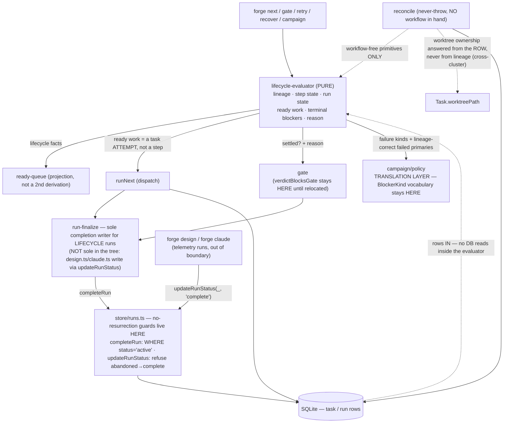

# PRD — Workflow lifecycle semantics (FG-477 + FG-527)

**Status:** proposed — binding on acceptance.
**Cluster:** FG-477 (lifecycle evaluator) + FG-527 (classifier migration of `retry.ts` / `dispatchFanoutStep`).
**Verified at:** `f3bfee0`. `git diff 185afc3 f3bfee0 -- src/` is **empty** — source is byte-identical to the
discovery baseline, so every citation in the discovery artifact holds unchanged at this SHA. **VERIFIED FACT.**

**Evidence base (cited, not restated):** `docs/plans/foundations-lane-c-lifecycle-semantics.md` and its four
rerunnable probes under `docs/plans/foundations-lane-c-probes/`. All four were **re-executed against `f3bfee0`
during authorship of this PRD** and reproduce their captured output; `npm run typecheck` is clean. (The plan's
note that `tsc` is unavailable was an artifact of an uninstalled `node_modules`, not of the repo — `npm ci`
resolves it.)

---

## 0. Normative status — read this first

**This PRD is the sole normative surface for this cluster.** It owns the binding decisions, invariants,
boundaries, non-goals and acceptance conditions below.

The lane plan at `docs/plans/foundations-lane-c-lifecycle-semantics.md` is **architecture and discovery input**:
evidence, probes, census, ground truth. It is **not a contract and is not accepted.** Where its prose reads as a
decision, **this PRD is authoritative and supersedes it.** Two documents asserting the same rule is how they
drift; that is the failure this split exists to prevent. Where this PRD needs evidence it **cites** the plan by
section rather than restating it.

Two further supersessions, stated explicitly so they cannot be re-imported:

- **FG-527's acceptance criterion #2 is WRONG.** This PRD contradicts it. See §2.
- **FG-477's 2026-07-07 architecture artifact and its decision table are SUPERSEDED** (the ticket's own
  supersession note already says so). The shipped code and its tests are authoritative for what the lineage
  layer *is*; this PRD is authoritative for what it must *become*. **Do not re-derive from the artifact's
  decision table.**

### Evidence labels used throughout

| Label | Meaning |
|---|---|
| **VERIFIED FACT** | A `file:line` citation at `f3bfee0`, or output from a probe actually executed. |
| **INFERENCE** | Reasoning from verified facts. A source-pattern match is *not* evidence of a runtime property; runtime properties are demonstrated by execution or not at all. |
| **OPEN QUESTION** | Unsettled. §10 names what would settle it and who owns it. |
| **NORMATIVE-UNMET** | A decision or invariant **this PRD establishes** that the system does not implement. It is **not a bug**, it has **no baseline**, and it is **UNMET, not falsified**. It gets an acceptance condition and a verification method — **never a fabricated red**. |

### The red-baseline rule (binding on the decomposition that follows this PRD)

- **A factual defect — an existing wrong behavior, or a named hollow/partial implementation — REQUIRES
  observed-red evidence against the pre-fix baseline.** No fix ships on a defect claim that was never observed
  failing.
- **A normative decision that is simply not implemented is NORMATIVE-UNMET.** It gets an acceptance condition
  and a verification method. **Do NOT invent a strawman implementation merely to have something to turn red.**
  If a claimed falsification test can only go red against code invented for the purpose, it is not evidence.

**Reclassification performed.** The discovery plan's §5 table asserted a "RED against baseline" falsification for
every proposed child, including the evaluator surfaces that **do not exist at all** — C4 is annotated in the plan
itself as *"RED by construction (the surface doesn't exist)"*, and C7 as *"weakest RED in the set"*. That is the
anti-pattern above. **This PRD reclassifies the evaluator-proper surfaces (step state, run state, ready work,
terminal blockers, operator reason) as NORMATIVE-UNMET** and gives them acceptance conditions instead of reds.
You cannot falsify an absent module against a baseline. §8 records the reclassification per item.

---

## 1. Objective

One authoritative answer, in one place, to every lifecycle question the system asks of a task row and a run:
*what kind of attempt is this, what state is this step in, is this run settled, what work is dispatchable right
now, what is terminally blocking it, and what do I tell the operator.* Consumers **consume** those answers.
They do not re-derive them.

Today they re-derive them **26 times** (`parentId === undefined` predicates) and **5 times** (`startsWith("red-")`
predicates) across production source, and the derivations **disagree with each other** — provably, not
theoretically (plan §1.4 census; probes p2/p3/p4). Two of those disagreements destroy operator data.

---

## 2. The headline correction — binding

**FG-527's AC #2 says a failed shipping-reviewer (or any non-`red-`-prefixed red) on a fanout step *"is
retryable as red_review"*. That is wrong, and this PRD contradicts it.**

The classifier's *classification* is right. The *retry* is not.

**VERIFIED FACT** (`src/v2/retry.ts:427-466`): `retry()` mints its replacement row with `parentId` deliberately
left undefined — a **PRIMARY** row. The comment at `:435-438` says so in as many words. So "allow the retry of
a red" means: mint a **parent-less** row, **in the fanout step's phase**, carrying the **red's** `agentRole`.

**VERIFIED BY EXECUTION** (`p2-retry-shipping-reviewer.out`, re-run at `f3bfee0`; real `seeds/workflows/feature.yml`,
real `retry()`, real `computeReadyQueue`): that row classifies as `retry_replacement`, becomes a **detached second
primary of the fanout phase**, `computeReadyQueue` re-admits the phase, and `dispatchFanoutStep`'s `existingParent`
lookup (`runNext.ts:1572-1574`) then **selects the red's row as the fanout PARENT of a fresh wave.**

That is precisely the damage `FanoutChildRetryError` exists to prevent (`retry.ts:72-88`, FG-455 p3). **The
refusal is correct today for the wrong reason** — it asks "is this a fanout child?" via a role-name prefix, so it
reaches the right answer about `shipping-reviewer` by accident and would reach the wrong answer the moment the
prefix convention is dropped.

> **DECISION D-1 (binding).** Migrating `retry.ts` to the evaluator means: **classify with the evaluator, and
> KEEP REFUSING** — with an accurate message. The decision does not change; only its *reason* and its *wording*
> change. A red is refused **as a red**, not as a "fanout child".
>
> **A PRD that quietly inherits FG-527's AC #2 ships this bug.** FG-527's AC #2 is hereby amended to D-1.

---

## 3. Binding decisions

### D-2 — The lineage / attempt-kind contract: what is authoritative

**Authoritative today, and it stays authoritative:** the shipped 7-kind classifier in
`src/v2/lifecycle-evaluator.ts` (`LineageKind` at `:22-61`; `classifyTaskLineage` at `:110`) — **VERIFIED FACT**,
plus its pinned test suite (32/32 green at `f3bfee0`, `p1-recorded-disagreements.out`).

Binding properties of the contract, all of them already pinned by tests and **not** re-litigable by this cluster:

1. **Provenance beats lineage.** `dispatchSource` (FG-512) is checked **before** any structural lineage rule
   (rule 0, `lifecycle-evaluator.ts:116-127`). A recorded fact always beats a structural guess. This is the
   pattern the rest of the cluster should imitate, not work around.
2. **Total.** Every row maps to exactly one kind; no default case is reachable; classification is
   **order-insensitive**; a phase's non-invoke parent-less rows hold **exactly one** `primary`.
3. **It names ambiguity rather than guessing it.** `legacy_ambiguous_invoke` exists because a marker-less legacy
   row and a genuine step primary are structurally identical and nothing recorded tells them apart.

**"Is this row a fanout parent?" is NOT a lineage question.** It is `kind === primary` **and the phase's step
declares `fanout`** — a workflow-shape lookup, which the workflow states directly. Today it is answered **three
mutually different structural ways**, none of them the classifier's (`gate.ts:178`; `reconcile.ts:1261-1263`;
`recover.ts:285`; and a fourth raw gate at `reconcile.ts:1120`) — **VERIFIED FACT**, plan §1.4. **Ending that is
the point of the evaluator.**

**The evaluator proper must add five more surfaces (D-3). The lineage layer is the only one that shipped.**

### D-3 — The evaluator's five surfaces, as a contract

Semantics and precedence only. **Type names, function names and file structure are the engineer's call** and are
deliberately not specified here.

**Purity (load-bearing).** The evaluator is pure: `(workflow, rows [, verdict rows]) → states`. **No DB reads
inside it.** Two consumers depend on this: `reconcile`'s never-throw sweeps, which have **no workflow in hand by
design** (`lifecycle-evaluator.ts:192-201`), and the parity/property harness that made the lineage layer safe to
ship (`lifecycle-evaluator.test.ts:399-585`). Verdict rows are **passed in, never fetched**.

**S1 — Lineage / attempt kind.** Shipped. See D-2.

**S2 — Step state.** **One derivation, many projections.** Today `computeReadyQueue` (`ready-queue.ts:63-134`)
and `computeStepSettleStates` (`:221-307`) walk the same rows with *different vocabularies* and agree only by
hand-maintenance — the comment at `:169-187` exists solely to explain why they differ (**VERIFIED FACT**). The
evaluator computes the richer step state **once**; "ready work" and "settled" become **filters over it**, so they
**cannot** drift.

*"Unreachable" is defined transitively:* a step is permanently **blocked** when its only primary(s) are terminally
failed with **no pending replacement**, **or** any dependency is itself permanently blocked. A step downstream of
a terminally-failed dependency is **unreachable, not pending** — it never acquires a task row, and a naive
"does every step have a row" check waits forever.

*Non-primary dispatchability — binding, and it must be stated because S2/S4 otherwise specify only primaries.* An
`on_reject_recovery` row (rule 3: parented, carrying `inputs.rejectedTaskId`; `lifecycle-evaluator.ts:96`) is
**parented, not a primary**, so a step-state that keys only off primaries never marks it ready. **Step state must
admit a pending `on_reject_recovery` row as dispatchable in its phase, independent of that phase's primary
settle-state.** The load-bearing case is the schema-legal **self-referencing** `on_reject` (`on_reject === step.id`,
FG-476): rule 3 is ranked **above** rules 4/5 precisely because such a recovery row **lands in the SAME phase as
the task that rejected it** (`lifecycle-evaluator.ts:100-103`), a phase that is by then **already settled**. A
settle-state derivation that treats "phase settled" as "phase closed to further dispatch" **wedges that recovery
row forever.** This is FG-477's AC line *"on_reject recovery targeting an already-complete phase dispatches
correctly"*; it is a binding contract obligation, not an implementation detail. **Fanout and red children remain
governed by their parent's dispatch (D-5); this rule is specifically about the recovery kind's independent
readiness.**

**S3 — Run state.** **`abandoned` is an INPUT, not a derivation.** `run.status` is authoritative and **the
evaluator must never be able to resurrect it.**

> **Boundary (binding), stated precisely — the earlier "SOLE writer" phrasing was an overclaim and is
> corrected here.**
>
> **What is VERIFIED FACT (narrow, and true):** `completeRun(` has exactly **one** non-test caller in the tree
> — `run-finalize.ts:40` — so it is the sole `completeRun`-mediated completion path. All seven *lifecycle*
> finalization sites route through `finalizeRunIfSettled` (`gate.ts:460`, `runNext.ts:220`, `runNext.ts:307`,
> `runNext.ts:2289`, `reconcile.ts:1342`, `invoke.ts:312`, `review-loop.ts:923`), which re-reads the run and
> refuses any non-`active` run at `:38-39`; and `completeRun`'s guarded write is `UPDATE … WHERE id = ? AND
> status = 'active'` (`store/runs.ts:147`), so it applies to an active run **only**.
>
> **What CONTRADICTS the old "SOLE writer" sentence (VERIFIED FACT):** completion is **also written from OUTSIDE
> this boundary** by `updateRunStatus(runId, "complete")` — `design.ts:139`, `:147`, `:151` and `claude.ts:405`,
> `:408` — which never touches `completeRun` / `finalizeRunIfSettled`. These are the single-shot telemetry /
> usage-capture runs of `forge design` and `forge claude` (they `insertRun` and self-complete for usage
> accounting), not lifecycle-driven workflow runs. So run-finalize is the sole completion writer **for the runs
> it owns — the workflow/lifecycle-driven ones — and is NOT the sole completion writer in the tree.**
>
> **Where the no-resurrection guarantee ACTUALLY lives (VERIFIED FACT — and it is NOT `completeRun`'s single
> caller):** it is a **store-layer** guard that holds regardless of which caller reaches it. Two independent
> guards, one per write path: (1) `completeRun`'s `AND status = 'active'` (`store/runs.ts:147`) refuses any
> non-active run; (2) `updateRunStatus`'s FG-484 backstop (`store/runs.ts:174-179`) refuses `abandoned →
> complete` inside the same transaction as the read. Since `abandoned` is the only terminal non-`active` status
> (`RunStatus = "active" | "complete" | "abandoned"`, `types/index.ts:78`), those two guards together mean **no
> path — inside the boundary or the design.ts/claude.ts writers outside it — can resurrect a settled run.** That
> is the property INV-2 must pin, and it is met **at the store, not at the finalize boundary.**
>
> **NORMATIVE-UNMET (target, not verified fact):** *"run-finalize is the single completion writer"* as a
> **global** claim is a contract to be **established**, by routing `design.ts` / `claude.ts` through the boundary
> (or by a decision to accept them as out-of-boundary telemetry writers the store guard already makes safe). It
> is **not true today.** Do not assert it as verified; if the cluster wants it, it is a normative target with its
> own acceptance condition — the store-layer no-resurrection guarantee above is what carries the safety in the
> meantime.
>
> **The evaluator answers "is it settled". It does NOT answer "write complete".** Anything else re-opens the
> AWN-2 cancel/complete race that is currently closed. **The cluster's job is to not break the store-layer
> no-resurrection guard, and to not add a third completion-writing path.**

**S4 — Ready work.** Must name **the task attempt to dispatch**, not merely the step. This is the load-bearing
requirement: `dispatchSingleStep` already re-derives that pick from rows (`runNext.ts:441-449`) and
`dispatchFanoutStep` re-derives it **differently and destructively** (`:1572-1574`; probe p3). **A ready-work
surface that returns only a step id does not kill the second derivation and does not satisfy this PRD.**

**Ready work is not primaries-only.** The pick must include a pending `on_reject_recovery` row in a settled phase
per the S2 rule above — the self-referencing on_reject (FG-476) is exactly the attempt that a step-id-only or
primary-only ready-work surface silently drops. Ready work names **the attempt to dispatch**, and an
`on_reject_recovery` row is one such attempt.

**S5 — Terminal blockers.** The *lineage-correct* failed-primary set, with **SHARED-wins** aggregation over
**all** failed primaries. The aggregation itself already exists and is correct (`executor.ts:496-503`;
`isSharedBlocker → "hold_campaign"` at `policy.ts:144`). **What is wrong is the row set it aggregates over**
(`executor.ts:494`, `:2183` — raw `parentId === undefined && status === "failed"`, which admits a failed
**ad-hoc invoke** row into a *workflow's* terminal-blocker set).

*Precedence, binding:*
1. **Run status wins over everything.** An abandoned/cancelled run is not re-derived into any other state.
2. **SHARED beats LOCAL, across all failed primaries** — one shared blocker anywhere holds the campaign, even if
   every other failed primary is local. Never "last one wins".
3. **Among locals, the tiebreak must be deterministic under a total order** (the `(createdAt, id)` order the
   classifier already uses and pins with an order-insensitivity property test). **Today it is not:**
   `executor.ts:497` takes `failedBlockerKinds[failedBlockerKinds.length - 1]` — i.e. **whatever order
   `tasksForRun` returned**. That is a latent nondeterminism in campaign policy, unpinned by any test.
   **INFERENCE** from `executor.ts:494-497`; it becomes a factual defect only once observed (§8, A-6).

**S6 — Operator reason.** This is an **API contract to surfaces** (`show`, `report`, dashboard, campaign hold
reasons) — **not** an internal union. **Do not ship the evaluator's internal step-state union to the client**, or
every future state added to the evaluator becomes a client-breaking change. It must render a
**validation-contract hold distinctly from a human gate** (`runNext.ts:977-981` logs `kind: "validation_contract"`)
— otherwise the operator reads "awaiting gate" and goes looking for a gate that does not exist. (The
don't-ship-the-union constraint is **INFERENCE**; the dashboard's transport was not audited — **OQ-4**.)

### D-4 — Retry of a red: refuse, including under `--force`

Per D-1, a red is refused **as a red**, with a message that says so. `FanoutChildRetryError` keeps firing for
genuine `fanout_child` rows.

**`--force` is also refused on a red row.** Today `--force` bypasses the refusal and mints exactly the corrupting
detached primary (probe p2 part B is literally that row). "Force" must not mean "corrupt the run": the operator's
path for re-driving a wave is `forge recover <parent> --re-drive`.

**The row shape a red re-run would need in order to ever become safe — named, not built:** a *parented red
re-dispatch* — a replacement red minted **under the red's existing parent, in the parent's phase** (i.e. a row
that classifies `red_review`, never `primary`). That is **a new dispatch path, not a classification change in
`retry.ts`**, and it is **out of scope for this cluster** (§7, **OQ-1**). Allowing the retry is safe **only**
once such a shape exists.

### D-5 — `dispatchFanoutStep`'s two defects

**(a) The missing FG-507 ad-hoc exclusion.** `existingParent` (`runNext.ts:1572-1574`) selects any parent-less
pending row in the phase — **including an operator's `forge invoke` row**. **VERIFIED BY EXECUTION** (probe p3,
re-run at `f3bfee0`, through the **real** `runNext`): this is **worse than FG-527 describes.** `forge next` does
not merely *adopt* the operator's pending invoke row — it **FAILS it**: `status = failed`,
`error = fanout: upstream 'plan' has no array at 'steps'`. On a happy path it would instead attach a fanout wave
and an integration merge to an ad-hoc row.

> **Required behavior:** an ad-hoc invoke row is **invisible** to workflow dispatch. `forge next` **leaves the
> invoke row untouched** and mints its **own** fanout parent. Same predicate, same defect, two further unmigrated
> sites — `gate.ts:384-386` (request-changes dedup) and `runNext.ts:3180-3182` (`dispatchManualStep`) — **neither
> of which is named in FG-527 or FG-477.** All three are one predicate and must move together.

**(b) The `red-` role-prefix heuristic** in the three child filters — `activeWithChildren` (`runNext.ts:1587`),
`childTasksForCleanup` (`:1624`), `pendingHasChildren` (`:1669`). It misclassifies every red whose agent name
does not happen to start with `red-`; `feature.yml`'s `shipping-reviewer` is one (**VERIFIED FACT**,
`seeds/workflows/feature.yml:76-113`).

> **Required behavior:** child identity comes from the evaluator (workflow-declared reds), never from a role-name
> prefix.
>
> **Why this is the top migration risk in the lane, and why it currently *looks* like a no-op:** today the three
> prefix filters agree with the classifier **by accident** — reds are inserted with **no `worktreePath`**
> (`runNext.ts:1298-1308`; children get one at `:2505`/`:2559`) — **VERIFIED FACT**. So a `shipping-reviewer`
> wrongly admitted to `childTasksForCleanup` contributes no worktree to clean and no branch to merge. **That
> accident is owned by a different cluster** (Agent Workspace Isolation assigns worktrees). **Binding: the fix
> ships with a guard test that fails if a red row ever acquires a `worktreePath`** — otherwise the day a red gets
> a worktree, this filter starts deleting it.

### D-6 — Non-drift (this is the whole point of FG-477)

> **INVARIANT INV-1 (binding).** **No consumer re-derives lifecycle semantics locally.** Lineage kind, step
> state, run settledness, ready work and terminal-blocker sets are **read from the evaluator**, never
> reconstructed from `parentId`, `agentRole` prefixes, `taskPackage.inputs` shape, or child-row structure.
>
> **Verification method (mechanical, not aspirational):** a repo-level guard test asserts that outside the
> evaluator and its own tests, production source under `src/` contains **zero** `parentId === undefined` lifecycle
> predicates and **zero** `agentRole.startsWith("red-")` predicates, against an **explicit, shrinking allowlist**
> that starts as the plan's §1.4 census and must reach empty. Each migration removes its entries; adding an entry
> requires amending this PRD.
>
> **Two deliberate permanent exclusions, and they are not lifecycle predicates:** `project-auth.ts:79` (a
> **security** predicate) and `retry.ts:263` (a **mount-mode** predicate — "was this a read-only mount", which
> the FG-350 receipt answers; only the no-receipt fallback uses the prefix). They stay on the allowlist forever,
> annotated with *why*. See **OQ-2** — `retry.ts:263` fails **open** for a non-prefixed red (a non-prefixed red
> gets a **writable** mount), which is plausibly a **security finding for another cluster**. **Flagged, not
> fixed, and it needs an owner.**

### D-7 — Sequencing constraint (binding; this is NOT a decomposition)

**FG-527 must not ship as one ticket.** Its three concerns are three different risk classes with three different
revert surfaces, and one of them is a **ticket amendment** (D-1), not a migration. Bundling would bury the AC
correction in a commit that also touches the dispatch hot path.

**Binding ordering constraint:**

1. **The `retry.ts` correction (D-1/D-4) ships FIRST**, and is independent (different file). Operator-visible
   retry semantics must be settled *before* the dispatch path moves.
2. **The ad-hoc exclusion (D-5a) ships BEFORE the `red-` prefix removal (D-5b).** They are the same function:
   D-5a changes **which row is the parent**, D-5b changes **which rows are its children**. Landing them together
   makes a bisect useless — and D-5b is the lane's top migration risk (a wrong answer inside `dispatchFanoutStep`
   silently re-drives a fanout wave, the FG-364 failure the `existingParent` comment at `:1567-1571` records).
3. **The step-state surface (S2) gates the run-state, terminal-blocker and operator-reason surfaces (S3/S5/S6).**
   Starting them first guarantees each grows a *private* derivation and the cluster ends with **more** heuristics
   than it started with.
4. **`resolvePhasePrimary`'s absorption lands AFTER D-5a.** Both are the ad-hoc-adoption family; shipping the
   narrowing before the dispatch fix makes the two behavior changes indistinguishable in a bisect.

**The child list itself is deliberately NOT in this document.** Decomposition is gated on this PRD passing
adversarial review and is not authored here. This PRD defines the acceptance a decomposition must satisfy.

---

## 4. Invariants

| # | Invariant | Verification method |
|---|---|---|
| **INV-1** | No consumer re-derives lifecycle semantics locally (D-6). | Shrinking-allowlist guard test over `src/`. Must reach empty but for the two annotated non-lifecycle exclusions. |
| **INV-2** | An abandoned run is **never resurrected** to `complete` by **any** completion write — through the finalize boundary or through the out-of-boundary `updateRunStatus` writers (`design.ts:139/147/151`, `claude.ts:405/408`). *(The stronger "run-finalize is the sole completion writer" is NORMATIVE-UNMET, not this invariant — see S3; it is false today because of those writers.)* | The guarantee is **store-layer**, not single-caller: assert (a) `completeRun`'s `AND status = 'active'` write (`store/runs.ts:147`) and (b) `updateRunStatus`'s FG-484 `abandoned → complete` refusal (`store/runs.ts:174-179`) each hold, **and exercise the `updateRunStatus` path directly** (an abandoned run + `updateRunStatus(id,"complete")` must stay abandoned) — a `completeRun`-only single-caller assertion does NOT cover it. **Already met at `f3bfee0`** — the cluster must not break either guard, and must not add a third completion-writing path. |
| **INV-3** | The evaluator is **pure**: no DB reads; verdict rows passed in, never fetched. | Import-boundary test: the evaluator module imports no store module. |
| **INV-4** | The evaluator is **total, order-insensitive, and exactly-one-primary-per-phase** — for every surface, not just lineage. | Extend the existing property/parity harness (`lifecycle-evaluator.test.ts:399-585`) to the new surfaces. |
| **INV-5** | Ready work names a **task attempt**, not a step (S4). | A dispatch path that must not re-derive the pick cannot compile against a step-only result. |
| **INV-6** | An ad-hoc `forge invoke` row is **invisible** to workflow dispatch, workflow upstream derivation, and workflow terminal-blocker classification. | Probes p3 and p4, promoted to tests (§8). |
| **INV-7** | A **validation-contract hold is ACTIVE**, never blocked/terminal. | See §6.2 — this is a cross-cluster requirement, and getting it wrong wedges a run forever. |

---

## 5. Boundaries

### 5.1 Module boundary — **verified intact at `f3bfee0`**

The evaluator lives in **`src/v2/`, NOT under `src/campaign/`.** **VERIFIED FACT:** `campaign/policy.ts` imports
only `types/index.js` and `v2/failure-kind.js`; the `BlockerKind` vocabulary lives at `types/index.ts:291-303`
and is mapped from `FailureKind` in `policy.ts:31-108`.

**Campaign is a TRANSLATION LAYER over lifecycle facts, and stays one.** Folding `BlockerKind` into the evaluator
would push **campaign policy** into a module that `ready-queue`, `gate`, `runNext` and `reconcile` all depend on.

> **Binding direction of dependency:** *evaluator → (failure kinds, lineage, states); campaign → maps them to
> policy.* The evaluator returns **lifecycle facts**. `policy.ts` keeps the **vocabulary**.

### 5.2 Cross-cluster seams — stated, **not resolved here**

The integration artifact resolves ordering. This PRD's job is to make the seams **explicit and precise**.

**(a) `runNext.ts` `dispatchFanoutStep` × Review Execution Trust (FG-524).** *The sharpest collision in the
program.*
- **Same function, same session.** This cluster edits the parent lookup and child filters (`:1572-1587`,
  `:1620-1671`). FG-524 adds a validation gate at the fanout **children's** finalize (`runNext.ts:2541`
  `markTaskComplete`; today the contract runs only on the single-step primary, `:680-685`, via
  `holdIfValidationContractFails` at `:967-994` — **the sole production consumer** of
  `validation-contract.ts:49-76`). Textually that is a rebase, not a merge disaster.
- **The real conflict is a state-space one, and it is invisible in the diff.** FG-524's hold puts a fanout
  **child** into a status that is **neither complete nor failed**. Today **three** places assume children settle
  terminally: `dispatchFanoutStep`'s child-settlement path, reconcile's "all children terminal" fanout sweep
  (`reconcile.ts:1124`), and reconcile's awaiting_red sweep (`:1261-1263`).
- > **Ownership, binding:** **this cluster owns the step-state union; FG-524 owns the hold.** The two are
  > **coupled**: FG-524's hold puts a fanout child into a status that is neither complete nor failed, and the S2
  > union is the surface that must model it. **The invariant this PRD binds — and the integration artifact must
  > preserve — is that S2 models "child held for validation" as ACTIVE** (work outstanding, human decision
  > pending), **never blocked/terminal** (INV-7). Whichever of {FG-524's hold, the S2 union} lands first **must
  > not freeze a shape the other needs**: freezing S2 before it models the hold leaves a held child as an
  > **unmodelled state that settle logic reads as "not terminal" forever — a permanent wedge**; landing FG-524
  > against an S2 that already omits the hold has the same effect.
  > **This PRD does NOT pick the landing order** — that ordering decision belongs to the integration artifact
  > (§5.2 opening; **OQ-6**). This PRD states only the invariant the chosen order must preserve. D-5a/D-5b are
  > unaffected either way and go first regardless.

**(b) `reconcile.ts` × Agent Workspace Isolation (FG-356, worktree reaper).**
- **Where they touch:** this cluster owns `finalizeOrphanedPrimaries` (`reconcile.ts:1361-1397`, already on
  `isPhasePrimaryRow` at `:1371`) and the fanout-parent sweeps (`:1120`, `:1261-1263`). FG-356 adds reaping to
  `reconcileRun`'s orphan finalization — **the same tail of the same function**.
- **Nature: semantic, not textual.** Reconcile **has no workflow in hand, by design** — so it cannot get an
  exact lineage answer without loading one, and it **must never throw**.
- > **Ownership, binding:** **worktree ownership is answered from the ROW (`worktreePath` presence), never from
  > lineage.** That keeps the worktree cluster independent of this one entirely. If it instead adds a **fourth**
  > structural lineage probe to reconcile, this cluster inherits it as debt and INV-1 regresses.
- **Second-order policy coupling, and it should be in the *worktree* ticket, not discovered in a campaign:**
  `merge_conflict` maps to a **SHARED** blocker (`policy.ts` + `:139-141`), so a retained-worktree conflict
  **holds the whole campaign.** **Broadening what fails as `merge_conflict` broadens campaign holds.**

**(c) The gate-blocking predicate × Review Execution Trust.** `verdictBlocksGate` (`gate.ts:59-65`) is **already**
the single gate-blocking predicate, shared by `aggregateVerdicts` (`gate.ts:68`) and dispatch (`runNext.ts:1220`)
— FG-523 closed the old F16 divergence. **This cluster's "slice 5" therefore has NO behavior change left in it;
it is a pure relocation.** (The FG-477 slice-5 prose is **STALE** — plan §1.2.)
- > **Ownership, binding:** the predicate **stays in `gate.ts`** until this cluster explicitly relocates it, and
  > the review-trust cluster edits it **in place**. **Two clusters must not fork it** — a forked gate-blocking
  > predicate *is* the F16 divergence FG-523 just closed, reintroduced.

---

## 6. Non-goals

- **Do not rewrite the runner.** This is a semantics-consolidation cluster.
- **Do not change campaign policy** — except where the evaluator **exposes an existing divergence** (the failed-
  primary row set, S5). SHARED-wins stays in `policy.ts`. `BlockerKind` stays in `types/`.
- **Do not build the parented red re-dispatch path** (D-4). Named, not built. **OQ-1.**
- **Do not persist the attempt kind on the task row.** It is the biggest available lever — it would make the
  classifier a *verification* rather than an inference, give reconcile an exact answer, and shrink
  `legacy_ambiguous_invoke` to historical rows only — but it needs a schema migration + backfill + a dual-write
  window, and it **collides head-on with the store-version policy being decided elsewhere (FG-553)**. It must
  land **inside** that policy, **never beside it**. **OQ-3.**
- **Do not touch `project-auth.ts:79` or `retry.ts:263`** (D-6): security and mount-mode questions, not lineage.
- **Do not fix `dispatchManualStep`'s missing status filter** in the same change as its ad-hoc exclusion
  (`runNext.ts:3180-3182` reuses *any* parent-less row in the phase, **including a `failed` one**). Preserve that
  behavior; add only the exclusion; flag it. **OQ-5.**
- **No decomposition.** No child list. Gated on this PRD passing review.

---

## 7. Acceptance

### 7.1 Factual defects — **observed-red REQUIRED**

**Per-item evidence state is MIXED — do not read this group as uniformly captured.** **A-1, A-2, A-3, A-5
already have captured, re-executed observed-red** against the pre-fix baseline (`p2`, `p1`, `p3`, `p4`
respectively, named in the table). **A-4 and A-6 do NOT yet have observed-red** — A-4's red is *not yet
captured* (the prefix filters agree with the classifier **by accident** today, D-5b); A-6 is **INFERENCE only —
NOT yet observed** (predicates verified at their lines, runtime manifestation unconfirmed). **Binding, per
item:** every fix in this group ships only after **its own** red is observed against the pre-fix baseline — for
A-4 and A-6 that observed-red is a **pending precondition on the implementing child**, not a claim already met.
If A-6's probe shows it does not manifest, it is dropped rather than fixed.

| # | Defect | Observed-red evidence at `f3bfee0` |
|---|---|---|
| **A-1** | `retry.ts` refuses a `red_review` row with a **wrong reason** — it calls a `shipping-reviewer` red a *"fanout child"*. | `p2` part A, captured: `FanoutChildRetryError` … *"is a fanout child (parent build-primary)"* on a row whose classifier kind is `red_review`. **Accept:** refused **as a red**, accurate message, and **no `retry_replacement` row exists in the phase afterwards** (incl. under `--force`). |
| **A-2** | The pinned classifier tests currently assert the **divergence** as correct (`lifecycle-evaluator.test.ts:603`, `:623`). | `p1`: 32/32 green, incl. two `DISAGREEMENT (…, unmigrated)` tests. **Accept:** both flip to **agreement** assertions; the legacy fixtures at `:596-601` and `:642` are **deleted, not inverted**. |
| **A-3** | `dispatchFanoutStep` adopts an operator's pending `forge invoke` row as a fanout parent **and then FAILS it**. | `p3`, executed through the **real** `runNext`: invoke row ends `status = failed`, `error = fanout: upstream 'plan' has no array at 'steps'`. **Accept:** invoke row **untouched**; a fresh fanout parent is minted. **Promote p3 to an integration test** — it drives the real dispatch path with no container. |
| **A-4** | The `red-` prefix admits a `shipping-reviewer` red into `childTasksForCleanup` / `activeWithChildren` / `pendingHasChildren`. | Red required (not yet captured — the prefix filters agree with the classifier **by accident** today, see D-5b). **Accept:** the red is excluded, **plus a guard test that fails if a red row ever carries a `worktreePath`.** |
| **A-5** | `resolvePhasePrimary` folds a **complete ad-hoc invoke row's** result into a downstream workflow step's inputs via `deriveUpstream`. | `p4` case A, captured: `deriveUpstream(review) TODAY -> [{… taskId: "task-invoke-1"}]`, `NARROWED? true`. **Accept:** it does not — **and case B is the BOUND: marker-less legacy rows stay unchanged** (`NARROWED? false`). The bound is the test. |
| **A-6** | A failed **ad-hoc invoke** row is counted as a **workflow** terminal blocker (`executor.ts:494`, `:2183`) and in run-completion's `anyFailed` (`runNext.ts:298-303`). Local-blocker tiebreak is **array-order dependent** (`executor.ts:497`). | **INFERENCE only — NOT yet observed.** The predicates are verified at those lines; the runtime manifestation is not. **Binding: this claim must be turned RED by a probe before its fix ships** — the same discipline the rest of the table meets. If the probe shows it does **not** manifest, say so and drop it. |

### 7.2 NORMATIVE-UNMET — acceptance condition + verification method, **NO fabricated red**

**The evaluator proper does not exist.** `src/v2/lifecycle-evaluator.ts` is **204 lines** exporting exactly the
lineage layer — `classifyTaskLineage` plus four single-row primitives (**VERIFIED FACT**, §D-2). **There is no
step-state, run-state, ready-work, terminal-blocker or operator-reason surface.**

**These are UNMET, not falsified.** You cannot falsify an absent module against a baseline, and **you must not
invent a strawman one to produce a red.** *(Reclassified from the discovery plan's §5, which asserted a
"RED against baseline" for each — including one it annotated "RED by construction (the surface doesn't exist)"
and one it conceded was "the weakest RED in the set". §0 records the reclassification.)*

| # | Norm (UNMET) | Acceptance condition | Verification method |
|---|---|---|---|
| **N-1** | **S2 step state** — one derivation; ready-queue and settle-states become projections. | No consumer-visible behavior change. `computeReadyQueue` becomes a thin projection **or is made structurally impossible to drift**. | **Parity property test** over the seeded generated corpus (the harness that made the lineage layer safe): the projection equals today's `computeReadyQueue` / `isRunSettled` on **every** generated shape. Parity against the *current* behavior — not a red against a strawman. |
| **N-2** | **S3 run state** — run-completion's superseded-primary logic (`runNext.ts:298-303`) is a **fourth** lineage heuristic and becomes evaluator-derived. | INV-2 preserved: no resurrection of an abandoned run, on **both** the finalize path and the `updateRunStatus` path; no third completion-writing path added. | Parity harness + INV-2's **store-layer** guards (`completeRun`'s `AND status='active'` at `store/runs.ts:147` and `updateRunStatus`'s FG-484 refusal at `:174-179`) — **not** a `completeRun`-only single-caller assertion, which stays green while `updateRunStatus` writes completion outside the boundary. (Its ad-hoc-row defect is **A-6** and needs its own red.) |
| **N-3** | **S4 ready work** — names the task attempt, not the step. | `dispatchSingleStep` and `dispatchFanoutStep` **stop re-deriving the pick**. | INV-5 + parity on dispatch decisions across the corpus. |
| **N-4** | **S5 terminal blockers** — consume the evaluator's failed-primary set. | SHARED-wins preserved; local tiebreak becomes deterministic under a total order. | Parity on the mixed local/shared case as a regression pin; determinism pinned by an order-insensitivity property test (as the classifier already has). |
| **N-5** | **S6 operator reason** — one explanation consumed by `show` / `report` / dashboard / campaign hold reasons; validation-contract hold rendered distinctly. | One source. Internal union **not** shipped to the client. | Assert a single source across the surfaces. **Scope against the real surfaces before decomposing** — the dashboard transport is unaudited (**OQ-4**). |

### 7.3 Closure

**FG-527 closes** on the three D-7 items: the `retry.ts` correction (D-1/D-4), the ad-hoc exclusion at **all
three** sites (D-5a), and the `red-` prefix removal (D-5b) **with its `worktreePath` guard test**.

> **FG-477's closure condition — no single change closes it, and no slice may claim it.**
> **FG-477 closes when, in aggregate:**
> 1. **All five evaluator surfaces exist** (N-1 … N-5) and every one is a **projection of a single derivation**;
> 2. **INV-1's allowlist is EMPTY** of lifecycle predicates — the plan's §1.4 census fully retired, but for the
>    two annotated non-lifecycle exclusions (`project-auth.ts:79`, `retry.ts:263`);
> 3. **INV-2, INV-3, INV-4, INV-6, INV-7 all hold** under test;
> 4. **The three "is this a fanout parent?" structural probes** (`gate.ts:178`, `reconcile.ts:1261-1263`,
>    `recover.ts:285`) **and the raw gate at `reconcile.ts:1120` are gone** — replaced by the workflow-shape
>    lookup (D-2).
>
> **Aggregate evidence, not slice-local green.** Two of FG-477's original eight slices are DONE, two are
> PARTIAL, one has **lost its behavior change** entirely (FG-523 closed it — it is now a pure relocation), and
> **the evaluator proper was never in the eight at all.** That last gap is the largest distance between FG-477's
> AC and its own plan, and it is what this PRD exists to close.

---

## 8. Revalidation triggers

If the store-version policy (FG-553) lands a rule under which **more than one Forge version can write the same
store**, two conclusions here must be **re-verified, not assumed**:

1. **A-5's whole safety argument.** It rests on p4's bound — *narrowing touches only marker-stamped rows*. The
   classifier's rule 0 reads a provenance marker **written by the current Forge version**. If marker-less rows
   become reachable on **live** runs rather than historical ones, `legacy_ambiguous_invoke` stops being a legacy
   kind and the bound dissolves.
2. **S5 / A-6.** `classifyTaskLineage` is deterministic *given a workflow and a row set* — but **two Forge
   versions with different classifier rules, writing the same store, can disagree about the same row.** Terminal-
   blocker derivation and reconcile's orphan sweeps would become **version-dependent**.

**Explicitly NOT a trigger:** FG-553's exec-not-spawn / pinned-interpreter work changes *how* `forge next` is
launched, not *what it decides*. **No conclusion here depends on it.** Saying so is part of the evidence
discipline — the temptation is to list it.

---

## 9. Open questions

Defaults are stated; **work proceeds on the default**. Each names what would settle it.

- **OQ-1 — Should a failed red be re-runnable at all, and should `--force` still mint a primary?**
  **Default taken (binding as D-4 until overridden): refuse reds outright, including under `--force`**, and
  point at `forge recover <parent> --re-drive`. If the operator wants red re-runs, that is the **parented red
  re-dispatch** path (D-4) — a new dispatch path, not a `retry.ts` classification change. **Owner: operator.**
- **OQ-2 — `retry.ts:263`'s mount-mode prefix fallback.** Out of scope here (a security question, not a lineage
  one) — but it fails **OPEN**: a non-prefixed red gets a **writable** mount. **That is plausibly a security
  finding for another cluster. Flagged, not fixed. It needs an owner, and it does not have one.**
- **OQ-3 — Persist the attempt kind on the task row?** Default: **not now** (§6). Biggest available lever;
  blocked behind FG-553's store-version decision. **Owner: operator + FG-553.**
- **OQ-4 — What is the dashboard's actual transport for run/step state?** **Not audited.** N-5's "don't ship the
  internal union to the client" constraint is **INFERENCE** until someone reads `dashboard/`. Settles by reading
  it. **Owner: whoever decomposes N-5.**
- **OQ-5 — `dispatchManualStep`'s lookup has no status filter** (`runNext.ts:3180-3182`): it reuses **any**
  parent-less row in the phase, **including a `failed` one**, and returns its status. Intentional (a manual step,
  once failed, stays failed) or a latent bug? **Default: preserve behavior** (add only the ad-hoc exclusion) and
  flag it. **Owner: operator.**
- **OQ-6 — Landing order for FG-524's hold vs. the S2 step-state union (§5.2a).** The two are coupled; this PRD
  binds only the invariant the order must preserve (S2 models the held child as ACTIVE, never blocked/terminal —
  INV-7). **This PRD does NOT pick the order.** Default: **defer the ordering decision to the integration
  artifact** — whichever lands first must not freeze a shape the other needs. **Owner: integration artifact.**

---

## Architecture

The dashed edges are architectural claims, not decoration: the evaluator **never reads the DB** (purity, INV-3);
reconcile may use **only** the workflow-free primitives (it has no workflow, by design); and worktree ownership
is deliberately **not** a lineage question — that is what keeps the workspace-isolation cluster independent of
this one.
